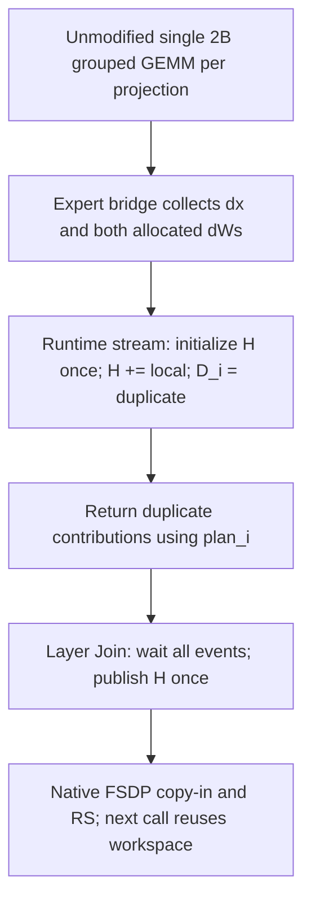

# Share home gradients at the layer Join

MoonEP uses scheme A: one BF16 home accumulator per projection and `N`
independent duplicate slots. This supersedes ADR-0018's per-slot home storage
and direct-output GEMM policy. It retains synchronized RS on every backward.

## Decision

`prepare_layer_inputs()` runs once, before branching into the layer's
microbatches. Its multi-output autograd Join is inside the FSDP-wrapped layer,
so its backward runs before FSDP's native input post-backward node. Each branch
still has its own invocation and routing plan. A call-local initialization flag
is shared by those invocations, not by independent calls or checkpoint replays.

All home writes and duplicate returns execute on the runtime stream. Event
waits establish device dependencies without host synchronization. Expert weight
gradients stop at the bridge instead of also reaching leaf AccumulateGrad.
Forward/no-grad/replay preparation never clears live gradient storage.

## Consequences

GEMM and Triton kernels do not change. GroupedLinear continues accepting the
dynamic 2B weight, but MoonEP no longer supplies `grad_weight_out`. Scheme B
and its home scratch mapping are not implemented.

The communication workspace uses `(N+1)G` instead of `2NG`, where `G` is the
two projections' home-gradient bytes. Allocation-return GEMM adds temporary
dW, and staging adds memory traffic. The old acceptance claim of zero full dW
temporary/copy therefore no longer applies; peak memory and throughput must
be measured, not inferred from workspace capacity alone.

The supported contract remains one active independent training graph per
runtime, with dependency-ordered layer/MTP calls. Native FSDP must consume H
before reuse. Cross-backward accumulation lives only in FSDP-owned FP32 shards.

In short: per-invocation production and return, per-layer-call publication,
native FSDP reduction, with explicit temporary-storage costs.
