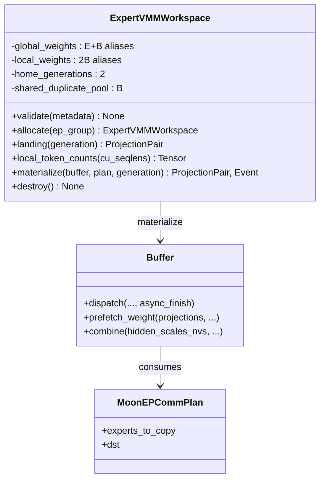
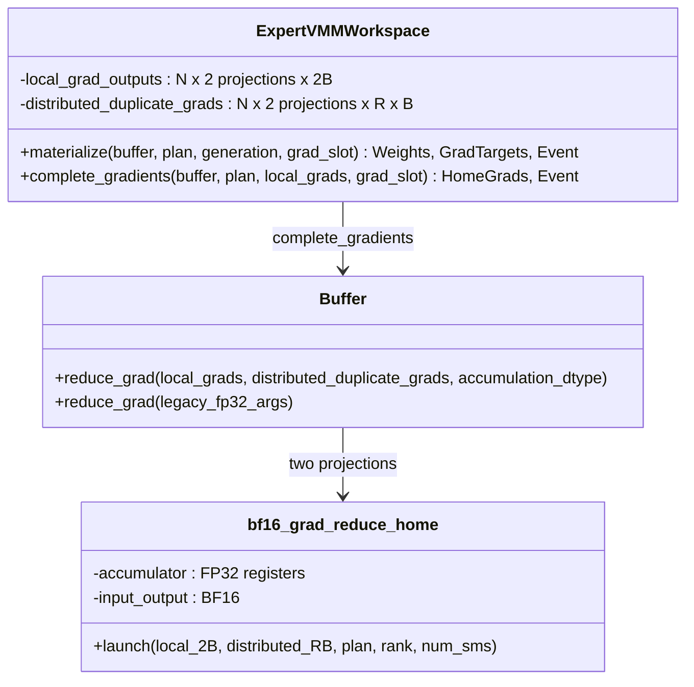

# 2026-08-05_03-20-01_MoonEP前向集成API与VMM异步链路

完成 Issue 01：MoonEP-mod 现在提供带版本号的 XTuner integration capability、`ExpertVMMWorkspace` 前向工作区，以及 `Buffer` 的 projection sequence 与 route-scaled combine 接口。实现位于 `MoonEP-mod/moonep/{workspace.py,api.py,__init__.py}`，公开行为测试位于 `MoonEP-mod/tests/test_xtuner_integration.py`。

## 关键单测

- 纯 metadata `validate()`：验证 BF16、EP2/4/8、expert divisibility、top-k、projection alignment、双 generation；测试前后均未初始化 CUDA。
- 真实 VMM 行为：landing、global `[E+B]` 和 local `[2B]` 映射同一 physical storage；两个 home generation 相互隔离，duplicated pool 跨 generation 共享。
- 真实 8-GPU topology matrix：分别显式构造 EP2、EP4、EP8 subgroup，覆盖 local、remote duplicated、empty、skew route，并跑通 dispatch、双 projection prefetch、route-scaled combine。
- 非默认 caller stream：仅用 dispatch/prefetch/combine 返回的 CUDA event 串联消费者；profiler 未发现 `.item()`、local scalar 或 CUDA host synchronization。
- 生命周期：`destroy()` 可重复调用；遗漏显式销毁时只发 `ResourceWarning` 并保留资源，不在析构器执行 collective teardown。
- 回归：MoonEP 原有 8-GPU E2E 通过；combine/prefetch 为 `24 passed`；planning/dispatch/grad-reduce 为 `42 passed, 1 skipped`。

## 类/接口设计和主要改动

`ExpertVMMWorkspace` 是唯一新增的 Deep Class。它隐藏 FD 交换、VMM VA、global/local aliases、generation 与资源释放顺序；XTuner 客户端只接触 landing、local counts、materialize 和 event。`Buffer` 保留原 gate/up/down 三投影兼容接口，并新增任意 projection sequence；`hidden_scales_nvs` 只允许 non-zero-copy combine。

## 类交互和主要改动

初始化期仅在调用方传入的 `ep_group` 内完成 hostname/device 收集和 FD 交换。热路径中的 plan、counts 与 routing 均留在 device；每段通信由 caller event 入队到 comm stream，再向消费者返回 completion event。

## 其他重要细节

- MoonEP-mod worktree：`/mnt/shared-storage-user/zhaopenghao/github/MoonEP-mod`。
- MoonEP-mod commit：`0be637d feat: add XTuner MoonEP forward integration API`。
- 正式 backward API 与 BF16 duplicated-gradient return 留给 Issue 02；本 issue 不提前混入训练梯度语义。
- 结论：Issue 01 的 forward capability、显式 EP topology、VMM alias 与无 host sync 异步契约均已由真实多 GPU public tests 固化。

# 2026-08-05_03-38-56_MoonEP_BF16梯度环与Duplicate_Return

完成 Issue 02：`ExpertVMMWorkspace` 按调用方给定的 Domino width 分配两块 fused projection 的 BF16 gradient-slot ring，`Buffer.reduce_grad()` 新增正式 BF16 路径，并由 CUDA owner kernel 将所有 duplicated partials 执行 FP32 累加、一次 BF16 舍入的 EP-local SUM。旧 FP32 reduce-grad 接口保持兼容。

## 关键单测

- 两个 gradient slots：验证 BF16、连续 `[2B,O,I]`、storage 独立、slot 越界及错配 slot 拒绝；输出 target 可被生产者直接覆盖，无完整 dW copy。
- BF16 owner SUM：真实远端 VMM reads 使用可区分 partials，逐位比较 rank-major/slot-major FP32 累加后的一次 BF16 舍入，并能检测 BF16 逐项舍入和错误 averaging。
- 真实 8-GPU EP2/EP4/EP8：覆盖 local、remote、empty、skew、同一 expert 多 rank partials；两个 slots 先后生产、逆序完成，并跨 step 复用 slot 0。
- non-default caller stream：gradient target 写入、owner SUM、suffix 清零和消费者只通过 returned CUDA event 排序；profiler 未发现 host scalar 或 CUDA synchronize。
- 回归：2-GPU integration suite 为 `12 passed, 3 skipped`；原有 8-GPU E2E 通过；旧 FP32 grad-reduce suite 为 `12 passed`。

## 类/接口设计和主要改动

每个 slot 的 home `[B]` 与 duplicate `[B]` 分别拥有 physical allocation，再映射为 grouped-GEMM 可直接写入的 contiguous local `[2B]`；所有 ranks 的 duplicate chunks 另映射为 owner 可读的 distributed `[R,B]`。ring 大小只等于 `gradient_slots`，不随 layer、MTP depth 或 route 动态扩容。

## 类交互和主要改动

两个 barrier 都是 GPU-side EP synchronization：第一个保证 owner 不会读取尚未完成的 remote dW，第二个保证任何 rank 清理本地 suffix 前，其他 owners 已完成 remote reads。清理固定 `[B:]`，不查询 plan scalar、不按 route 决定 host launch。

## 其他重要细节

- MoonEP-mod commit：`df548b0 feat: return duplicated expert gradients in BF16`。
- 新 binding 位于 `csrc/bf16_grad_reduce.cuh`；plan 先固定搬入 block shared memory，数据存储和 NVLink traffic 全程 BF16，只有寄存器 accumulator 为 FP32。
- 当前机器默认 `/usr/local/cuda` 为 12.8；重建与 PyTorch 13.2 匹配的 extension 时显式使用环境内 `nvidia/cu13` 作为 `CUDA_HOME`，editable module 与 `_C` 均确认来自 `MoonEP-mod`。
- `M_g=0` 行由后续 XTuner direct-output grouped-GEMM 对所有固定 groups 的覆盖写负责；workspace 不增加整块 memset 或 completion-time clone。
- 结论：Issue 02 已建立可直接交给后续 XTuner expert autograd/FSDP handoff 的 BF16 gradient completion boundary，同时保留旧 FP32 reference path。
