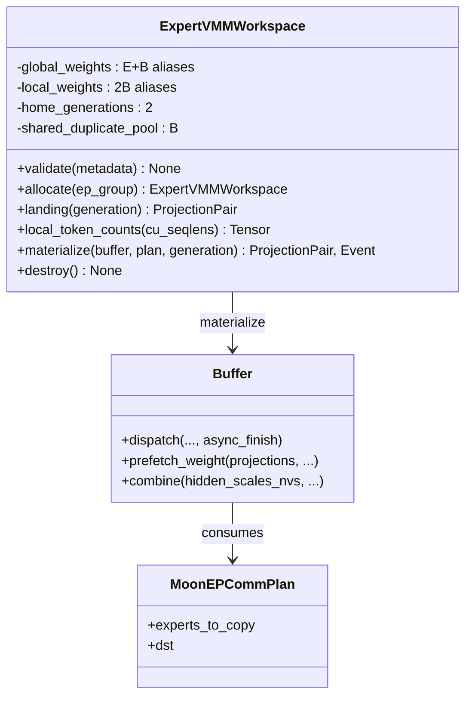

# 2026-08-05_03-20-01_MoonEP前向集成API与VMM异步链路

完成 Issue 01：MoonEP-mod 现在提供带版本号的 XTuner integration capability、`ExpertVMMWorkspace` 前向工作区，以及 `Buffer` 的 projection sequence 与 route-scaled combine 接口。实现位于 `MoonEP-mod/moonep/{workspace.py,api.py,__init__.py}`，公开行为测试位于 `MoonEP-mod/tests/test_xtuner_integration.py`。

## 关键单测

- 纯 metadata `validate()`：验证 BF16、EP2/4/8、expert divisibility、top-k、projection alignment、双 generation；测试前后均未初始化 CUDA。
- 真实 VMM 行为：landing、global `[E+B]` 和 local `[2B]` 映射同一 physical storage；两个 home generation 相互隔离，duplicated pool 跨 generation 共享。
- 真实 8-GPU topology matrix：分别显式构造 EP2、EP4、EP8 subgroup，覆盖 local、remote duplicated、empty、skew route，并跑通 dispatch、双 projection prefetch、route-scaled combine。
- 非默认 caller stream：仅用 dispatch/prefetch/combine 返回的 CUDA event 串联消费者；profiler 未发现 `.item()`、local scalar 或 CUDA host synchronization。
- 生命周期：`destroy()` 可重复调用；遗漏显式销毁时只发 `ResourceWarning` 并保留资源，不在析构器执行 collective teardown。
- 回归：MoonEP 原有 8-GPU E2E 通过；combine/prefetch 为 `24 passed`；planning/dispatch/grad-reduce 为 `42 passed, 1 skipped`。

## 类/接口设计和主要改动

`ExpertVMMWorkspace` 是唯一新增的 Deep Class。它隐藏 FD 交换、VMM VA、global/local aliases、generation 与资源释放顺序；XTuner 客户端只接触 landing、local counts、materialize 和 event。`Buffer` 保留原 gate/up/down 三投影兼容接口，并新增任意 projection sequence；`hidden_scales_nvs` 只允许 non-zero-copy combine。

## 类交互和主要改动

```mermaid
flowchart LR
    A["Caller stream: dispatch"] --> B["MoonEP comm stream"]
    B --> C["GPU plan + activation dispatch"]
    C --> D["dispatch event"]
    D --> E["Workspace.materialize"]
    E --> F["global E+B VMM prefetch"]
    F --> G["local 2B alias + prefetch event"]
    G --> H["Grouped compute consumer"]
    H --> I["combine staging: BF16 row scaling"]
    I --> J["route-scaled combine event"]
    J --> K["Caller-stream consumer"]
```

初始化期仅在调用方传入的 `ep_group` 内完成 hostname/device 收集和 FD 交换。热路径中的 plan、counts 与 routing 均留在 device；每段通信由 caller event 入队到 comm stream，再向消费者返回 completion event。

## 其他重要细节

- MoonEP-mod worktree：`/mnt/shared-storage-user/zhaopenghao/github/MoonEP-mod`。
- MoonEP-mod commit：`0be637d feat: add XTuner MoonEP forward integration API`。
- 正式 backward API 与 BF16 duplicated-gradient return 留给 Issue 02；本 issue 不提前混入训练梯度语义。
- 结论：Issue 01 的 forward capability、显式 EP topology、VMM alias 与无 host sync 异步契约均已由真实多 GPU public tests 固化。
