# 2026-08-05_03-20-01_MoonEP前向集成API与VMM异步链路

完成 Issue 01：MoonEP-mod 现在提供带版本号的 XTuner integration capability、`ExpertVMMWorkspace` 前向工作区，以及 `Buffer` 的 projection sequence 与 route-scaled combine 接口。实现位于 `MoonEP-mod/moonep/{workspace.py,api.py,__init__.py}`，公开行为测试位于 `MoonEP-mod/tests/test_xtuner_integration.py`。

## 关键单测

- 纯 metadata `validate()`：验证 BF16、EP2/4/8、expert divisibility、top-k、projection alignment、双 generation；测试前后均未初始化 CUDA。
- 真实 VMM 行为：landing、global `[E+B]` 和 local `[2B]` 映射同一 physical storage；两个 home generation 相互隔离，duplicated pool 跨 generation 共享。
- 真实 8-GPU topology matrix：分别显式构造 EP2、EP4、EP8 subgroup，覆盖 local、remote duplicated、empty、skew route，并跑通 dispatch、双 projection prefetch、route-scaled combine。
- 非默认 caller stream：仅用 dispatch/prefetch/combine 返回的 CUDA event 串联消费者；profiler 未发现 `.item()`、local scalar 或 CUDA host synchronization。
- 生命周期：`destroy()` 可重复调用；遗漏显式销毁时只发 `ResourceWarning` 并保留资源，不在析构器执行 collective teardown。
- 回归：MoonEP 原有 8-GPU E2E 通过；combine/prefetch 为 `24 passed`；planning/dispatch/grad-reduce 为 `42 passed, 1 skipped`。

## 类/接口设计和主要改动

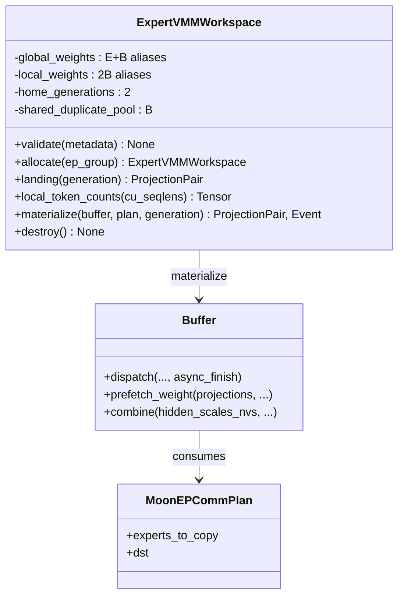

`ExpertVMMWorkspace` 是唯一新增的 Deep Class。它隐藏 FD 交换、VMM VA、global/local aliases、generation 与资源释放顺序；XTuner 客户端只接触 landing、local counts、materialize 和 event。`Buffer` 保留原 gate/up/down 三投影兼容接口，并新增任意 projection sequence；`hidden_scales_nvs` 只允许 non-zero-copy combine。

## 类交互和主要改动

初始化期仅在调用方传入的 `ep_group` 内完成 hostname/device 收集和 FD 交换。热路径中的 plan、counts 与 routing 均留在 device；每段通信由 caller event 入队到 comm stream，再向消费者返回 completion event。

## 其他重要细节

- MoonEP-mod worktree：`/mnt/shared-storage-user/zhaopenghao/github/MoonEP-mod`。
- MoonEP-mod commit：`0be637d feat: add XTuner MoonEP forward integration API`。
- 正式 backward API 与 BF16 duplicated-gradient return 留给 Issue 02；本 issue 不提前混入训练梯度语义。
- 结论：Issue 01 的 forward capability、显式 EP topology、VMM alias 与无 host sync 异步契约均已由真实多 GPU public tests 固化。

# 2026-08-05_03-38-56_MoonEP_BF16梯度环与Duplicate_Return

完成 Issue 02：`ExpertVMMWorkspace` 按调用方给定的 Domino width 分配两块 fused projection 的 BF16 gradient-slot ring，`Buffer.reduce_grad()` 新增正式 BF16 路径，并由 CUDA owner kernel 将所有 duplicated partials 执行 FP32 累加、一次 BF16 舍入的 EP-local SUM。旧 FP32 reduce-grad 接口保持兼容。

## 关键单测

- 两个 gradient slots：验证 BF16、连续 `[2B,O,I]`、storage 独立、slot 越界及错配 slot 拒绝；输出 target 可被生产者直接覆盖，无完整 dW copy。
- BF16 owner SUM：真实远端 VMM reads 使用可区分 partials，逐位比较 rank-major/slot-major FP32 累加后的一次 BF16 舍入，并能检测 BF16 逐项舍入和错误 averaging。
- 真实 8-GPU EP2/EP4/EP8：覆盖 local、remote、empty、skew、同一 expert 多 rank partials；两个 slots 先后生产、逆序完成，并跨 step 复用 slot 0。
- non-default caller stream：gradient target 写入、owner SUM、suffix 清零和消费者只通过 returned CUDA event 排序；profiler 未发现 host scalar 或 CUDA synchronize。
- 回归：2-GPU integration suite 为 `12 passed, 3 skipped`；原有 8-GPU E2E 通过；旧 FP32 grad-reduce suite 为 `12 passed`。

## 类/接口设计和主要改动

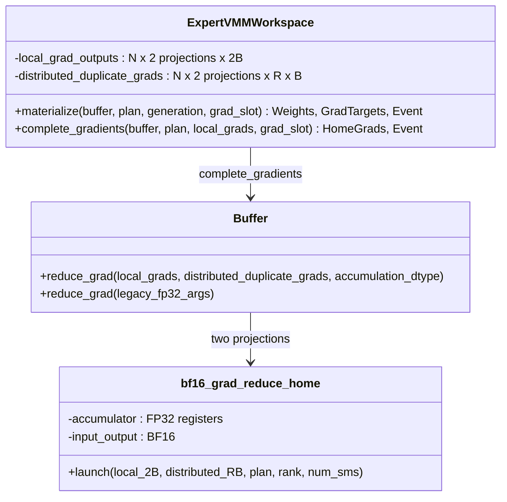

每个 slot 的 home `[B]` 与 duplicate `[B]` 分别拥有 physical allocation，再映射为 grouped-GEMM 可直接写入的 contiguous local `[2B]`；所有 ranks 的 duplicate chunks 另映射为 owner 可读的 distributed `[R,B]`。ring 大小只等于 `gradient_slots`，不随 layer、MTP depth 或 route 动态扩容。

## 类交互和主要改动

两个 barrier 都是 GPU-side EP synchronization：第一个保证 owner 不会读取尚未完成的 remote dW，第二个保证任何 rank 清理本地 suffix 前，其他 owners 已完成 remote reads。清理固定 `[B:]`，不查询 plan scalar、不按 route 决定 host launch。

## 其他重要细节

- MoonEP-mod commit：`df548b0 feat: return duplicated expert gradients in BF16`。
- 新 binding 位于 `csrc/bf16_grad_reduce.cuh`；plan 先固定搬入 block shared memory，数据存储和 NVLink traffic 全程 BF16，只有寄存器 accumulator 为 FP32。
- 当前机器默认 `/usr/local/cuda` 为 12.8；重建与 PyTorch 13.2 匹配的 extension 时显式使用环境内 `nvidia/cu13` 作为 `CUDA_HOME`，editable module 与 `_C` 均确认来自 `MoonEP-mod`。
- `M_g=0` 行由后续 XTuner direct-output grouped-GEMM 对所有固定 groups 的覆盖写负责；workspace 不增加整块 memset 或 completion-time clone。
- 结论：Issue 02 已建立可直接交给后续 XTuner expert autograd/FSDP handoff 的 BF16 gradient completion boundary，同时保留旧 FP32 reference path。

# 2026-08-05_05-01-57_XTuner_Staging_Forward端到端链路

完成 Issue 03：XTuner 新增可选的 `dispatcher="moonep"`、model-scoped `MoonEPRuntime`、per-forward `_MoonEPInvocation` 和六阶段 `MoonEPDispatcher`。Router 统一传递 device-resident `tokens_per_expert`；原生 FSDP 安装后才分配 VMM workspace，并通过显式 `moonep_staging_reference` 将完整 BF16 home expert 权重复制到 landing。主要改动位于 `xtuner/v1/module/dispatcher/moonep.py`、`xtuner/v1/model/moe/moe.py`、`xtuner/v1/module/decoder_layer/moe_decoder_layer.py`、`xtuner/v1/module/grouped_linear/moe_group_linear.py` 和对应测试。

## 关键单测

- backend contract：验证 lazy optional import、integration API/capability、module source、固定 PyTorch 版本和 meta-only validation。
- dispatcher public API：验证 staging 显式开关与 warning、Fixed-S、双 generation、六阶段结果以及 completion event 顺序。
- 原有 grouped GEMM public API：验证 `weight_override` 接收 local `[2B]` fused weights，默认 Parameter 路径不变。
- 真实 8-GPU compiled forward：Qwen-compatible tiny 模型在 BF16 FSDP2×EP4 下与 DeepEP 对齐，并连续运行四次 MoonEP no-grad forward；GLM5.2 tiny 模型与 All2All 对齐。
- 非 MoonEP 回归：NoEP、DeepEP、All2All、AGRS 的统一 `tokens_per_expert` seam 通过，合计 `14 passed, 1 skipped`。
- MoonEP-mod peer-skew 回归：在一个 rank 的 landing copy 前注入 GPU-only 延迟，确认 prefetch 不会读取上一 generation 的远端旧权重；profiler 继续排除 `.item()` 和 CUDA host synchronization。

## 类/接口设计和主要改动

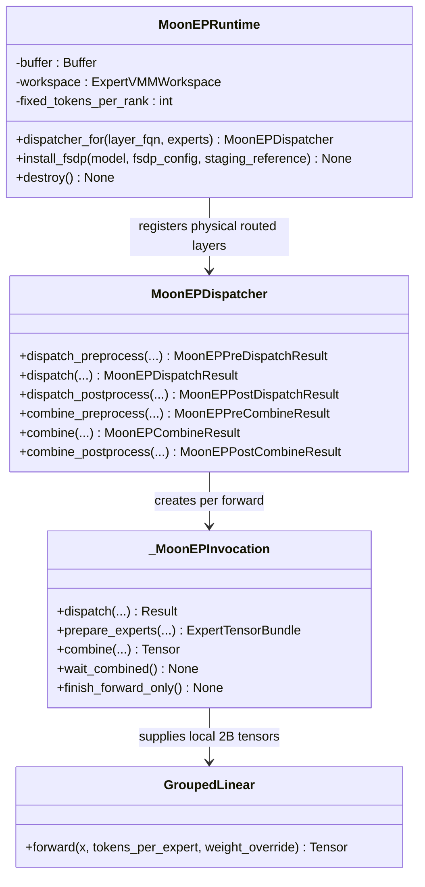

`MoonEPRuntime` 隐藏 model/EP-group 资源和 Fixed-S 生命周期；`_MoonEPInvocation` 隐藏一次 dispatch/combine 的 plan 与 device events；decoder 仅消费六阶段 TypedDict 和显式 tensor bundle，不按 backend 分支执行专家计算。

## 类交互和主要改动

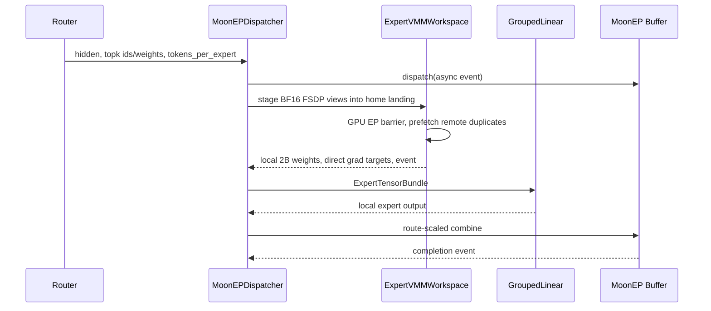

staging、remote prefetch 和 dispatch 的依赖全部通过 CUDA event/device barrier 排序。真实 peer-skew 复现定位到远端 rank landing 尚未发布的竞态，因此 MoonEP-mod 在 prefetch 前增加已有的 GPU inter-rank barrier；热路径未增加 host sync。

## 其他重要细节

- MoonEP-mod 修复提交：`4b3aefe fix: synchronize staged weights before prefetch`。
- `intra_layer_micro_batch` 由 Trainer 在 model build 前只传入一个 scalar；未传递整个 TrainerConfig。
- dense prefix 不注册 dispatcher、不占 generation；shared experts/gate 保持原路径；全 dense 配置在 workspace allocation 前失败。
- staging 是数值参考路径并明确 warning；Issue 05 将用 direct FSDP landing 替换逐 forward 的完整权重 copy。
- 结论：Issue 03 已跑通 staging forward tracer，保留 BF16 FSDP 参数身份、原 grouped-GEMM 计算和无 host sync 契约。

# 2026-08-05_05-31-05_XTuner_BF16训练反向与FSDP梯度归还

完成 Issue 04：`_DispatchAutograd`、`_CombineAutograd` 和 `_ExpertWeightAutograd` 将 MoonEP concrete communication、saved-plan backward、local `[2B]` grouped GEMM 与 FSDP home Parameter edge 连接为完整训练链路。Triton `k_grouped_gemm_out` 直接覆盖 invocation-owned BF16 dW 槽；fused route-weight backward 同时产生 BF16 expert-row gradient 与 FP32 route gradient。主要改动位于 `xtuner/v1/module/dispatcher/moonep.py`、`xtuner/v1/ops/moe/cuda/{group_gemm.py,route_weight.py,triton_kernels/}`、`xtuner/v1/module/{grouped_linear,decoder_layer}/` 和对应测试。

## 关键单测

- direct-output grouped GEMM：eager 与 `torch.compile(fullgraph=True)` 均直接覆盖调用方 BF16 target；empty expert 行从旧值/NaN 确定性写零，输出、dX、dW 与 PyTorch reference 对齐。
- fused route derivative：逐位验证 BF16 `grad_expert`，并以 FP32 reference 验证 `grad_route=dot(grad_weighted, raw_expert_output)`。
- 真实 BF16 FSDP2×EP4 compiled training：MoonEP 连续两个 optimizer steps 的 loss、global grad norm、全部 routed/shared/router gradient shards 和 updated parameter shards，与 DeepEP 在 `rtol=1e-2, atol=1e-3` 内一致；独立 MoonEP run 同样复现。
- native-router cast：真实训练把 BF16 router weights 转为 MoonEP FP32 communication weights，梯度仍返回 BF16 router graph；所有 routed expert 分片得到有限梯度并更新。
- asymmetric exact SUM：EP4 各 rank 产生 `1/2/4/8` partial，home BF16 结果逐位等于 `15`；真实 `MoE.scale_and_reduce_grad()` 只执行既有一次 `/4`，FP32 shard 等于 `15/4`。
- slot reuse 红测：两个 layer invocation 复用同一物理 dW slot 时，后层 mutable write 不再使前层 AOT saved tensor 版本失效；无 gradient payload allocation/copy。
- no-host-sync 与回归：MoonEP 5 个真实 EP4 workspace/async profiler tests 全部通过；dispatcher/backends/grouped-linear 为 `14 passed, 1 skipped`；Qwen/GLM no-grad forward 继续通过。

## 类/接口设计和主要改动

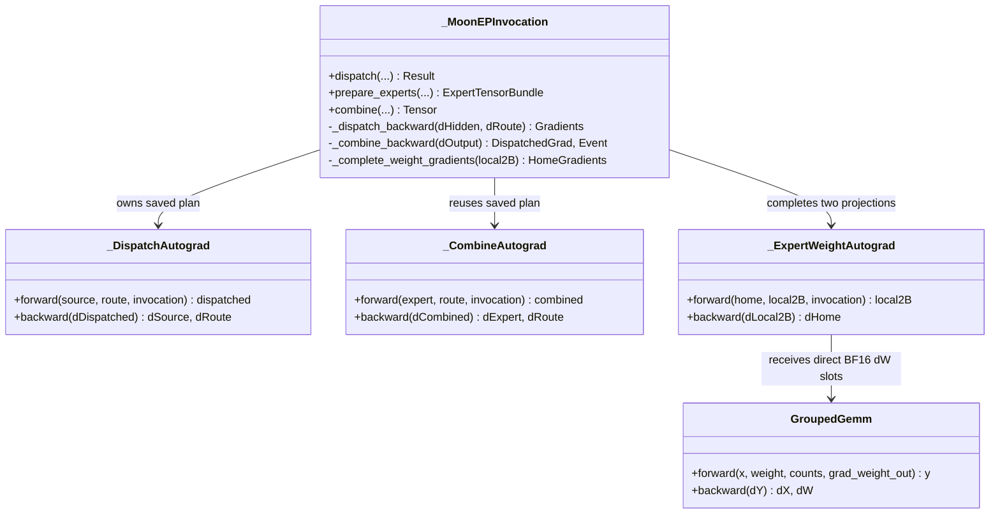

三个 private Function 各自内聚一对 forward/backward，不新增 facade。`_MoonEPInvocation` 是唯一保存 plan、events、generation 与 grad slot 的 per-call Deep Class；Runtime/Dispatcher 不保存 `last_plan`。

## 类交互和主要改动

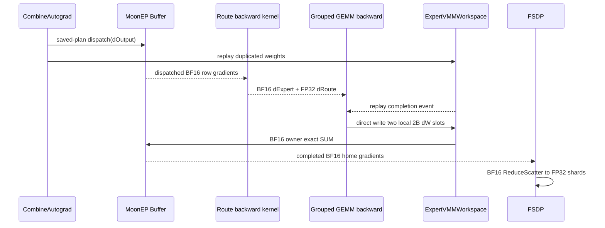

replay 与 route derivative 可重叠，仅在 grouped-GEMM 即将读取 duplicated weights 前插入 device event wait。每个 materialization 对复用的 VMM dW storage 创建 fresh Tensor/version-counter alias；它不分配或复制 payload，只解决 AOT 对跨 layer mutable alias 的版本跟踪。

## 其他重要细节

- MoonEP-mod 提交：`ba3c1bc fix: isolate reused gradient slot aliases`。
- routed dtype 流程保持 `FP32 shard → BF16 AG/compute/dW → BF16 duplicate return/ReduceScatter → FP32 shard gradient → /ep_size → FP32 optimizer`；MoonEP exact SUM 不做 average。
- shared experts/gate 未进入 VMM，继续使用原 BF16 FSDP ReduceScatter 与 FP32 EP-replica mean AllReduce。
- backward 只复用 forward plan，不重新 planning；staging reference 在 FSDP pre-backward AG 后重新填充可能被后续 generation 覆盖的 home landing。
- 结论：Issue 04 已建立不依赖 engine post-backward callback 的完整 staging training 数值基准，并保持 compile 与无 host sync 契约。

# 2026-08-05_05-48-39_Direct_FSDP到VMM与无Host_Sync

完成 Issue 05：新增版本锁定的 `fsdp_vmm_landing` Deep Module，使 FSDP2 fused AllGather 的最终 per-parameter unpack 直接写入 MoonEP 双 generation VMM landing；原生 FSDP 仍管理 Parameter identity、SHARDED/UNSHARDED 切换、BF16 ReduceScatter 和 FP32 optimizer shard。正式路径不再复制完整 home weight，staging 仅作为显式 warning reference。主要改动位于 `xtuner/v1/module/dispatcher/{fsdp_vmm_landing.py,moonep.py}` 及对应 contract/engine tests。

## 关键单测

- TDD 红测首先确认 `moonep_staging_reference=False` 在真实 BF16 FSDP2×EP4 compiled 两步训练中因 direct adapter 缺失而失败；实现后转绿。
- production direct 对 DeepEP：Qwen tiny 的 output、loss、global grad norm、router/routed/shared gradient shards 和更新后 FP32 parameter shards 在既定容差内一致；GLM tiny forward 与 All2All 一致。
- direct 对 staging：独立建模并连续训练两个 optimizer steps，比较两步 loss、grad norm、全部 selected gradients 和 updated shards。
- profiler calibration：staging 能检测到完整 `[B,O,I]` `aten::copy_`；direct 同形 copy 为 0，local `[2B,O,I]` dW clone/copy/zeros-like 为 0。
- profiler host-sync gate：warmup compile 后检查 `MoonEP::dispatch_forward/prepare_experts/combine_forward/combine_backward/dispatch_backward/gradient_handoff`，未发现 `cudaDevice/Event/StreamSynchronize`。
- contract：XTuner dispatcher 目录仅 `fsdp_vmm_landing.py` 导入 `_fully_shard` private API；非 FSDP target 的 direct 安装明确失败、销毁 workspace，且不回退 staging。
- 回归结果：完整 8-GPU engine 文件为 `6 passed`；dispatcher contract/六阶段行为为 `9 passed`；Ruff 与 `git diff --check` 通过。

## 类/接口设计和主要改动

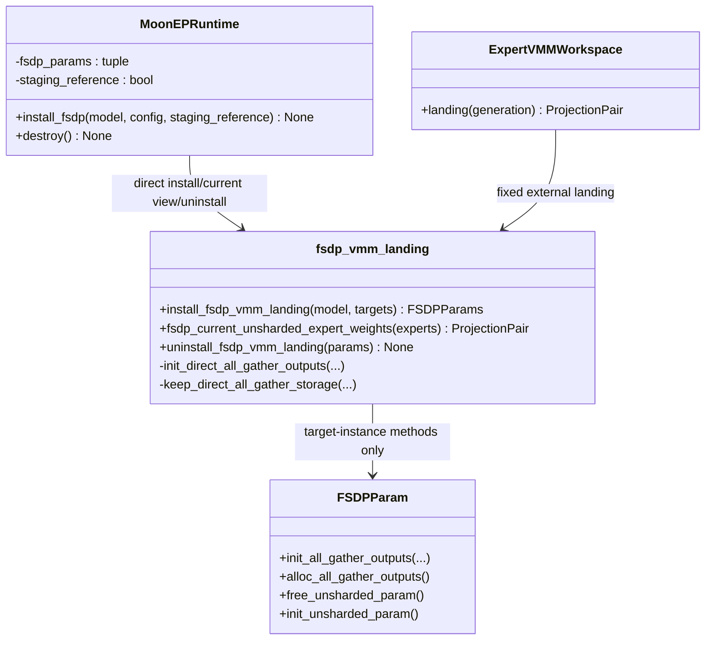

`fsdp_vmm_landing.py` 是唯一理解目标 PyTorch private layout 的模块，没有新增 adapter class。Installer 通过 FSDP 保存的 `(module identity, parameter name)` 精确选择 routed `fused_w1w3.weight` 与 `fused_w2.weight`；只给这些 instances 绑定三个 storage lifecycle methods，原生 `init_unsharded_param()` 和 Parameter switching 保持不变。

## 类交互和主要改动

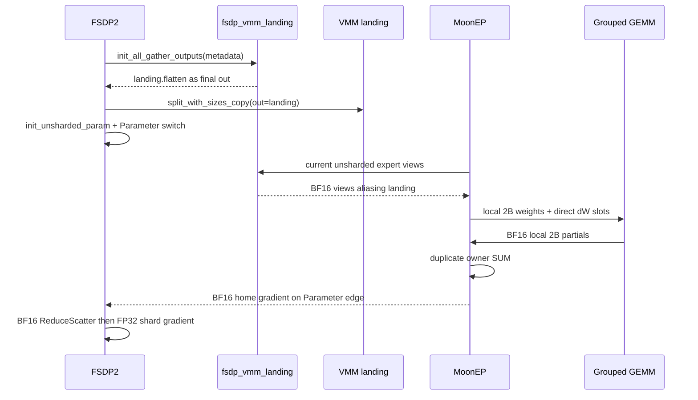

forward 和 pre-backward AllGather 都经过同一 final-output binding，因此每次自动刷新该 physical routed layer 的 ordinal generation；dense/shared layers不注册 target，也不占 generation。MoonEP 调用只读取已经 unsharded 的 current view，不主动触发 AllGather；通信依赖继续由 CUDA event 和 GPU-side EP barrier 排序。

## 其他重要细节

- 安装前固定校验 PyTorch `2.12.1+cu132`、dim-0 contiguous、无 padding、单一默认 AllGather output、无 post-AllGather extension、BF16 dtype、device/numel 以及首次 AG 前状态；invariant 改变会明确报错。
- direct 的 `alloc_all_gather_outputs()`/`free_unsharded_param()` 对 external VMM storage 为 no-op，禁止原生 `resize_`；卸载在 FSDP idle boundary 先公开 `reshard()`，再删除 unsharded alias、landing metadata 和 instance methods，最后才 unmap workspace。
- profiler 曾在整个 `TrainEngine.train_step()` 范围实测到 loss/logging 的 `.item()`、CPU `.to()` 与 `nonzero()` host sync；这些是既有 trainer 行为。缩小到 production MoonEP ranges 后同步计数为 0，未用白名单掩盖 MoonEP 调用。
- dtype 流程保持 `FP32 shard -> BF16 AG/direct landing/compute/dW/duplicate return/RS -> FP32 shard grad -> FP32 optimizer update`；DCP 仍只观察 FSDP-owned Parameter/optimizer identity。
- 结论：Issue 05 已把 staging tracer 升级为 production direct FSDP-to-VMM 路径，并由真实连续训练、数值对照、private-invariant 与 profiler gate共同固化无完整权重 copy、无 full-dW temporary 和 MoonEP 热路径无 host sync。

# 2026-08-05_07-06-17_Domino_MTP_SP与Compile执行矩阵

完成 Issue 06：MoonEP 正式路径支持 Domino micro1/micro2、MTP shared/unshared、reentrant original/replay、SP2/4/8、shared-expert overlap 和 `torch.compile`。`MoE.forward()` 在首个 MoonEP operation 前校验 trainer-resolved width；`MoEDecoderLayer` 对 EP dispatcher 异步启动 routed combine，并只在 routed/shared 相加前建立 device wait。主要改动位于 `xtuner/v1/model/moe/moe.py`、`xtuner/v1/module/decoder_layer/moe_decoder_layer.py` 与 `tests/engine/test_moonep_forward.py`。

## 关键单测

- 完整 MoonEP engine 文件：16 个真实 8-GPU 测试全部通过（487.85s），覆盖 BF16 FSDP2×EP4、Direct landing、compile、两层 routed tiny model、三步 optimizer 与 DeepEP 数值对照。
- Domino ring：同一 public model 先执行 width1 forward-only、再执行 width2 三步训练；identical micro2 的 loss、grad norm 与 routed dW 精确等于 micro1 的两倍；width3 在 capacity2 下于首个 MoonEP op 前报错。
- MTP：`share_weights=False/True, num_layers=2` 均完成两次 fixed-S `eval()+no_grad()`、三步 reentrant training/replay；main loss、MTP loss 和 global grad norm 与 DeepEP 在 `rtol=1e-2` 内一致。
- Shared expert：`n_shared_experts=0/1`、shared gate 均得到有限梯度；独立构造各 rank 梯度后，shared gate 仍以 FP32 得到每个 EP4 row 的精确 mean。
- SP matrix：SP2 与 EP4 部分重叠、SP4 等于 EP4、SP8 包含 EP4，三种真实训练均与同 mesh 的 DeepEP loss/grad norm 对齐，并完成 routed gradient 与 optimizer 检查。
- Profiler：MTP shared + micro2 + reentrant + SP4 + EP4 + compile 的 MoonEP ranges 内，CUDA host synchronize、完整 home-weight copy、完整 local-dW materialization 均为 0；tiny pack length 32 的实测 peak allocated 为 0.185 GiB/rank，并设置 1 GiB 回归上限。
- Dispatcher contract 回归为 `9 passed`；既有 pytree EP2 micro2 checkpoint 测试通过。两个 checkpoint-based engine 文件因未设置 `QWEN3_MOE_PATH`/`GLM5_2_TINY_MOE_PATH` 无法 collection；GLM EP1 shared-MTP compile 测试在 decoder 完全恢复 HEAD 后仍复现既有 `_pre_moe_forward missing self`，确认不是本 issue 引入。

## 类/接口设计和主要改动

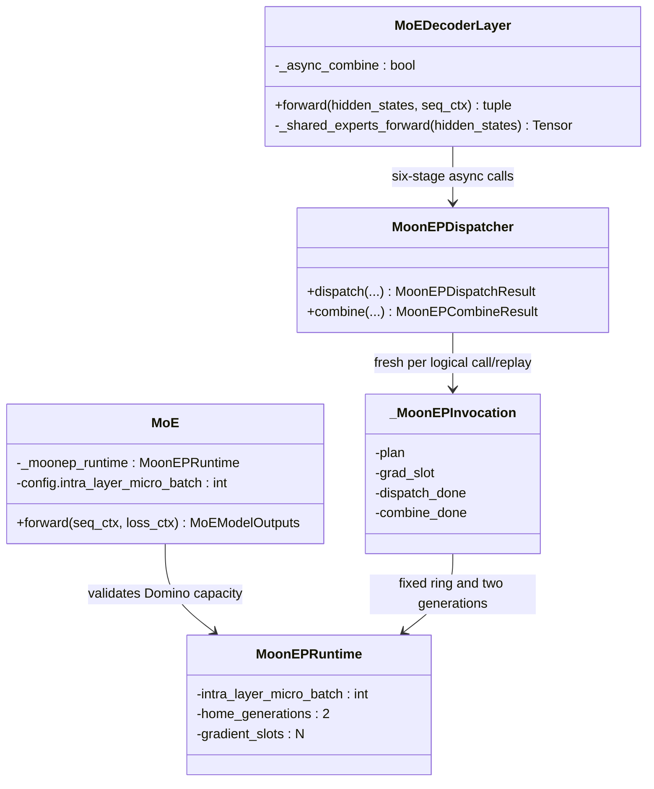

没有新增 facade 或 mode-specific controller。model-scoped Runtime 继续隐藏固定资源，per-call Invocation 继续隐藏 plan/events/slot；新增状态只有 decoder 构造期解析的 `_async_combine` 常量，Naive EP1 保持同步接口。

## 类交互和主要改动

```mermaid
flowchart LR
    A["Trainer resolves width N"] --> B["MoE public forward validates width <= N"]
    B --> C["Each logical microbatch creates fresh Invocation"]
    C --> D["Dispatch + fresh device plan"]
    D --> E["Direct generation landing + fixed grad slot"]
    E --> F["Grouped expert compute"]
    F --> G["Async routed combine on comm stream"]
    G --> H["Shared expert/gate on default stream"]
    H --> I["Device event wait before routed + shared"]
    I --> J["Reentrant replay creates another fresh Invocation"]
    J --> K["BF16 duplicate return + FSDP ReduceScatter"]
```

MTP shared weights 只注册一个 physical routed layer，logical depth 与 replay 仍逐次创建 Invocation；unshared MTP 注册多个 physical layers并沿 FSDP 顺序交替 generation。SP 只在进入 model 前切分 sequence，MoonEP 固定 S 因而只看到 post-SP local tokens，不增加 full-sequence collective。

## 其他重要细节

- tiny fallback 配置为 3 层（dense prefix 1 + routed 2）、8 experts、top2、hidden 512、pack length 16/32；满足 Direct landing、BF16 duplicated-gradient return、compile 与至少三步 optimizer 的组合验收。
- 两次 forward-only 调用会在 combine device dependency 入队后释放 Python plan references；随后的 training original 与 backward replay 均重新 planning，不复用过期 Invocation。
- DeepEP/MoonEP 的 BF16 forward 舍入会经后续 router 放大，因此多层跨 dispatcher 不逐元素判 dW；loss/grad norm 对齐，gradient finite/nonzero，而 slot 累加用相同输入的 micro1/micro2 精确测试独立固化。
- dtype 流程未改变：FP32 shard 参数经 BF16 AllGather、BF16 compute/dW/duplicate return/ReduceScatter 后形成 FP32 shard gradient，再由 FP32 optimizer 更新。
- 结论：Issue 06 已把 Direct tracer 扩展到 XTuner 的 Domino、MTP、SP 和 compile 正式执行矩阵，同时保持固定资源、fresh invocation、shared FP32 mean、无完整 copy 与 MoonEP 热路径无 host sync。

# 2026-08-05_08-00-00_DCP_HF_Offload_Optimizer与Runtime生命周期

完成 Issue 07：Direct MoonEP 继续只把 FSDP-owned Parameter/optimizer shard 作为持久化身份，VMM landing、Buffer、Invocation、plan、event 和 gradient slot 均为瞬态执行状态。`TrainEngine.close()` 统一等待异步 DCP/HF、销毁 MoonEP、释放异步保存资源；`SwapAdamW` 与 `Muon` 修复 cold-resume 所需的 optimizer state schema。主要改动位于 `xtuner/v1/engine/train_engine.py`、`xtuner/v1/model/base.py`、`xtuner/v1/train/trainer.py`、`xtuner/v1/optim/{swap_adamw,muon}.py` 和 `tests/engine/test_moonep_persistence.py`。

## 关键单测

- 新增 10 个真实 BF16 FSDP2×EP4 public-path tests，全部通过（308.25s）：同步/异步 DCP cold resume、同步/异步 HF fresh load、activation/router offload、SwapAdamW/Muon 两步与 DCP resume、close 幂等/关闭后失败、rank-divergent destructor。
- DCP resume 逐项比较 checkpoint 时刻以及下一步的 model/optimizer shards，并比较 loss 与 global grad norm；async DCP/HF 在继续训练后仍恢复保存调用时的不可变 snapshot，`close()` 返回时 future 已完成。
- checkpoint metadata 明确不含 MoonEP workspace、landing、invocation、gradient slot 或 event；fresh runtime 在首次 forward 前 load，首次 FSDP AllGather 再填充 Direct landing。
- activation offload on/off 的 loss、grad norm、updated shards 逐位一致；router async offload 只改变 detached logging tensors 的 device，训练结果逐位一致。
- 既有 MoonEP dispatcher tests 为 `2 passed`；Trainer async-checkpoint lifecycle test 为 `1 passed`；Ruff、compileall 与 `git diff --check` 通过。

## 类/接口设计和主要改动

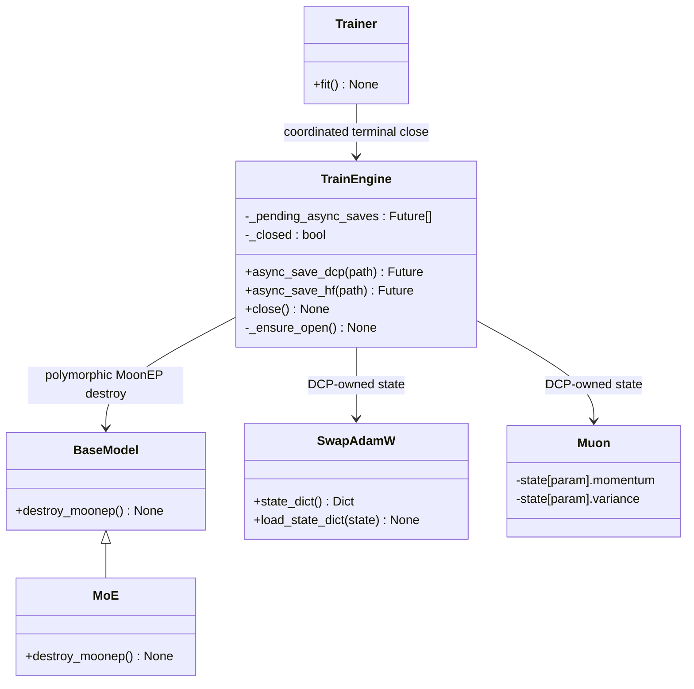

没有新增 MoonEP checkpoint/optimizer adapter。`TrainEngine` 只负责执行资源的统一终点；`BaseModel.destroy_moonep()` 是非 MoE model 的 no-op hook，MoE override 释放既有 Runtime。SwapAdamW 的 persistence view 临时恢复 DTensor placement metadata，load 后重新建立 pinned-CPU canonical state；Muon 在构造时用 `zeros_like` 建立 cold-load schema。

## 类交互和主要改动

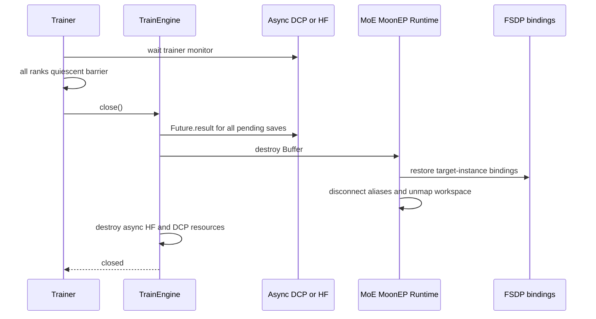

正常路径在所有 rank 的训练与异步写入均静止后进入 collective teardown；重复 `close()` 无操作，关闭后的 TrainEngine/model forward 明确报错。异常路径的 `__del__` 只发 `ResourceWarning`，不进入 barrier、CUDA synchronize、VMM unmap 或 process-group destroy。

## 其他重要细节

- dtype/ownership 未改变：checkpoint 观察 FP32 FSDP shards；运行时仍是 `FP32 shard -> BF16 AG/direct landing/compute/dW/duplicate return/RS -> FP32 shard grad -> FP32 optimizer update`。
- `SwapAdamW.state_dict()` 的 DTensor 只是 checkpoint-time persistence view，live moments 始终以 pinned CPU tensor 为 canonical owner；`load_state_dict()` 会刷新 step 实际读取的 CPU buffer map。
- Muon cold load 的真实根因是 PyTorch optimizer unflatten 只按 fresh optimizer 已存在的 state keys 恢复；构造期 materialization 保留 DTensor placement，并未在 MoonEP 路径按 optimizer type 分支。
- MoonEP Runtime/config/tests 中未引入 DSA top-k cache；router training 的 ids、weights 与 counts 保持 device-resident。
- 既有 `TestMuonFSDP` 数值 tolerance 在改动回退后仍可独立复现失败，确认不是本 Issue 引入；既有 async-HF hook 测试因当前环境未安装 FlashAttention 而在分布式退出阶段挂起，已由本 Issue 的真实 async-HF fresh-load test 覆盖目标行为。
- 结论：Issue 07 已完成 Direct MoonEP 的持久化、offload、optimizer 与显式 lifecycle 闭环，并保持 FSDP 唯一参数所有权和异常路径无 collective cleanup。

# 2026-08-06_12-01-13_Qwen3.5数值与性能最终验收

完成 Issue 08：真实 Qwen3.5-35B-A3B 在 8×H200、BF16 FSDP2×EP4、Direct landing、`torch.compile` 和 Triton grouped GEMM 下完成 MTP0/MTP1 两组 DeepEP/MoonEP 各 20-step 对照训练。验收期间修复跨 compute-rank 的 BF16 combine 舍入语义，并新增可配置的 MoonEP SM budget。主要接口为 MoonEP 的 `MoonEPCommPlan.topk_experts`、`Buffer.combine()`，XTuner 的 `MoEConfig.moonep_num_sms`、`MoonEPRuntime` 和 `AcceptanceRun`/`compare_runs()`；完整结果见 `xtuner_moonep_acceptance.md`。

## 关键单测

- 正式四次 Qwen3.5 训练均使用 pack length 65536，未使用 tiny fallback；MTP0/MTP1 的 steps 6–20 吞吐比分别为 `1.011047`、`1.009522`，超过 `0.95` 门禁。
- 两组 loss、total loss 与 global grad norm 均 finite；全部 paired curves cosine `>= 0.999997`，mean relative difference `< 0.62%`。
- MoonEP-mod public EP2/4/8 integration 每 rank `16 passed, 2 skipped`，EP4 combine kernel 每 rank `14 passed`；新增 top-k8 跨 compute-rank 红测固化 DeepEP 的 home-rank BF16 partial 语义。
- XTuner 当前提交完整 forward/MTP/Domino/SP/compile 为 `16 passed`，persistence/DCP/HF/offload/optimizer/lifecycle 为 `10 passed`，dispatcher 回归为 `13 passed, 1 skipped`，config/acceptance contract 为 `15 passed`。
- Direct profiler gate 为 `1 passed`：完整 home-weight copy、full-dW temporary、MoonEP planning 到 duplicated-gradient handoff 区间内 host sync 均为 `0`。

## 类/接口设计和主要改动

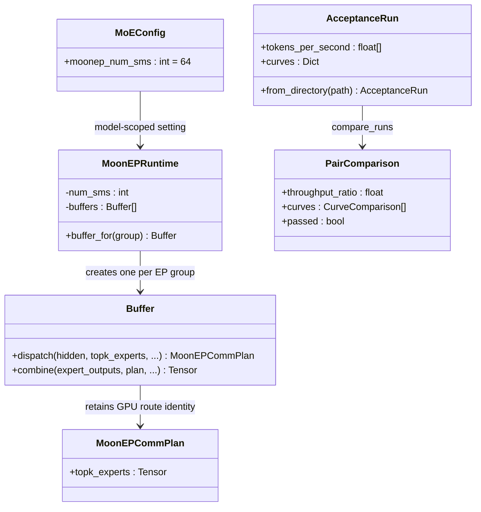

`MoonEPCommPlan` 只按引用保留原始 device `topk_experts`，没有新增 host mirror 或 device copy。`Buffer.combine()` 依据 expert home rank 与 top-k 顺序形成 BF16 local partial，再以 FP32 按 home rank 合并，从而在动态 compute placement 下保持 DeepEP grouped-GEMM 的舍入语义。XTuner 仅增加 model-scoped `moonep_num_sms` 并传给唯一 `Buffer`，不引入额外 controller。

## 类交互和主要改动

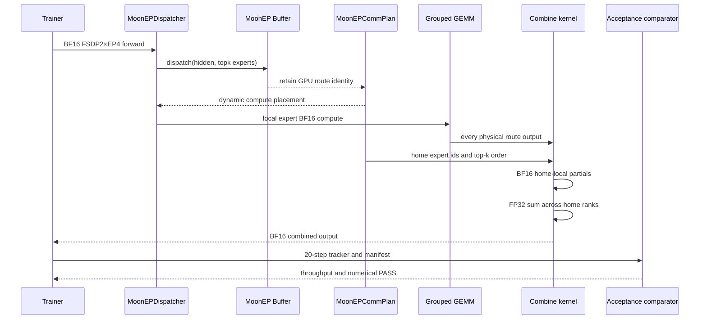

验收器从 rank0 JSONL 读取全部 step samples，丢弃前 5 个 compile/warm-up steps后计算吞吐中位数，并对相同 step 的 loss/grad-norm 曲线统一计算 finite、cosine 和 mean relative difference；manifest 同时固化 commit、实际 import 路径、完整 config、环境和 GPU 信息。

## 其他重要细节

- 真实根因是 BF16 加法非结合性，不是梯度丢失：动态 compute-rank grouping 改变了 DeepEP 原本按 expert home rank 形成 top-k partial 的舍入边界。MoonEP commit `c14bd43` 修复该语义，XTuner commit `21edfccc` 将 H200 microbenchmark 最优的 `num_sms=64` 固化为可调默认值。
- 正式 dtype/ownership 流程保持 `FP32 FSDP shard -> BF16 AG/direct landing/compute/dW/duplicate return/ReduceScatter -> FP32 shard grad -> FP32 optimizer update`；DCP 仍只观察 FSDP-owned Parameter 与 optimizer identity。
- 首版只声明 BF16、TP1、node-local EP2/4/8（性能验收 EP4）、FSDP2、训练及已覆盖的 MTP/Domino/SP；TP、FP8、跨节点、`no_sync`、PP、decoding 和 XTuner 自管 expert+DCP 适配仍为待办。
- 结论：Issue 08 的数值、性能、回归和无 host sync 门禁全部通过，MoonEP 接入达到第一版 Definition of Done。
