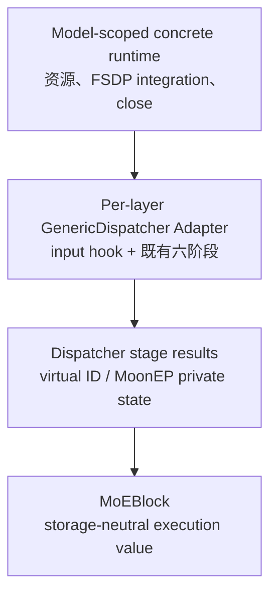
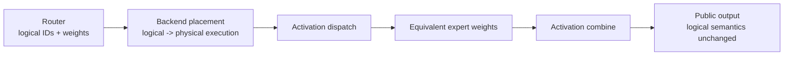
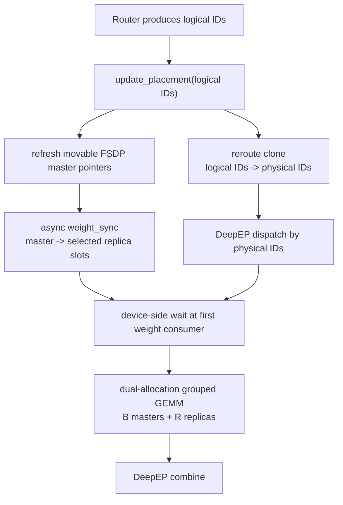
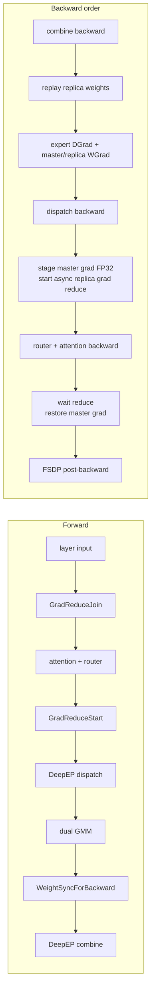
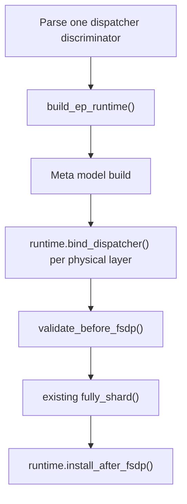
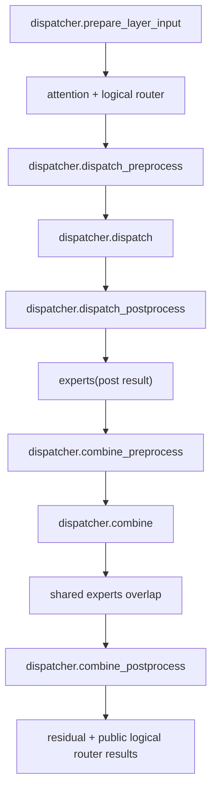
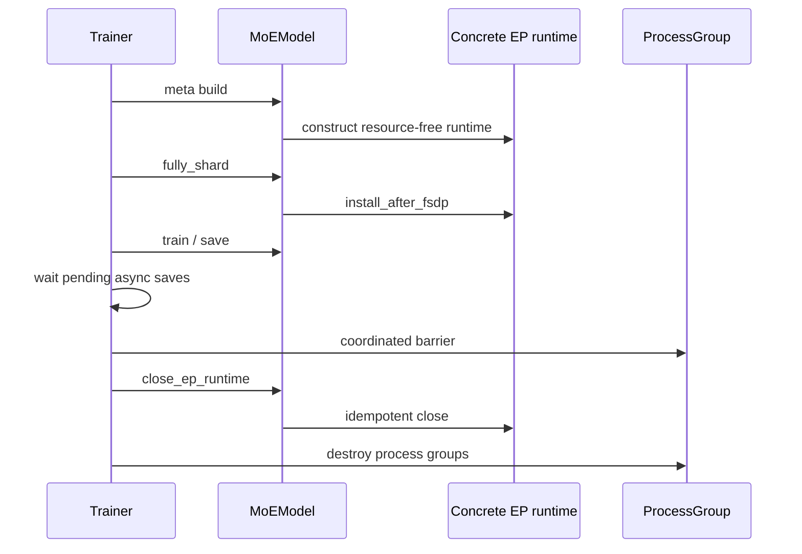

# XTuner 动态 EP 扩展统一设计

## 总结

MoonEP 与 UltraEP 都在保持 logical routing 和 FSDP 参数所有权不变的前提下，动态改变 expert 的物理执行位置；但二者的 placement、weight layout、activation transport 和重复梯度归并方式并不相同。因此，统一点应放在 XTuner 已有的 Dispatcher Seam，而不是新造调用 façade 或低层 placement/kernel 抽象。

目标结构只保留两个行为层，调用状态继续走 Dispatcher 已有 stage results：



核心决策如下：

1. 保留 `GenericDispatcher` 的六阶段作为 activation dispatch/combine 的唯一 Seam。
2. 只给 Dispatcher 增加默认恒等的 `prepare_layer_input()`。UltraEP 用它在 attention 前放置 backward join 并返回 `virtual_layer_id`；它不包装六阶段，也不是第七个通信阶段。
3. `MoEDecoderLayer` 直接调用六阶段并传递 stage results，不新增 routed-expert invocation façade。
4. `UltraEPDispatcher` 包装现有 `DeepEPDispatcher`，把 placement、weight sync、reroute、dual-weight execution 和三个 backward ordering node 全部收进 Adapter；调用状态由 external Manager 的 `virtual_layer_id` 索引。
5. `MoonEPDispatcher` 保留自己的 Buffer、VMM、plan、`_MoonEPInvocation` 和三个 autograd Function；该 private state 从 `dispatch` result 传到后续阶段。
6. Router 是 logical `tokens_per_expert[E]` 的唯一生产者；Dispatcher 输出的 counts 只描述本 rank 的物理执行 groups。
7. `MoEBlock` 只接收 storage-neutral execution value，普通 FP8/CUTLASS/NPU 路径仍调用原有 public API。
8. MoonEP 与 UltraEP 各自使用 concrete model-scoped runtime，共用同形 lifecycle，但不新增只含抽象声明的基类；runtime 在 process group 销毁前显式关闭。

## 1. 目标与非目标

### 1.1 目标

- 让普通 EP、DeepEP、MoonEP、UltraEP 共用一条线性的 decoder 调用流程。
- 最大限度复用已有六阶段 Dispatcher Implementation 和 DeepEP transport。
- 隔离 logical routing、physical execution 和参数所有权，避免 physical IDs 泄漏到 router loss、日志或 public return。
- 用同一调用端表达 backend 已声明支持的 in-flight 宽度；支持并发的 backend 必须隔离 state，不支持的 backend 必须在进入不安全调度前 fail fast。
- 保持 FSDP 是 master parameters、optimizer state 和 checkpoint 的唯一 owner。
- 保持 `torch.compile` 的 tensor compute path；runtime/plan/event 等 Python control state 不传入 compiled expert graph。
- 保持现有普通 expert substitutes 的 public Interface，不把 MoonEP/UltraEP kwargs 无条件传给 TileWise FP8、CUTLASS 或 NPU 实现。

### 1.2 非目标

- 不统一 MoonEP 与 UltraEP 的 placement 算法。
- 不统一 MoonEP VMM `[2B]` layout 与 UltraEP master/replica 双 allocation layout。
- 不让 MoonEP 经由 DeepEP transport；MoonEP Buffer 仍同时拥有 plan、dispatch 和 combine。
- 不把两套 backward 机制压成一个可选方法很多的 `PlacementProtocol`。
- 不改变 router 的 top-k 数学语义，不让 replica 成为新模型参数。
- 不在本设计中放宽未经真实训练验证的 dtype、TP、DP、MTP 或 recompute 支持范围。

## 2. 两种动态 EP 的总体原理

### 2.1 共同问题：logical load 与 physical execution 解耦

普通 Expert Parallelism 将每个 logical expert 固定放在一个 rank。router 每个 microbatch 产生的 top-k 分布是动态的；当少数 expert 变热时，吞吐由最忙 rank 决定。

MoonEP 和 UltraEP 都不改变 router 选中了哪个 expert，而是在 router 之后为同一数学计算选择更合适的物理执行位置：



两者都必须满足三个不变量：

1. 对任意 physical instance `p`，其执行 weight 等于 placement 指向的 logical master：

   ```text
   W_physical[p] = W_master[physical_to_logical[p]]
   ```

2. router logits、top-k weights、aux loss 和对外返回的 IDs 始终是 logical 语义。
3. 一个 logical expert 的所有 physical WGrad 必须在 FSDP 开始该参数的 ReduceScatter 前归并回唯一 master gradient。

### 2.2 MoonEP 原理

MoonEP 是完整 execution backend，而不只是 activation dispatcher：

- FSDP 仍拥有 home expert parameters；direct landing 将 FSDP AllGather 输出直接落入 MoonEP VMM workspace。
- MoonEP plan 同时决定 activation dispatch、global duplicated weight view、local contiguous `[2B]` expert view 和 combine。
- 当前 rank 的 expert compute 读取本 invocation 对应的 `[2B]` weights，并将 WGrad 直接写入该 invocation 独占的 gradient slot。
- backward 使用同一 plan 重放 activation 与 weight routing；duplicated BF16 WGrad 先做 exact SUM 回 home rows，再交给 FSDP。
- model-scoped runtime 共享 Buffer/VMM 资源；每次调用独占 plan、events 和 gradient slot。

因此 MoonEP 的 placement 不能被降格为一个只返回 physical IDs 的接口：plan 还同时控制 weight alias、activation transport 和 backward replay。

### 2.3 UltraEP 总体原理

#### 2.3.1 它均衡的是执行负载，不是 router 决策

设：

- `E`：模型拥有的 logical experts 数量；
- `P`：EP world size；
- `B = E / P`：每 rank 固定拥有的 master experts 数量；
- `R`：每 rank 的 reusable replica slots 数量。

UltraEP 的 physical expert 总数为：

```text
E_physical = E + P * R
local physical groups = B master groups + R replica groups
```

Global physical IDs 按 rank 分块，每块固定为 `[B masters, R replicas]`，而不是先排满全局 `E` 个 masters 再追加 replicas。logical expert `e` 的固定 master physical ID 为：

```text
rank_block = B + R
master_physical_id(e) = (e // B) * rank_block + (e % B)
replica IDs on rank p = [p * rank_block + B, p * rank_block + B + R)
```

因此 global master IDs 会被每个 rank 的 replica gap 交错。总计仍有 `E` 个固定 master instances 和 `P*R` 个 runtime replica slots。某个 replica slot 在不同 layer 或调用中可以承载不同 logical expert，因此它不进入 Parameter、optimizer 或 checkpoint。

router 完成后，UltraEP 根据本次精确负载建立：

- `physical_to_logical`：每个 physical instance 当前执行哪个 logical expert；
- `logical_to_physical`：一个 logical expert 当前有哪些等价 instances；
- quota：同一 logical expert 的 tokens 如何分摊到 master 与 replicas。

原始 logical IDs 不修改；只 clone 一份供物理执行使用。

#### 2.3.2 Forward：placement、weight sync 与 DeepEP dispatch 重叠



详细顺序为：

1. Router 正常输出 logical `topk_ids`、`topk_weights` 和 `tokens_per_expert[E]`。
2. `prepare_layer_input` 已为本 physical layer 分配受 active-call guard 保护的 `virtual_layer_id`；`dispatch_preprocess` 再根据 logical IDs 更新这个 ID 对应的 placement。
3. FSDP 每次 unshard 后参数 data pointer 可能变化；runtime 在发起同步前刷新 manager 看到的 master pointers。
4. `weight_sync(async_finish=True)` 将本次需要的 master FC1/FC2 weights 分发到 replica buffers。
5. `reroute` 只改写 logical IDs 的 clone，按 quota 将 hot expert tokens 分给多个 physical instances。
6. 内层 `DeepEPDispatcher` 以 `E + P*R` 为专家总数执行 dispatch。DeepEP 通信与 replica weight sync 并行。
7. `dispatch_postprocess` 在 expert 第一次读取 replica weights 前执行 device-side event wait；不做 host synchronize。
8. local counts 的 group 顺序固定为 `[B masters, R replicas]`。dual grouped GEMM 直接读取两块 allocation，不做 `cat()` 或热路径 snapshot。
9. expert output 继续走原 DeepEP combine，最终回到 token 原 rank。

前向数学等价性来自：

```text
y(token)
  = sum(gate_weight * Expert(x, W_physical[physical_id]))
  = sum(gate_weight * Expert(x, W_master[logical_id]))
```

#### 2.3.3 Backward：replay、异步 grad reduce 与 attention 重叠

Replica storage 会被后续 layer 调用复用。当前 layer backward 执行 expert DGrad 时，forward 使用过的 replica weights 可能已被覆盖，所以不能只保存 tensor pointer；三个 autograd nodes 必须捕获同一 `virtual_layer_id`，并在正确的图边重放 weight sync。

三个 identity autograd nodes 的位置如下：



- `WeightSyncForBackward` 位于 expert output 之后。反向经过 combine 后先按 `virtual_layer_id` blocking replay 本次调用的 replicas，再允许 dual GMM 读取 weights 做 DGrad。
- dual GMM 对 master groups 正常返回 WGrad；replica groups 的 WGrad 写入 manager-owned FP32 grad buffers。
- `GradReduceStart` 位于 dispatch input。它的 backward 在 expert 与 dispatch backward 完成后触发，将 master BF16 grad stage 到 FP32，并按 forward placement 启动 replica-to-master reduce。
- `GradReduceJoin` 位于 attention 前的 layer input。它的 backward 在 router/attention backward 后等待 reduce event，把完成的 master gradient cast/copy 回 FSDP-owned grad，再允许 FSDP post-backward 前进。

这三个节点是 UltraEP 的 ordering Implementation。它们直接捕获 `(UltraEPDispatcher, virtual_layer_id)`；Decoder 只看到一次 `prepare_layer_input()` 和既有六阶段，不需要 `_UltraEPInvocation`。

#### 2.3.4 官方 replica layout 必须作为 kernel contract

UltraEP 的 FC1/FC2 replicas 可以是同一块 per-expert storage 上的 strided views。`R >= 2` 时，expert 内部维度连续，但相邻 expert 的 `stride(0)` 可能包含另一 projection 的间隔，因此不能要求整个 tensor contiguous。

目标 dual kernel 必须显式使用：

```text
replica_expert_stride = replica_weight.stride(0)
```

不应在 hot path 调用 `.contiguous()`；这会产生每层、每 microbatch 的完整 replica copy，并抵消删除 snapshot 的收益。在 stride-aware kernel 合入前，配置入口必须 fail fast 限制 `R == 1`，不能声称支持任意正数。

### 2.4 共同点与不可统一点

| 维度 | MoonEP | UltraEP | 统一位置 |
| --- | --- | --- | --- |
| Router semantics | logical IDs | logical IDs | Router result |
| Placement | `_MoonEPInvocation` opaque plan | Manager state keyed by `virtual_layer_id` | Dispatcher stage results |
| Activation transport | MoonEP Buffer | DeepEP | Dispatcher 六阶段 |
| Local groups | contiguous `[2B]` | `[B masters, R replicas]` | `dispatch_postprocess` result |
| Weight materialization | VMM prefetch/alias | manager weight sync | `dispatch_postprocess` completion |
| Expert weights | private-state override | module master + replica allocation | tensor-only execution value |
| Duplicate WGrad | BF16 exact SUM | FP32 replica-to-master reduce | completion-before-FSDP invariant |
| Runtime owner | concrete `MoonEPRuntime` | concrete `UltraEPRuntime` | 同形 lifecycle，无公共基类 |
| Backward mechanism | MoonEP private autograd trio | UltraEP replay/start/join trio | 不统一 Implementation |

## 3. 统一架构

### 3.1 两层行为作用域

#### Model-scoped concrete runtimes

`MoonEPRuntime` 与 `UltraEPRuntime` 直接实现同形 lifecycle，不新增 `EPExecutionRuntime` ABC：

```python
runtime.bind_dispatcher(layer_fqn, experts) -> GenericDispatcher
runtime.validate_before_fsdp(model, fsdp_config) -> None
runtime.install_after_fsdp(model, fsdp_config) -> None
runtime.close() -> None
```

- `MoonEPRuntime` 持有 Buffer、VMM workspace、FSDP landing 和 generation registrations。
- `UltraEPRuntime` 合并原 Manager Adapter 的模型级职责，唯一拥有 external Manager、FP32 staging、replica storage、layer registrations 和 explicit teardown；per-call external calls 直接留在已有 `UltraEPDispatcher` Adapter。
- 普通 Dispatcher 不需要 runtime，继续由现有 factory 直接构建。
- constructor 只做 resource-free metadata/capability validation；任何 CUDA/network resource 都在 FSDP topology 明确后安装。
- `close()` 幂等，并且必须在 EP/default process group 销毁前协调调用。

两个 concrete runtime 都是有 Depth 的 Module：删除任意一个都会把 backend 初始化、FSDP integration、resource ownership 和 teardown 重新散到 model、layer 与 engine。公共 ABC 只有声明、没有共享 Implementation，删除它只把 model annotation 改为 union，不会让复杂度重现。

#### Per-layer `GenericDispatcher` Adapter

现有六阶段保持原名和原顺序：

1. `dispatch_preprocess`
2. `dispatch`
3. `dispatch_postprocess`
4. `combine_preprocess`
5. `combine`
6. `combine_postprocess`

`UltraEPDispatcher` 是 `DeepEPDispatcher` 的 Adapter；`MoonEPDispatcher` 是 MoonEP Buffer 的 Adapter。Decoder 不知道两者内部使用哪个 transport。

调用端直接保存六阶段已有的 result dictionaries：

```python
layer_input, layer_state = dispatcher.prepare_layer_input(layer_input)
pre = dispatcher.dispatch_preprocess(..., layer_state=layer_state)
dispatched = dispatcher.dispatch(pre_dispatched=pre, ...)
post = dispatcher.dispatch_postprocess(pre_dispatched=pre, dispatched=dispatched)
expert_out = experts(
    post["hidden_states"],
    post["tokens_per_expert"],
    execution=post["expert_execution"],
)
pre_combined = dispatcher.combine_preprocess(...)
combined = dispatcher.combine(...)
output = dispatcher.combine_postprocess(...)["hidden_states"]
```

这就是当前 Dispatcher Interface 的显式数据流，没有新 façade：

- 普通、All2All 和 DeepEP 的 `layer_state` 为 `None`。
- MoonEP 在 `dispatch()` 创建既有 `_MoonEPInvocation`，并把它放在 `dispatched` result；后续阶段从同一 result 读取。
- UltraEP 的 `layer_state` 只是 `int virtual_layer_id`；phase 1 再把它和 weight-sync event 放进 `pre` result。
- Domino 继续维护 `pre_dispatched_list`、`dispatched_list` 等现有列表，不维护另一套 façade 列表。
- Dispatcher 不保存 `last_plan`、`last_slot` 或 `last_event`。

### 3.2 为什么仍需要 `prepare_layer_input()`

UltraEP 的 grad-reduce join 必须位于 attention 前，而 router-dependent placement 只能在 attention/router 后计算。六阶段全部位于 router 后，无法诚实表达这个图边界。

`prepare_layer_input(layer_input)` 只负责：

- 普通、All2All、DeepEP 和 MoonEP 默认返回 `(layer_input, None)`；
- UltraEP 分配受 active-call guard 保护的 `virtual_layer_id`；
- UltraEP 返回 `(_GradReduceJoin.apply(layer_input, dispatcher, virtual_layer_id), virtual_layer_id)`。

`layer_state` 只作为显式参数进入 `dispatch_preprocess`，随后由 stage result 继续携带。这个 hook 不发起 activation communication、不包装六阶段，也不定义新的调用对象，因此不是第七个 dispatch 阶段。

### 3.3 Router-owned counts

当前 Router 已计算 histogram，但字段仍错拼为 `topkens_per_expert`，MoonEP 又在 `dispatch_preprocess` 对 `topk_ids` 做一次 `bincount`。统一方案直接改为：

```python
class RouterResults(TypedDict):
    topk_ids: Tensor
    topk_weights: Tensor
    tokens_per_expert: Tensor  # [E], logical/source counts, device resident
```

并将 `tokens_per_expert` 设为所有 Dispatcher `dispatch_preprocess` 的必传参数：

- MoonEP 直接转为 contiguous int32 交给 Buffer plan；
- UltraEP external API 从 logical IDs 推导 placement；统一 counts 参数仍向内层 DeepEP 传递，但不被 UltraEP 重新解释；
- DeepEP/All2All/AGRS 第一阶段可接收并忽略 source counts，不改变其 received/local count Implementation。

不要保留错拼 alias。Router count 与 `dispatch_postprocess` 返回的 local execution count 是两个不同作用域：

| 名称位置 | shape | 语义 |
| --- | --- | --- |
| `RouterResults.tokens_per_expert` | `[E]` | 本 source batch 的 logical counts |
| `post_dispatched["tokens_per_expert"]` | backend-dependent | 本 rank expert compute group counts |

### 3.4 Storage-neutral expert execution Interface

`dispatch_postprocess` 继续返回现有 result dictionary，只固定三个供 expert compute 使用的 key：

```python
post_dispatched = {
    "hidden_states": Tensor,
    "tokens_per_expert": Tensor,
    "expert_execution": ExpertExecution | None,
}
```

不新增 `ExpertBatch`。`expert_execution is None` 表示完全保留旧 expert call；扩展路径用一个两元素 tuple 分别描述 gate-up 和 down projection：

```python
ProjectionExecution(
    primary_weight: Tensor | None,
    primary_grad_out: Tensor | None,
    secondary_weight: Tensor | None,
    secondary_grad_out: Tensor | None,
)

ExpertExecution: TypeAlias = tuple[ProjectionExecution, ProjectionExecution]
```

含义为：

- `primary_weight is None`：使用 `GroupedLinear.weight`；否则使用 backend private state 提供的 override。
- `primary_grad_out`：可选 direct WGrad target。
- `secondary_weight`：存在时启用 dual-allocation grouped GEMM。
- `secondary_grad_out`：secondary groups 的 WGrad target。

三条路径映射如下：

| Backend | primary | primary dW target | secondary | secondary dW target |
| --- | --- | --- | --- | --- |
| 普通/DeepEP | `execution=None`，走旧 public call | - | - | - |
| MoonEP | local `[2B]` VMM weight | invocation BF16 grad slot | None | None |
| UltraEP | None，即 module master `[B]` | None，由 autograd 返回 | strided replica `[R]` | manager FP32 replica grad buffer |

`MoEBlock` 不判断 backend 名称。它只在 `execution is None` 时调用现有 projection public Interface；扩展配置在构建时已经验证使用支持 execution 的 BF16 `GroupedLinear`。这样 TileWise FP8、CUTLASS 和 NPU substitutes 不会收到新 kwargs。

扩展 `GroupedLinear` 的单一深接口为 `forward_with_execution()`：

- 无 secondary 时复用现有 single-allocation GMM；只有 `primary_grad_out` 非空时才进入 direct-output capability。
- 有 secondary 时调用 dual GMM，按 `primary.shape[0]` 切分 counts，并原生消费 `secondary.stride(0)`。
- 不为只有一个生产实现的路径新增 `UltraEPGroupedLinear Protocol`。

### 3.5 `UltraEPDispatcher` 对六阶段的映射

| 生命周期/阶段 | UltraEP 行为 | 复用 |
| --- | --- | --- |
| `prepare_layer_input` | allocate `virtual_layer_id`；在 layer input 放置 grad-reduce join | Dispatcher 默认 hook |
| `dispatch_preprocess` | placement；refresh pointers；async weight sync；clone/reroute logical IDs；放置 grad-reduce start | delegate DeepEP preprocess |
| `dispatch` | physical IDs dispatch | delegate DeepEP |
| `dispatch_postprocess` | delegate permutation/counts；首次 consumer device wait；返回预绑定的 dual execution tuple | delegate DeepEP postprocess |
| `combine_preprocess` | 在 expert output 放置 backward weight replay | delegate DeepEP preprocess |
| `combine` | physical result combine | delegate DeepEP |
| `combine_postprocess` | 返回 routed output；no-grad 时释放 active-call guard | delegate DeepEP postprocess |

不新增 `_UltraEPInvocation`。external Manager 本来就以 `virtual_layer_id` 索引 placement、replica mapping 与 gradient state，额外对象只会重复这张索引表。phase 1 的 result 明确携带唯一需要向后传的两个值：

```python
pre_dispatched = {
    "inner": deep_ep_pre_dispatched,
    "_virtual_layer_id": virtual_layer_id,
    "_weight_sync_event": weight_sync_event,
}
```

三个 private autograd Function 捕获 `(UltraEPDispatcher, virtual_layer_id)`：replay 与 grad-reduce 都回到同一个 Manager slot；grad-reduce event 由 `UltraEPRuntime` 按 ID 保存，Join backward 取出 event、恢复 FSDP grad 并释放 active guard。`UltraEPDispatcher` 不保存 `last_slot`、`last_placement` 或 `last_event`。

### 3.6 `MoonEPDispatcher` 的适配

MoonEP 现有 Deep Modules 保留：

- `MoonEPRuntime`
- `ExpertVMMWorkspace`
- `_MoonEPInvocation`
- `MoonEPDispatcher`
- FSDP-to-VMM landing Adapter

只做以下 contract 收敛：

1. 使用 Dispatcher 默认恒等的 `prepare_layer_input()`，不提前创建 state。
2. `dispatch_preprocess` 直接消费 Router 的 `tokens_per_expert`，删除第二次 `bincount`。
3. `dispatch` 按静态 gradient ring ordinal 创建 fresh `_MoonEPInvocation`，并放入 `dispatched` result。
4. `dispatch_postprocess` 将原 `expert_tensors` 嵌套 tuple 改为 tensor-only execution tuple。
5. Decoder 不再 `.get("expert_tensors")`，后续阶段从 `dispatched` result 读取 private invocation。
6. model/engine 通过通用 `close_ep_runtime()` lifecycle，而不是 concrete `destroy_moonep()`。

MoonEP 内部 `_DispatchAutograd`、`_CombineAutograd`、`_ExpertWeightAutograd` 继续保持独立 Implementation。UltraEP 的 FP32 grad reduce 不能替代 MoonEP 的 BF16 exact SUM。

### 3.7 配置与 factory

建议让 dispatcher selector 表达完整 execution Adapter：

```python
dispatcher: None | "naive" | "all2all" | "deepep" | "moonep" | "ultraep"
```

`dispatcher="ultraep"` 内部固定包装 DeepEP；不要使用 `dispatcher="deepep" + ultraep_cfg!=None` 作为 overlay，否则 Decoder/factory 必须同时解释两套互相依赖的开关。

配置构建顺序：



- `moonep`：创建 `MoonEPRuntime`，每层返回 `MoonEPDispatcher`。
- `ultraep`：创建 `UltraEPRuntime`，每层内部先创建 physical-count `DeepEPDispatcher`，再用 `UltraEPDispatcher` 包装。
- 其他值：不创建 execution runtime，走现有 dispatcher factory。

Capability validation 必须在任何 FSDP mutation/CUDA resource allocation 前集中完成。首版 UltraEP 继续明确拒绝尚未验证的组合；`R` 的公开范围必须与 stride-aware kernel 能力一致。

UltraEP v1 的写实边界为：BF16、EP>1、expert TP1、DP1、bias-free、`intra_layer_micro_batch=1`，并禁用 MTP 与 activation recompute。同一 physical layer 只允许一个尚未完成 backward 的调用；第二个 independent graph 必须在 `prepare_layer_input` fail fast。统一调用端能表达更宽调度，但不代表 UltraEP v1 已支持它。

以后放宽 UltraEP microbatch/outstanding-graph 限制，不能只增加 placement slots。external Manager 必须为每个 in-flight ID 隔离 replica weight views、replica grad buffers、FP32 master staging/reduce state，并证明多次调用对同一 master gradient 的累积语义；否则后一次 weight sync 会在第一次 expert compute 前覆盖共享 replica storage。

## 4. 调用端主流程

### 4.1 单 microbatch



Decoder 的业务代码直接保存并传递 `pre_dispatched`、`dispatched`、`post_dispatched`、`pre_combined` 和 `combined`，不读取 backend-private state，也不按 backend 分支。

### 4.2 Domino/microbatch

对声明支持 intra-layer concurrency 的 backend，Domino 通过保存多组 stage results 交错推进相同六阶段：

1. 对每个 microbatch 调用 `prepare_layer_input -> attention/router -> dispatch_preprocess`，保存 `pre_dispatched_list`。
2. 对每组 pre result 调用 `dispatch -> postprocess -> experts -> combine_preprocess`，保存对应 result lists。
3. 对每组 result 启动 `combine`。
4. 计算 shared experts。
5. 对每组 result 调用 `combine_postprocess` 并汇总。

每组 stage results 携带自己的 backend-private state，但 storage policy 由 backend 决定：

- MoonEP v1 只在同一个 active training graph 内支持已配置宽度的 Domino，按确定性 ordinal 使用静态 gradient ring；第二个 independent graph 不属于 v1 client contract，应由 Trainer/PP scheduler 的配置边界拒绝。热路径不新增动态 completion tracker、event query 或 host guard。
- UltraEP v1 的 replica weight/grad storage 是共享的，因此只允许 microbatch1 和每个 physical layer 一个 active call。virtual placement slot 本身不能证明 tensor storage 隔离。
- 普通/DeepEP 继续沿用各自已声明的调度能力。

### 4.3 MTP 与 checkpoint replay

- 对声明支持 MTP 的 backend，每个 logical depth 调用一次 `prepare_layer_input`，即使多个 depth 共享同一 physical layer/Dispatcher；UltraEP v1 在配置边界拒绝 MTP。
- reentrant checkpoint original forward 在 no-grad 路径完成并释放自己的 forward-only state。
- replay forward 创建 fresh backend plan/virtual ID，不复用 original metadata；backend 可在 original forward-only state 已结束后复用静态 storage ordinal。
- backend 未正式验证该组合时，在 `validate_before_fsdp` 拒绝，而不是在热路径猜测降级。

## 5. 所有权、生命周期与持久化

### 5.1 参数与 runtime state

| State | Owner | state_dict/optimizer |
| --- | --- | --- |
| Logical master parameters | FSDP Module | 是 |
| Master gradients after backend completion | FSDP | 是 |
| MoonEP VMM weights/grad slots | MoonEPRuntime | 否 |
| UltraEP replica weights/grad buffers | UltraEPRuntime | 否 |
| Placement/plan/events | Dispatcher stage results + backend runtime | 否 |
| Router logits/weights/IDs | current forward graph | 正常 autograd/public semantics |

Replica/VMM tensors不应 `register_parameter` 或 `register_buffer`。DCP/HF 只保存 FSDP-owned state；恢复后用 fresh runtime，在首次 forward 重新物化 transient execution state。

### 5.2 生命周期



UltraEP external Manager 由 `UltraEPRuntime` 以 explicit-destroy 模式创建；删除 Provider 与全局 `_MANAGERS` 双缓存。Python destructor 只能告警，不能在 rank-divergent 路径进入 collective teardown。

## 6. 文件级落地方案

| 文件/Module | 主要改动 |
| --- | --- |
| `router/protocol.py`, `router/greedy.py` | 规范字段 `tokens_per_expert` |
| `dispatcher/base.py` | 默认恒等 `prepare_layer_input`；preprocess 必传 logical counts 与 `layer_state`；post result 固定 `expert_execution` key |
| `dispatcher/moonep.py` | 复用 Router counts；输出 `ExpertExecution`；接入 common lifecycle |
| `dispatcher/ultraep.py` | 新增包装 `DeepEPDispatcher` 的 Adapter；直接用 `virtual_layer_id` 和 stage results，不新增 invocation class |
| `ultraep/runtime.py` | concrete model-scoped manager owner、FP32 staging、layer registration、explicit close；无 Provider/全局 registry/公共基类 |
| `decoder_layer/moe_decoder_layer.py` | 直接调用 input hook + 六阶段；删除 backend 分支和 `.get("expert_tensors")` |
| `grouped_linear/moe_group_linear.py` | 保留旧 `forward`；新增仅动态 BF16 路径调用的 `forward_with_execution` |
| dual GMM op | 支持 master/strided-replica 两 allocation 与 explicit replica expert stride |
| MoE model/factory | 单 discriminator；runtime build/bind/validate/install/close |
| `TrainEngine.close()` | 通用 `close_ep_runtime()`，保持 save/barrier/process-group 顺序 |

建议按以下顺序实施，以保持每一步可验证：

1. 先恢复 Router-owned counts，并让 post result 固定返回 `expert_execution`；普通路径值为 `None`，行为不变。
2. 给 Dispatcher 增加默认恒等 `prepare_layer_input`，让 Decoder 单 microbatch 与 Domino 直接传递既有 stage results。
3. 将当前 MoonEP 的 private invocation 放进 `dispatched` result，完整回归既有 MoonEP public behavior。
4. 实现 model-scoped `UltraEPRuntime` 与包装 DeepEP 的 `UltraEPDispatcher`。
5. 实现 stride-aware dual GMM；在此之前配置只允许真实支持的 `R`。
6. 删除 Decoder UltraEP branches、Provider/global registry 和专用 expert Protocol。

## 7. 验证方案

测试 public Interface 和真实代码路径，不通过 mock XTuner 内部 Module 固化实现细节。

### 7.1 Contract tests

1. 参数化普通、DeepEP、MoonEP、UltraEP 的完整 Dispatcher 六阶段；验证 public logical IDs 不变，physical IDs 不出 Dispatcher。
2. Router 生成规范 `tokens_per_expert[E]` 并传给所有 Dispatcher；MoonEP 不再重复扫描 IDs。
3. `ExpertExecution=None` 时运行现有 TileWise FP8、CUTLASS 和 NPU public forward/backward，证明旧 substitute Interface 未被污染。
4. MoonEP single-allocation override/direct-dW 与 UltraEP dual-allocation execution 分别覆盖两次 projection。

### 7.2 UltraEP correctness

1. 用 external Manager 同构 storage 构造 `R=2` strided FC1/FC2 views，验证 dual GMM forward、DGrad、master WGrad 和 replica WGrad。
2. 完整 `MoEConfig.build -> forward -> backward -> optimizer.step`，与无 UltraEP 的 DeepEP reference 比较 output、loss、input/router/master expert gradients 和 updated FSDP shards。
3. 验证 weight sync 与 reroute 使用同一 `virtual_layer_id`；故意跨 layer call 覆盖 replica storage 后，backward replay 仍恢复正确 weights。
4. UltraEP v1 的第二个 outstanding same-layer call 必须在 public Interface fail fast。未来只有在 weight、grad、FP32 staging 与 master accumulation 都实现 per-ID 隔离后，才能把测试改成并发数值正确。
5. 真实 FSDP2×EP 路径验证 UltraEP grad completion 先于 FSDP post-backward/ReduceScatter。

### 7.3 MoonEP regression

- 保留 Direct FSDP-to-VMM landing、Fixed-S、two-generation、Domino micro2、MTP/reentrant replay、SP 和 BF16 exact duplicate-grad completion 的现有测试。
- 增加 Router count public path，并用 profiler 证明 MoonEP planning 不再出现第二个 histogram kernel；不要 mock `torch.bincount` 调用次数。
- 保持 DCP/HF cold-runtime restore 与 coordinated close。

### 7.4 Lifecycle、compile 与性能

- 显式 close 后在同一 process group 中重建不同 shape 的 runtime，不命中 stale global manager。
- `MODEL_COMPILE=1` 下只让 tensor `ExpertExecution` 进入 expert graph；plan/runtime/event 留在 eager control plane。
- 测试 no-grad、reentrant original/replay 与 capacity exhaustion 的 backend-specific state cleanup；不把 MoonEP 静态 ring 描述为动态 lease/release，也不依赖 Dispatcher `last_*` fields。
- 分别记录 DeepEP、MoonEP、UltraEP 的 dispatch、weight materialization、expert compute、combine 和 backward completion ranges；性能 gate 绑定当前 commit 和同一 workload。

## 8. 抽象质量与 deletion test

| 候选 Module/contract | 删除后的结果 | 评价 |
| --- | --- | --- |
| `RoutedExpertInvocation` | Decoder 直接保存现有五组 stage results，没有复杂度在别处重现 | 对六阶段逐一浅转发，删除 |
| `ExpertBatch` | 直接读取 post result 的三个既有 key | 重复 value carrier，删除 |
| `EPExecutionRuntime` ABC | model annotation 变成两个 concrete runtime 的 union | 只有声明、没有共享 Implementation，删除 |
| `UltraEPLayerBinding` | `UltraEPDispatcher` 直接持有 `layer_id` 与 experts | 三字段 carrier，删除并内联 |
| `UltraEPManagerAdapter` | model-scoped ownership/staging/teardown 合入 runtime，phase calls 留在 `UltraEPDispatcher` | 额外 forwarding layer 没有 Depth；合并后 Locality 更清楚 |
| `_UltraEPInvocation` | `virtual_layer_id`、pre result 与 runtime event table 已覆盖全部状态 | 重复 external Manager 的索引模型，删除 |
| `ExpertExecution` class | 改为 `tuple[ProjectionExecution, ProjectionExecution]` 类型别名 | 两字段 value class 没有额外语义，降级为 alias |
| `iter_ultraep_dispatchers(model)` | runtime 遍历自己在 bind 时登记的 Dispatcher | 重复扫描 model，删除 |
| `ProjectionExecution` | 四个 optional tensors 退化为含义不明的 positional tuple/backend kwargs | tensor contract 有明确 Depth，保留 |
| concrete MoonEP/UltraEP runtimes | 初始化、FSDP integration、resource ownership 与 close 散入 model/engine | 小 Interface 隐藏多条规则，Depth、Leverage、Locality 都高，保留 |
| `_MoonEPInvocation` | plan、events、gradient slot、replay/completion 散回六阶段 | 既有领域 Module，保留 |
| MoonEP/UltraEP Dispatcher | transport、placement 与 ordering 分支回到 Decoder | 真实 Adapter 与稳定 Seam，保留 |
| 三个 UltraEP autograd Function | 三个不同 backward graph edge 无处表达 | 每个隐藏必要 ordering Implementation，保留 |
| global Manager registry | 单模型调用端不需要增加任何替代逻辑 | 没通过 deletion test，应删除 |
| common `PlacementProtocol` | 两个 backend 仍需大量 type checks/optional methods | hypothetical Seam，不应新增 |

## 9. 被拒绝的方案

### 9.1 统一低层 `PlacementProtocol`

拒绝。MoonEP plan 拥有 activation transport 与 VMM alias，UltraEP placement 只装饰 DeepEP physical IDs。公共 Protocol 会充满只对一侧有意义的 optional methods，降低 Depth。

### 9.2 在 Decoder 中叠加 `if ultraep`

拒绝。placement、event wait、three autograd nodes 和 dual weights 会散布在六阶段之间；删除 `UltraEPDispatcher` 后正是这种复杂度重新出现，说明 Adapter 是有价值的 Seam。

### 9.3 把 UltraEP replica 拼到 master weight

拒绝。`cat()` 或 `.contiguous()` 会引入每层、每 microbatch 的 weight copy，破坏 external strided storage contract，并缩短 weight-sync/dispatch 可重叠区间。

### 9.4 在 Dispatcher 保存 `last_*` 调用状态

拒绝。Domino、MTP、checkpoint replay 和两个 outstanding graphs 都会出现 last-plan-wins。MoonEP private state 放在 `dispatched` result；UltraEP 使用 `virtual_layer_id` 和 keyed event table。Dispatcher 只保留 per-layer binding，不保留“最近一次”调用状态。

### 9.5 全局 UltraEP Manager registry

拒绝。单模型 runtime 已有唯一 owner；删除 registry 不会让复杂度在调用端重现，因此它未通过 deletion test，并且会破坏同进程重建与显式 teardown。

## 10. 最终方案

最终接入形态是：每个动态 backend 用一个 concrete model-scoped runtime 管资源，每个 routed-expert layer 用一个 Dispatcher Adapter 复用既有六阶段；Decoder 直接传递 stage results，只有 UltraEP 通过默认 input hook 补上 attention 前的 ordering edge。

MoonEP 直接实现 Dispatcher Seam，并在 `dispatched` result 中保留既有 `_MoonEPInvocation`；UltraEP 作为 DeepEP decorator，直接以 `virtual_layer_id` 串联 placement、replica sync、dual GMM 和 FP32 grad reduce。二者只在真正稳定的 contract 上复用：Router logical counts、六阶段 activation flow、storage-neutral expert execution、FSDP-owned master state，以及 backend completion 必须先于 FSDP 的边界。不新增 routed-expert invocation façade，也不为相似但不同的底层机制制造公共 Protocol。
