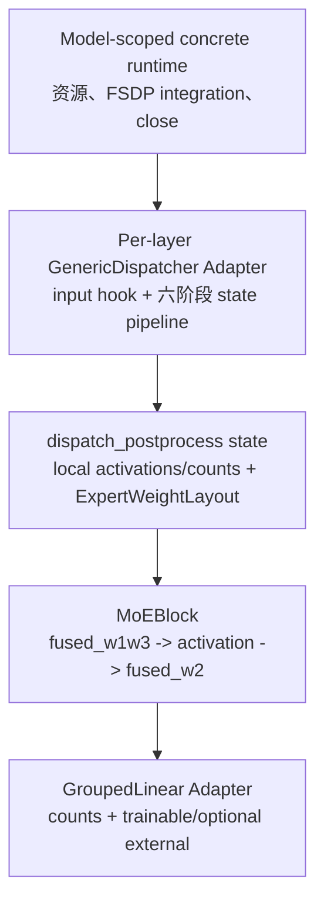
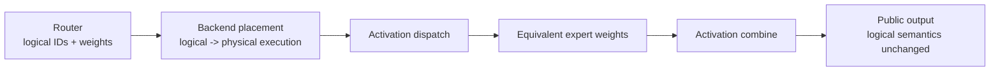
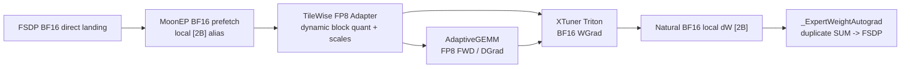
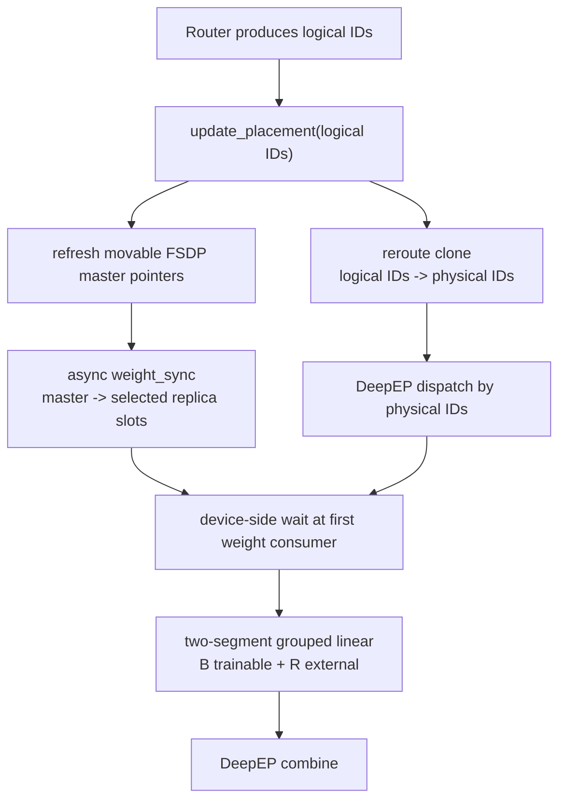
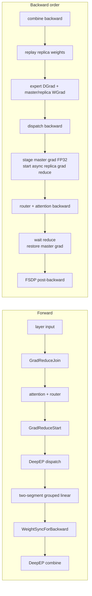
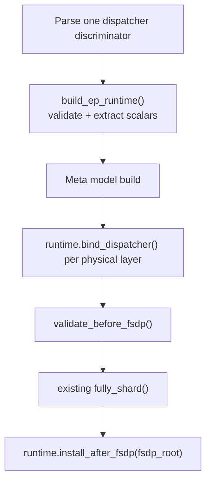
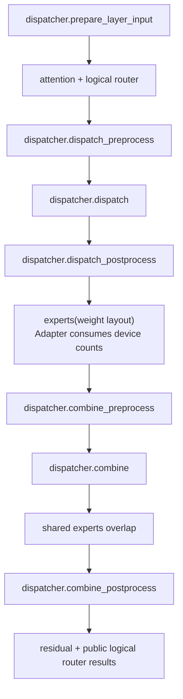
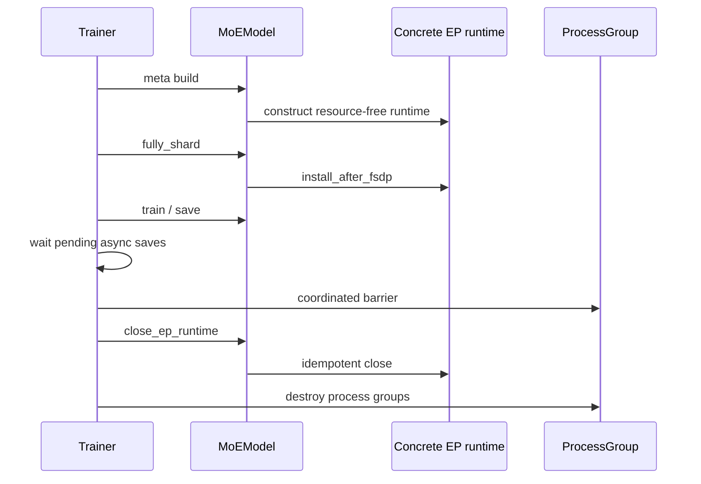

# XTuner 动态 EP 扩展统一设计

## 总结

MoonEP 与 UltraEP 都在保持 logical routing 和 FSDP 参数所有权不变的前提下，动态改变 expert 的物理执行位置。本方案不保留现有 Python 接口兼容：六阶段 Dispatcher 收敛为“只消费前一阶段 state”的管线，expert compute 收敛为一个 MLP 粒度的 weight-layout value。`GroupedLinear` 的 caller Interface 只暴露 logical counts 与可选 weight ownership；BF16 Triton、CUTLASS 和 TileWise FP8 各自的 schedule、scale 与 problem descriptor 留在 Adapter 内部。runtime 只保留已验证标量和两块 projection registration，不长期持有整个 model/config；本轮只设计 CUDA 路径，不考虑 NPU。

这三层分别负责调度、存储所有权和 tensor compute：



核心决策如下：

1. 保留 `GenericDispatcher` 的六阶段作为 activation dispatch/combine 的唯一 Seam。
2. 只给 Dispatcher 增加默认恒等的 `prepare_layer_input()`。UltraEP 用它在 attention 前放置 backward join 并返回 `virtual_layer_id`；它不包装六阶段，也不是第七个通信阶段。
3. 六阶段每次只接收前一阶段的 `StageState`；dispatch/combine async policy、route metadata、event 和 private handle 由 state 自己向后传递。Decoder 不再回传五组历史 dictionary，也不新增 routed-expert invocation façade。
4. `dispatch_postprocess` 交付一个 call-local `ExpertWeightLayout`：普通路径使用 Module 的 trainable weights，MoonEP 替换 trainable segment，UltraEP 在 trainable master 后追加 runtime-owned external segment。
5. `MoonEPDispatcher` 保留自己的 Buffer、VMM、plan、`_MoonEPInvocation` 和三个 autograd Function；该 private state 从 phase-2 state 传到后续阶段。
6. Router 是 logical `tokens_per_expert[E]` 的唯一生产者；Dispatcher 输出的 counts 只描述本 rank 的物理执行 groups。
7. `MoEBlock` 只把同一份 device `tokens_per_expert` 交给两块 fused projections；不新增公共 `GroupedGemmSchedule`。各算子 Adapter 私有地构造并保存自身 forward/backward metadata。
8. 普通 EP 与 MoonEP 的 one-segment 路径都使用已有标准 GMM 的自然 autograd/WGrad；MoonEP 在 differentiable local-weight edge 捕获 `[2B]` dW 并私有地完成 duplicate SUM。只有 UltraEP 使用 stride-aware two-segment mutable-output Implementation，避免完整 `[B+R]` 临时 dW 与 BF16→FP32 copy。
9. MoonEP 与 UltraEP 各自使用 concrete model-scoped runtime，共用同形 lifecycle，但不新增只含抽象声明的基类；runtime 在 process group 销毁前显式关闭。
10. 参数按 knowledge ownership 收窄：完整 `MoEConfig` 只到 build/validation Seam，runtime 只保存必要标量；每层只注册 FQN 与 `(fused_w1w3, fused_w2)`。UltraEP start/join autograd nodes 捕获 `(runtime, layer_id, virtual_layer_id)`，只需 replay 的节点进一步缩成 `(runtime, virtual_layer_id)`。`StageState` 和 `_MoonEPInvocation` 仍作为 call-local transaction 整体传递。
11. MoonEP FP8 首版采用 **BF16 weight/activation transport + local `[2B]` dynamic quantization + AdaptiveGEMM**；expert compute dtype 与 Dispatcher transport dtype 分离，standard FP8 WGrad 自然返回 BF16，继续进入相同 grad hook。UltraEP FP8 不属于首版。

## 1. 目标与非目标

### 1.1 目标

- 让普通 EP、DeepEP、MoonEP、UltraEP 共用一条线性的 decoder 调用流程。
- 最大限度复用已有六阶段 Dispatcher Implementation 和 DeepEP transport。
- 隔离 logical routing、physical execution 和参数所有权，避免 physical IDs 泄漏到 router loss、日志或 public return。
- 用同一调用端表达 backend 已声明支持的 in-flight 宽度；支持并发的 backend 必须隔离 state，不支持的 backend 必须在进入不安全调度前 fail fast。
- 保持 FSDP 是 master parameters、optimizer state 和 checkpoint 的唯一 owner。
- 保持 `torch.compile` 的 tensor compute path；runtime/plan/event 等 Python control state 不传入 compiled expert graph。
- 用一个 backend-neutral `GroupedLinear.forward` 表达普通、MoonEP 和 UltraEP；不同算子只在内部 operands、metadata 与 capability 上不同。
- 让 FP8 与 BF16 Triton/CUTLASS 都能复用普通 one-segment 调用，不让某个 kernel 的 tile schedule 成为公共 Interface。
- 让 MoonEP 的 FP8 compute Adapter 不改变 Dispatcher、plan、`ExpertWeightLayout` 或 duplicate-gradient completion Interface。

### 1.2 非目标

- 不统一 MoonEP 与 UltraEP 的 placement 算法。
- 不统一 MoonEP VMM `[2B]` layout 与 UltraEP master/replica 双 allocation layout。
- 不让 MoonEP 经由 DeepEP transport；MoonEP Buffer 仍同时拥有 plan、dispatch 和 combine。
- 不把两套 backward 机制压成一个可选方法很多的 `PlacementProtocol`。
- 不改变 router 的 top-k 数学语义，不让 replica 成为新模型参数。
- 不公开任意 allocation 数量或 arbitrary group-to-pointer table；当前三条真实路径最多只有 trainable/external 两段。
- 不统一 BF16、FP8 与 CUTLASS 的低层 op schema；量化 scales、tile map 和 device problem arguments 都是各 Adapter 的 Implementation 细节。
- 不将整个 expert MLP 融成 opaque custom op；保留 `fused_w1w3 -> activation -> fused_w2` 的模块边界。
- 不把“Interface 可以表达”当成“已经支持”；未经真实训练验证的 FP8、TP、DP、MTP 或 recompute 组合仍在配置边界拒绝。

## 2. 两种动态 EP 的总体原理

### 2.1 共同问题：logical load 与 physical execution 解耦

普通 Expert Parallelism 将每个 logical expert 固定放在一个 rank。router 每个 microbatch 产生的 top-k 分布是动态的；当少数 expert 变热时，吞吐由最忙 rank 决定。

MoonEP 和 UltraEP 都不改变 router 选中了哪个 expert，而是在 router 之后为同一数学计算选择更合适的物理执行位置：



两者都必须满足三个不变量：

1. 对任意 physical instance `p`，其执行 weight 等于 placement 指向的 logical master：

   ```text
   W_physical[p] = W_master[physical_to_logical[p]]
   ```

2. router logits、top-k weights、aux loss 和对外返回的 IDs 始终是 logical 语义。
3. 一个 logical expert 的所有 physical WGrad 必须在 FSDP 开始该参数的 ReduceScatter 前归并回唯一 master gradient。

### 2.2 MoonEP 原理

MoonEP 是完整 execution backend，而不只是 activation dispatcher：

- FSDP 仍拥有 home expert parameters；direct landing 将 FSDP AllGather 输出直接落入 MoonEP VMM workspace。
- MoonEP plan 同时决定 activation dispatch、global duplicated weight view、local contiguous `[2B]` expert view 和 combine。
- `[2B]` local weights 是既有 `_ExpertWeightAutograd` 的 differentiable outputs；expert compute 对它调用普通 one-segment GMM，不传 MoonEP 专用 WGrad target。
- 标准 GMM backward 自然分配并返回两个 local `[2B]` dW；`_ExpertWeightAutograd.backward` 正好在这个 edge 获得它们，作用等价于一个成对的 local-weight grad hook。
- hook/Function 使用同一 plan 完成 duplicated BF16 WGrad exact SUM，再把 home `[B]` gradients 返回给 FSDP。若 MoonEP Buffer 的 one-sided reduce 需要 symmetric VMM，普通 dW 只在这里被 stage 到 invocation 独占的 reduction slot；该 slot 不进入 GMM Interface。
- model-scoped runtime 共享 Buffer/VMM 资源；每次调用独占 plan、events 和 reduction slot。


hook 必须挂在 local `[2B]` weight edge，而不是 home Parameter 的 post-accumulate edge：前者仍保留 physical duplicate layout，并保证 completion 在 home gradient 进入 FSDP 前完成。直接复用既有 `_ExpertWeightAutograd` 比分别 `register_hook` 两块 projection 更合适，因为它把两块 WGrad 作为同一个 completion transaction；若实现改用 `Tensor.register_hook`，语义边界也必须相同。

这只撤销初版 MoonEP 的 **direct WGrad target** 约束，不改变 FSDP weight **direct landing**。代价是标准 GMM 的 local `[2B]` dW allocation，以及当前 one-sided reduce 实现需要时的一次私有 D2D staging；收益是 MoonEP 不再绑定某个专用 GMM backward schema，BF16 Triton 与 CUTLASS 都可复用同一标准接口。

因此 MoonEP 的 placement 不能被降格为一个只返回 physical IDs 的接口：plan 还同时控制 weight alias、activation transport 和 backward replay。

#### 2.2.1 MoonEP 接入 FP8

实现结论是：**MoonEP 保持 BF16 transport，在 expert Adapter 内执行 FP8 FWD/DGrad 与 BF16 WGrad。** 标准 allocation-return WGrad 已消除 direct-output kernel 的限制；FP8 compute 不再改变 Dispatcher 或 FSDP ownership。接入必须处理以下边界：

1. Dispatcher factory 只声明 transport dtype，不能再用 training/generation dtype 代替 expert compute policy。
2. `TileWiseFloat8GroupedLinear.forward` 必须接收 call-local BF16 weight override。
3. `WeightWithDynamicTilewiseFloat8CastTensor.fsdp_pre_all_gather()` 将参数转换成 FP8 data + FP32 scales；MoonEP direct landing、VMM mapping 和 duplicated-weight prefetch 当前按每个 projection 一块 BF16 tensor 建模，而 landing Adapter 也明确拒绝带 `fsdp_post_all_gather` 的参数扩展。
4. FP8 weight padding、block scales 和 replay 生命周期目前由 Float8 FSDP path 拥有，不能只把一个 `Float8Tensor` 塞进 BF16 VMM alias 就宣称兼容。

首版采用较深且改动较小的路径：MoonEP 继续运输 BF16 weights，不把 FP8 scales 纳入 Dispatcher 或 `ExpertWeightLayout`；TileWise FP8 Adapter 在 expert compute 内对 local `[2B]` override 动态量化：



对应改造只有三个显式位置：

- factory 不再用 `training_dtype` 同时表示 expert compute 与 activation transport。`float8_cfg/expert_compute_dtype` 只选择 GroupedLinear Implementation；MoonEP runtime 仍声明 BF16 transport，避免 Dispatcher 因 FP8 compute 错误切换通信 representation。
- `TileWiseFloat8GroupedLinear` 对齐 `GroupedLinear.forward(..., trainable_weight=...)`；收到普通预量化 weight 时保持现有 fast path，收到 MoonEP BF16 override 时在 Adapter 内调用现有 differentiable block quantization，再进 AdaptiveGEMM。
- model/Float8 build policy 对 MoonEP routed experts 保留 FSDP-owned trainable weight 与 BF16 AllGather/direct landing，不安装“FSDP AllGather 输出 FP8 data + scales”的参数子类；shared experts 和非 MoonEP FP8 路径不受影响。

这样 quantization scales、padded counts 和 AdaptiveGEMM metadata 都留在 FP8 Adapter 内。当前 AdaptiveGEMM FP8 WGrad launcher 在 H200 默认 SM 数及真实 `O=2048, I=512` 投影上会产生非法 launch；全局降低 `num_sms` 会影响 dense/其他 GMM，因此不作为集成方案。Adapter 保存原 BF16 activation，FWD/DGrad 使用 AdaptiveGEMM，WGrad 使用项目已有 Triton allocation-return kernel，直接得到自然 BF16 dW，与 MoonEP completion contract 一致。DGrad 仍读取 forward 保存的 FP8 weight data/scales；checkpoint/reentrant replay 必须在恢复对应 BF16 weights 后重新量化。

MoonEP 的 `hidden_nvsh` 是固定容量张量，`cu_seqlens` 只覆盖有效的物理前缀，而标准 GMM 要求 `sum(counts) == M`。phase 3 因此把未覆盖尾部 activation 清零，并把尾部长度计入最后一个 physical group 的 padding count；尾部 forward 为零、WGrad 也因 activation 为零不产生贡献。整个适配只使用 device tensor 运算，不做 `.item()`/`.cpu()`，Triton、AdaptiveGEMM 与后续 CUTLASS 都得到相同标准 counts contract。

代价是每次 expert forward 的 local weight quantization、一个固定容量尾部 mask，以及每个 live invocation 的 FP8 snapshot/scales；必须用 profiler 同时判断时间和显存。只有该开销无法接受时，才进入第二阶段：为 MoonEP VMM 增加 FP8 data/scale 双平面 direct landing 与成对 prefetch。第二阶段会同时改动 FSDP storage Adapter、MoonEP public capability、VMM layout 和 replay，不应作为首版前置条件。

FP8 支持必须覆盖 block-128 shape/padding、empty expert、Domino/replay、compile、BF16 dW completion、optimizer parity 和相同 workload 性能。BF16 WGrad 是明确的混合精度策略，不是 silent fallback；FWD 与 DGrad 必须实际进入 FP8 kernel。

本设计明确重开 ADR-0018 与 ADR-0020 中“MoonEP 必须 direct-output WGrad”的部分；slot/ring capacity、device counts 和 no-host-sync 约束继续有效。FP8 目前只是设计目标，因此尚不重开现有 BF16-only capability boundary。

### 2.3 UltraEP 总体原理

#### 2.3.1 它均衡的是执行负载，不是 router 决策

设：

- `E`：模型拥有的 logical experts 数量；
- `P`：EP world size；
- `B = E / P`：每 rank 固定拥有的 master experts 数量；
- `R`：每 rank 的 reusable replica slots 数量。

UltraEP 的 physical expert 总数为：

```text
E_physical = E + P * R
local physical groups = B master groups + R replica groups
```

Global physical IDs 按 rank 分块，每块固定为 `[B masters, R replicas]`，而不是先排满全局 `E` 个 masters 再追加 replicas。logical expert `e` 的固定 master physical ID 为：

```text
rank_block = B + R
master_physical_id(e) = (e // B) * rank_block + (e % B)
replica IDs on rank p = [p * rank_block + B, p * rank_block + B + R)
```

因此 global master IDs 会被每个 rank 的 replica gap 交错。总计仍有 `E` 个固定 master instances 和 `P*R` 个 runtime replica slots。某个 replica slot 在不同 layer 或调用中可以承载不同 logical expert，因此它不进入 Parameter、optimizer 或 checkpoint。

router 完成后，UltraEP 根据本次精确负载建立：

- `physical_to_logical`：每个 physical instance 当前执行哪个 logical expert；
- `logical_to_physical`：一个 logical expert 当前有哪些等价 instances；
- quota：同一 logical expert 的 tokens 如何分摊到 master 与 replicas。

原始 logical IDs 不修改；只 clone 一份供物理执行使用。

#### 2.3.2 Forward：placement、weight sync 与 DeepEP dispatch 重叠



详细顺序为：

1. Router 正常输出 logical `topk_ids`、`topk_weights` 和 `tokens_per_expert[E]`。
2. `prepare_layer_input` 已为本 physical layer 分配受 active-call guard 保护的 `virtual_layer_id`；`dispatch_preprocess` 再根据 logical IDs 更新这个 ID 对应的 placement。
3. FSDP 每次 unshard 后参数 data pointer 可能变化；runtime 在发起同步前刷新 manager 看到的 master pointers。
4. `weight_sync(async_finish=True)` 将本次需要的 master FC1/FC2 weights 分发到 replica buffers。
5. `reroute` 只改写 logical IDs 的 clone，按 quota 将 hot expert tokens 分给多个 physical instances。
6. 内层 `DeepEPDispatcher` 以 `E + P*R` 为专家总数执行 dispatch。DeepEP 通信与 replica weight sync 并行。
7. `dispatch_postprocess` 在 expert 第一次读取 replica weights 前执行 device-side event wait；不做 host synchronize。
8. local counts 的 group 顺序固定为 `[B trainable masters, R external replicas]`。two-segment grouped linear 直接读取两块 allocation，从 Tensor metadata 取各自 stride，不做 `cat()` 或热路径 snapshot。
9. expert output 继续走原 DeepEP combine，最终回到 token 原 rank。

前向数学等价性来自：

```text
y(token)
  = sum(gate_weight * Expert(x, W_physical[physical_id]))
  = sum(gate_weight * Expert(x, W_master[logical_id]))
```

#### 2.3.3 Backward：replay、异步 grad reduce 与 attention 重叠

Replica storage 会被后续 layer 调用复用。当前 layer backward 执行 expert DGrad 时，forward 使用过的 replica weights 可能已被覆盖，所以不能只保存 tensor pointer；三个 autograd nodes 必须捕获同一 `virtual_layer_id`，并在正确的图边重放 weight sync。

三个 identity autograd nodes 的位置如下：



- `WeightSyncForBackward` 位于 expert output 之后。反向经过 combine 后先按 `virtual_layer_id` blocking replay 本次调用的 replicas，再允许 two-segment grouped linear 读取 weights 做 DGrad。
- grouped-linear backward 对 trainable master groups 正常返回 WGrad；replica groups 的 WGrad 在同一 mutable-output op 中直接写入 manager-owned FP32 grad buffers。
- `GradReduceStart` 位于 dispatch input。它的 backward 在 expert 与 dispatch backward 完成后触发，将 master BF16 grad stage 到 FP32，并按 forward placement 启动 replica-to-master reduce。
- `GradReduceJoin` 位于 attention 前的 layer input。它的 backward 在 router/attention backward 后等待 reduce event，把完成的 master gradient cast/copy 回 FSDP-owned grad，再允许 FSDP post-backward 前进。

这三个节点是 UltraEP 的 ordering Implementation。start/join 捕获 `(UltraEPRuntime, layer_id, virtual_layer_id)`，weight replay 只捕获 `(UltraEPRuntime, virtual_layer_id)`；runtime 用注册表找到两块 projections、Manager storage 和 FP32 staging。Decoder 只看到一次 `prepare_layer_input()` 和既有六阶段，不需要 `_UltraEPInvocation`。

#### 2.3.4 官方 replica layout 必须作为 kernel contract

UltraEP 的 FC1/FC2 replicas 可以是同一块 per-expert storage 上的 strided views。`R >= 2` 时，expert 内部维度连续，但相邻 expert 的 `stride(0)` 可能包含另一 projection 的间隔，因此不能要求整个 tensor contiguous。

目标 two-segment kernel 必须直接使用 Tensor 携带的：

```text
weight_stride = replica_weight.stride()
grad_stride = replica_grad.stride()
```

不应在 hot path 调用 `.contiguous()`；这会产生每层、每 microbatch 的完整 replica copy，并抵消删除 snapshot 的收益。在 stride-aware kernel 合入前，配置入口必须 fail fast 限制 `R == 1`，不能声称支持任意正数。

### 2.4 共同点与不可统一点

| 维度 | MoonEP | UltraEP | 统一位置 |
| --- | --- | --- | --- |
| Router semantics | logical IDs | logical IDs | Router result |
| Placement | `_MoonEPInvocation` opaque plan | Manager state keyed by `virtual_layer_id` | call-local Dispatcher state |
| Activation transport | MoonEP Buffer | DeepEP | Dispatcher 六阶段 |
| Local groups | contiguous `[2B]` | `[B masters, R replicas]` | `dispatch_postprocess` result |
| Weight materialization | VMM prefetch/alias | manager weight sync | `dispatch_postprocess` completion |
| Expert weights | trainable `[2B]` override | module trainable `[B]` + external `[R]` | `ExpertWeightLayout` |
| Duplicate WGrad | BF16 exact SUM | FP32 replica-to-master reduce | completion-before-FSDP invariant |
| Runtime owner | concrete `MoonEPRuntime` | concrete `UltraEPRuntime` | 同形 lifecycle，无公共基类 |
| Backward mechanism | MoonEP private autograd trio | UltraEP replay/start/join trio | 不统一 Implementation |

## 3. 统一架构

### 3.1 控制面的两个行为作用域

#### Model-scoped concrete runtimes

`MoonEPRuntime` 与 `UltraEPRuntime` 直接实现同形 lifecycle，不新增 `EPExecutionRuntime` ABC：

```python
runtime.bind_dispatcher(layer_fqn, projections) -> GenericDispatcher
runtime.validate_before_fsdp(fsdp_config) -> None
runtime.install_after_fsdp(fsdp_root) -> None
runtime.close() -> None
```

- `MoonEPRuntime` 持有 Buffer、VMM workspace、FSDP landing 和 generation registrations。
- `UltraEPRuntime` 合并原 Manager Adapter 的模型级职责，唯一拥有 external Manager、FP32 staging、replica storage、layer registrations 和 explicit teardown；per-call external calls 直接留在已有 `UltraEPDispatcher` Adapter。
- 普通 Dispatcher 不需要 runtime，继续由现有 factory 直接构建。
- `build_ep_runtime()` 在 configuration Seam 完成 capability validation 并提取必要标量；constructor 本身 resource-free，不接收完整 config。任何 CUDA/network resource 都在 FSDP topology 明确后安装。
- `fsdp_root` 只是两种 storage Adapter 在安装时定位 FSDP-owned state 的短生命周期 traversal root；runtime 不保存它。为了移除一次引用传递而新增 FSDP-handle carrier，会把 PyTorch 私有结构泄漏到 model build，反而扩大 Interface。
- `close()` 幂等，并且必须在 EP/default process group 销毁前协调调用。

两个 concrete runtime 都是有 Depth 的 Module：删除任意一个都会把 backend 初始化、FSDP integration、resource ownership 和 teardown 重新散到 model、layer 与 engine。公共 ABC 只有声明、没有共享 Implementation，删除它只把 model annotation 改为 union，不会让复杂度重现。

#### 传参范围与对象所有权

“对象大”本身不是问题：Python 调用传递的是引用，Tensor/Manager/runtime 不会因此复制。需要缩小的是 **Interface 要求 caller 知道的状态范围**，以及长生命周期对象无意保留的引用图。

| 当前传参/保留 | 实际需要 | 调整 |
| --- | --- | --- |
| runtime constructor 保存完整 `MoEConfig` | MoonEP 的 shape/top-k/capacity/SM/staging facts，或 UltraEP 的 expert/replica facts | build/validation 消费完整 config 一次；runtime 只保存确实影响资源布局与生命周期的显式标量，不新增 config carrier class |
| `bind_dispatcher(..., experts: MoEBlock)` | 两块 routed projections | model assembly Seam 提取 `(fused_w1w3, fused_w2)` 后注册；runtime 不知道 activation/shared experts |
| `install_after_fsdp(model, fsdp_config)` | 已注册 projections + FSDP owner traversal root | 删除 config；保留语义收窄为 `fsdp_root` 的短暂 model 引用，因为当前 FSDP2 Adapter 必须扫描 owner state，调用后不保存 |
| UltraEP autograd 捕获 `UltraEPDispatcher` | model-scoped storage owner + 当前节点实际使用的 key | start/join 捕获 runtime + layer/virtual IDs，weight replay 不再携带未使用的 layer ID；DeepEP inner Adapter 不进入 autograd lifetime |
| Dispatcher 直接接收 external Manager | placement/weight/grad 的少量 runtime behaviors | Manager 完全留在 `UltraEPRuntime` Implementation 内；Dispatcher 只调用 runtime 的 private behavior methods |
| `validate_before_fsdp(fsdp_config)` | backend-specific FSDP configuration invariants | 保留；这是短生命周期 configuration validation Seam，拆成不断增长的 booleans 会形成更浅的 Interface |
| `StageState` 携带 `_MoonEPInvocation` 或 virtual ID/event | 一次调用的 live transaction | 保留；每阶段构造只含下一阶段仍存活值的新 state，不拆 plan/events/slot 为平行参数 |
| `_ExpertWeightAutograd` 捕获 `_MoonEPInvocation` | 同一 plan 下的 replay、staging 和 completion | 保留；删除 invocation 会把强耦合状态散回多个 hook，降低 Locality |

因此缩小后没有新增 `RuntimeConfig`、`LayerBinding` 或 invocation façade。`ep_group`、runtime 和 `_MoonEPInvocation` 虽然内部状态较多，却分别是 collective capability、model-scoped resource 和 call-local transaction 的正确 owner；继续传其引用比暴露内部字段有更高 Depth。

#### Per-layer `GenericDispatcher` Adapter

现有六阶段保持原名和原顺序：

1. `dispatch_preprocess`
2. `dispatch`
3. `dispatch_postprocess`
4. `combine_preprocess`
5. `combine`
6. `combine_postprocess`

`UltraEPDispatcher` 是 `DeepEPDispatcher` 的 Adapter；`MoonEPDispatcher` 是 MoonEP Buffer 的 Adapter。Decoder 不知道两者内部使用哪个 transport。新 Interface 不保留旧签名：每阶段只消费前一阶段 state，不让 caller 理解某个 backend 还需要哪些历史 result。

```python
layer_input, layer_state = dispatcher.prepare_layer_input(layer_input)
state = dispatcher.dispatch_preprocess(
    ...,
    layer_state=layer_state,
    dispatch_async=False,
    combine_async=True,
    decoding=False,
)
state = dispatcher.dispatch(state)
state = dispatcher.dispatch_postprocess(state)
expert_out = experts(
    state["hidden_states"],
    state["tokens_per_expert"],
    weight_layout=state["expert_weight_layout"],
)
state = dispatcher.combine_preprocess(state, expert_out)
state = dispatcher.combine(state)
output = dispatcher.combine_postprocess(state)
```

这个线性 Interface 有三个约束：

1. `dispatch_async`、`combine_async`、`decoding`、route weights、row map、handle 和 event 只在 phase 1 写入，由 state 向后转移；后续阶段不重复接收可能不一致的 flags。两个 async 开关分开，因为单 microbatch 可同步 dispatch，却仍需异步 combine 覆盖 shared experts。
2. state 是 per-call 所有权。MoonEP 的 `_MoonEPInvocation`、UltraEP 的 `virtual_layer_id` 和 weight-sync event 都由该 microbatch 的 state 携带；Dispatcher 不保存 `last_plan`/`last_slot`/`last_event`。
3. phase 3 与 phase 4 之间仍是显式 `MoEBlock` Seam。把 expert compute 塞进 Dispatcher 虽能减少一行 caller，却会让 transport Adapter 知道 fused projections、activation、FP8/TP 和 compile graph，降低 Locality。

### 3.2 为什么仍需要 `prepare_layer_input()`

UltraEP 的 grad-reduce join 必须位于 attention 前，而 router-dependent placement 只能在 attention/router 后计算。六阶段全部位于 router 后，无法诚实表达这个图边界。

`prepare_layer_input(layer_input)` 只负责：

- 普通、All2All、DeepEP 和 MoonEP 默认返回 `(layer_input, None)`；
- UltraEP 分配受 active-call guard 保护的 `virtual_layer_id`；
- UltraEP 返回 `(_GradReduceJoin.apply(layer_input, runtime, layer_id, virtual_layer_id), virtual_layer_id)`。

`layer_state` 只作为显式参数进入 `dispatch_preprocess`，随后由 call-local state 继续携带。这个 hook 不发起 activation communication、不包装六阶段，也不定义新的调用对象，因此不是第七个 dispatch 阶段。

### 3.3 Router-owned counts

当前 Router 已计算 histogram，但字段仍错拼为 `topkens_per_expert`，MoonEP 又在 `dispatch_preprocess` 对 `topk_ids` 做一次 `bincount`。统一方案直接改为：

```python
class RouterResults(TypedDict):
    topk_ids: Tensor
    topk_weights: Tensor
    tokens_per_expert: Tensor  # [E], logical/source counts, device resident
```

并将 `tokens_per_expert` 设为所有 Dispatcher `dispatch_preprocess` 的必传参数：

- MoonEP 直接转为 contiguous int32 交给 Buffer plan；
- UltraEP external API 从 logical IDs 推导 placement；统一 counts 参数仍向内层 DeepEP 传递，但不被 UltraEP 重新解释；
- DeepEP/All2All/AGRS 第一阶段可接收并忽略 source counts，不改变其 received/local count Implementation。

不要保留错拼 alias。Router count 与 `dispatch_postprocess` 返回的 local execution count 是两个不同作用域：

| 名称位置 | shape | 语义 |
| --- | --- | --- |
| `RouterResults.tokens_per_expert` | `[E]` | 本 source batch 的 logical counts |
| phase-3 state `tokens_per_expert` | backend-dependent | 本 rank expert compute group counts |

### 3.4 MLP 粒度的 `ExpertWeightLayout`

`dispatch_postprocess` 返回的 state 只固定三个供 expert compute 使用的 key：

```python
state = {
    "hidden_states": Tensor,
    "tokens_per_expert": Tensor,
    "expert_weight_layout": ExpertWeightLayout,
    # backend-private state remains opaque to the caller
}
```

不再按 projection 展开 optional tensors。MoonEP 与 UltraEP 在 `fused_w1w3` 和 `fused_w2` 上总是成对改变存储模式，因此 value contract 收敛到 MLP 粒度的三个 ownership fields：

```python
ProjectionPair = tuple[Tensor, Tensor]  # (fused_w1w3, fused_w2)

class ExpertWeightLayout(NamedTuple):
    # None means use the two FSDP-owned Module weights.
    trainable_weights: ProjectionPair | None = None
    # Runtime-owned weights are consumed by forward/DGrad but are not Parameters.
    external_weights: ProjectionPair | None = None
    # External dW is a side output and is never returned to autograd.
    external_wgrad_outs: ProjectionPair | None = None
```

三条路径映射如下：

| Backend | trainable segment | trainable dW | external segment | external dW |
| --- | --- | --- | --- | --- |
| 普通/DeepEP | Module `[B]` | selected Adapter 的自然 autograd 返回 dW | 无 | 无 |
| MoonEP | invocation local differentiable `[2B]` VMM view | 标准 GMM 自然返回；local-weight hook 私有归并后返回 home `[B]` | 无 | 无 |
| UltraEP | Module master `[B]` | two-segment wrapper 内部分配 BF16 dW 并返回 autograd/FSDP | official strided replica `[R]` | manager FP32 strided buffer |

`ExpertWeightLayout()` 是普通路径的标准值，不再用整个 `execution=None` 切回旧 API。`MoEBlock` 不判断 backend 名称；它只解析 trainable/external ownership，然后对两块 projection 调用同一 grouped-linear Interface。

layout 的 `None`/tuple 结构在建模后对该 Dispatcher 是静态的，`torch.compile` 只对普通、MoonEP 或 UltraEP 的固定 pytree 做 specialization；每次调用只替换 tensor leaves。plan、Manager、event 和 `virtual_layer_id` 不进入 compiled `MoEBlock`。

### 3.5 Backend-neutral `GroupedLinear` 与 BF16 two-segment Implementation

已提交版本把 BF16 Triton 的 `M_TILE=128`、padding offsets 和 M-tile-to-group map 放进 `_GroupedGemmSchedule`，再要求所有 `GroupedLinear` 消费它。这个 Seam 不成立：

- BF16 Triton 当前需要 128-row padding 与 tile map；
- TileWise FP8 还需要 activation/weight scales，forward tile 由 AdaptiveGEMM 选择，WGrad 又消费 padded K counts；
- CUTLASS 需要由 counts 构造 device problem arguments。

把这些字段取并集只会形成一个大而浅的 carrier。删除 `_GroupedGemmSchedule` 后，caller 仍只需传原本就有的 device counts，复杂度不会散回 Decoder 或 Dispatcher，因此它没有通过 deletion test。

唯一 caller Interface 是 `GroupedLinear.forward`：

```python
def forward(
    hidden_states,
    tokens_per_expert,
    *,
    trainable_weight=None,
    external_weight=None,
    external_wgrad_out=None,
): ...
```

- `tokens_per_expert` 是唯一跨 Adapter 的分组事实；FC1/FC2 读取同一个 Tensor，但不共享 backend-specific metadata。
- 删除现有未被计算使用的 `decoding` 参数；generation capability 属于 Dispatcher/model validation，不应泄漏到 grouped linear。
- `trainable_weight=None` 表示使用 Module Parameter；MoonEP 传 differentiable `[2B]` VMM alias。
- 无 external segment 时，BF16 `GroupedLinear` 与既有 TileWise FP8 Module 各自直接调用标准 one-segment op。两者实现同一结构化调用签名，但不新增公共基类/Protocol；GMM 不知道当前 weight 是否来自 MoonEP。
- 有 external segment 时，使用 BF16 two-segment Implementation。group 顺序固定为 `[trainable groups, external groups]`，分界由两个 weight 的 shape 推导。
- `external_weight` 与 `external_wgrad_out` 成对出现；external weight 不是 Parameter，其 dW 只写显式 target。

`MoEBlock` 的调用不包含 backend 分支：

```python
gate_up = fused_w1w3(hidden, tokens_per_expert, ...)
output = fused_w2(activation(gate_up), tokens_per_expert, ...)
```

Tensor 自身的 shape、storage offset 和 stride 是唯一 storage contract；Interface 不暴露 `trans_b`、`primary/secondary` 或 explicit expert stride。two-segment backward 为缺省 trainable dW 分配 target，并用一个 mutable-output op 同时写 trainable 与 external WGrad；schema 必须准确声明两个 mutated outputs。trainable dW 返回 autograd，UltraEP external FP32 dW 只是 side effect。zero-token group 和 `M == 0` 必须覆盖写零。

静态/config 边界必须保证：

- 两段 weights 均为 `[G, O, I]`，device/input dtype 与 `(O, I)` 一致；`stride(2) == 1`、`stride(1) == I`，但 `stride(0)` 可大于 `O*I`。
- external WGrad target 与对应 weight 具有相同 logical shape，但 dtype 和 expert stride 可独立；UltraEP 因此可直写 FP32 interleaved storage。
- `len(counts) == G_trainable + G_external`、`sum(counts) == M`。这是 device contract，热路径不为验证它做 `.item()`/`.cpu()`。
- training 中 `external_weight` 与 `external_wgrad_out` 必须成对出现，external weight 不是 Parameter、不向 autograd 返回 dW。
- runtime-owned weight 在 forward 与 DGrad 两个消费点都必须有效；backward replay ordering 仍由 Dispatcher/runtime 拥有，GMM 不持有 Manager 或 plan。

普通 allocation-return WGrad op 保留。它同时服务普通 EP、MoonEP、FP8 和 CUTLASS；删除它反而会强迫所有 one-segment caller 采用只为 UltraEP 引入的 side-output contract。two-segment autograd 只服务确有第二块 allocation 的 UltraEP，不再增加一层 caller-facing `grouped_linear()` helper。

#### 3.5.1 两种动态 EP 对 GMM 的真实要求

MoonEP 的 compute layout 仍是单 allocation，因此只要求：device counts 不触发 D2H、接受 contiguous `[G,O,I]` trainable weight、自然返回 BF16 dW，并且 FP8 Adapter 能在内部处理 weight representation。它不要求 direct WGrad target、strided expert storage 或多个 base pointers。

UltraEP 则不同：同一次逻辑 GMM 横跨 trainable `[B]` 和 external `[R]` 两块 allocation；external weight 可有较大 `stride(0)`，其 WGrad 是 runtime-owned FP32 target。普通 one-segment op 即使数学相同，也不能在不 `cat()`/copy 的情况下直接表达这一 storage contract。

基于当前实现重新评估如下：

| GMM Implementation | 当前关键性质 | MoonEP | UltraEP | 设计结论 |
| --- | --- | --- | --- | --- |
| XTuner BF16 Triton allocation-return | device counts；contiguous `[G,O,I]`；自然 BF16 dW | 直接兼容 `[2B]` alias | 不能表达两块 weight/两种 dW ownership | MoonEP 默认；复用 launcher 新增 UltraEP two-segment FWD/DGrad/WGrad |
| XTuner BF16 CUTLASS | 自然 dW；当前 wrapper 对 counts `.cpu()`；单 base allocation | 数学与 autograd 兼容，但当前 host sync 不合格 | 现有 op 不兼容 | 先让 batch-size/problem arguments 全程 device-resident；UltraEP 需私有 multi-base problem descriptors，WGrad 建议按 BF16 master/FP32 external 分两次 typed launch |
| TileWise FP8 AdaptiveGEMM + Triton WGrad | device counts；weight data+block scales；FP8 FWD/DGrad；自然 BF16 dW | BF16 override + dynamic quant 已匹配 `[2B]`；固定容量尾部由 Dispatcher 归一化 | 不支持 strided external scales 或 FP32 external dW | MoonEP 首版组合；规避 Adaptive FP8 WGrad 的真实 shape/SM launch 缺陷；UltraEP FP8 暂不实施 |
| MoonEP VM grouped-GEMM | global `[E+B]` weight/cu-seqlens contract，可按 plan remote-read | local training `[2B]` 不能冒充其 global contract | placement/storage 均不匹配 | 不作为统一 expert compute Adapter；继续服务 MoonEP 原有 global/inference use case |
| 新 BF16 Triton two-segment op | 两个 base/stride；一个 BF16 returned dW + 一个 FP32 side output | 没有必要使用 | 完整匹配 | 仅 UltraEP 使用，不替代标准 one-segment Interface |

CUTLASS 的 `.cpu()` 不是 GroupedLinear Interface 要求；修复应位于 CUTLASS Adapter。对于 UltraEP，forward/DGrad 的 operand dtype 相同，可以用 op-private device problem descriptors 描述两块 base；WGrad 的 BF16/FP32 outputs 不应强塞进一个 homogeneous typed kernel，两个 typed launches 仍可共享 counts/row-offset metadata，而且不需要完整 `[B+R]` 临时 dW。

FP8 的 scales、quantized transposes、padded counts 同样不进入 caller Interface。MoonEP 走标准 one-segment FP8 Adapter；UltraEP 若以后支持 FP8，需要真正的 two-segment FP8 op，同时表达两块 data/scales、external stride 和 FP32 external WGrad，不能靠把当前 AdaptiveGEMM wrapper 外包一层实现。

因此兼容性结论是：MoonEP 是“标准 one-segment GMM + call-local trainable alias”，Triton 已兼容，CUTLASS 只差 device-count 验证，TileWise FP8 主要差 weight-supply Adapter；UltraEP 则只有新的 BF16 two-segment op 完整兼容。统一的是 `GroupedLinear` caller 语义，不是假装所有低层 op 拥有相同 operands。

### 3.6 `UltraEPDispatcher` 对六阶段的映射

| 生命周期/阶段 | UltraEP 行为 | 复用 |
| --- | --- | --- |
| `prepare_layer_input` | allocate `virtual_layer_id`；在 layer input 放置 grad-reduce join | Dispatcher 默认 hook |
| `dispatch_preprocess` | placement；refresh pointers；async weight sync；clone/reroute logical IDs；放置 grad-reduce start | delegate DeepEP preprocess |
| `dispatch` | physical IDs dispatch | delegate DeepEP |
| `dispatch_postprocess` | delegate permutation/counts；首次 consumer device wait；返回 call-local external weight layout | delegate DeepEP postprocess |
| `combine_preprocess` | 在 expert output 放置 backward weight replay | delegate DeepEP preprocess |
| `combine` | physical result combine | delegate DeepEP |
| `combine_postprocess` | 返回 routed output；no-grad 时释放 active-call guard | delegate DeepEP postprocess |

不新增 `_UltraEPInvocation`。external Manager 本来就以 `virtual_layer_id` 索引 placement、replica mapping 与 gradient state，额外对象只会重复这张索引表。phase 1 的 state 明确携带唯一需要向后传的两个值：

```python
state = {
    "inner": deep_ep_pre_dispatched,
    "_virtual_layer_id": virtual_layer_id,
    "_weight_sync_event": weight_sync_event,
}
```

三个 private autograd Function 只捕获各自 backward 所需的 runtime/IDs：replay 用 runtime + virtual ID，grad-reduce start/join 再加 layer ID。它们回到 runtime registration table 和同一个 Manager slot；grad-reduce event 由 runtime 按 ID 保存，Join backward 取出 event、恢复 FSDP grad 并释放 active guard。它们不再延长 `UltraEPDispatcher`、DeepEP inner Adapter 或整个 `MoEBlock` 的生命周期；Dispatcher 也不保存 `last_slot`、`last_placement` 或 `last_event`。

### 3.7 `MoonEPDispatcher` 的适配

MoonEP 现有 Deep Modules 保留：

- `MoonEPRuntime`
- `ExpertVMMWorkspace`
- `_MoonEPInvocation`
- `MoonEPDispatcher`
- FSDP-to-VMM landing Adapter

只做以下 contract 收敛：

1. 使用 Dispatcher 默认恒等的 `prepare_layer_input()`，不提前创建 state。
2. `dispatch_preprocess` 直接消费 Router 的 `tokens_per_expert`，删除第二次 `bincount`。
3. `dispatch` 按静态 reduction-staging ring ordinal 创建 fresh `_MoonEPInvocation`，并放入 phase-2 state。
4. `dispatch_postprocess` 将原 `expert_tensors` 嵌套 tuple 改为 MLP 粒度 `ExpertWeightLayout`。
5. Decoder 不再 `.get("expert_tensors")`，private invocation 随线性 state 向后转移。
6. model/engine 通过通用 `close_ep_runtime()` lifecycle，而不是 concrete `destroy_moonep()`。

MoonEP 内部 `_DispatchAutograd`、`_CombineAutograd`、`_ExpertWeightAutograd` 继续保持独立 Implementation。UltraEP 的 FP32 grad reduce 不能替代 MoonEP 的 BF16 exact SUM。

### 3.8 配置与 factory

建议让 dispatcher selector 表达完整 execution Adapter：

```python
dispatcher: None | "naive" | "all2all" | "deepep" | "moonep" | "ultraep"
```

`dispatcher="ultraep"` 内部固定包装 DeepEP；不要使用 `dispatcher="deepep" + ultraep_cfg!=None` 作为 overlay，否则 Decoder/factory 必须同时解释两套互相依赖的开关。

`expert_compute_dtype` 只参与 expert Module/GroupedLinear 的构建；Dispatcher 接收的是自己的 `transport_dtype`。现有 DeepEP 等 backend 仍可选择 FP8 transport，MoonEP/UltraEP 首版固定 BF16 transport。这样启用 MoonEP TileWise FP8 不会把 FP8 data/scales 误认为 MoonEP Buffer/VMM 的公共通信 contract。

配置构建顺序：



- `moonep`：验证完整 config 后，只提取 shape、top-k、capacity、SM、staging policy 与 `ep_group` 创建 `MoonEPRuntime`；每层注册 FQN + projection pair 并返回只持有 runtime/layer ID 的 `MoonEPDispatcher`。
- `ultraep`：验证完整 config 后，只用 `num_experts/replica_slots_per_rank/ep_group` 创建 `UltraEPRuntime`；每层内部先创建 physical-count `DeepEPDispatcher`，再用只持有 runtime/layer ID 的 `UltraEPDispatcher` 包装。
- 其他值：不创建 execution runtime，走现有 dispatcher factory。

Capability validation 必须在任何 FSDP mutation/CUDA resource allocation 前集中完成。MoonEP FP8 gates 完成前仍拒绝 FP8；首版 UltraEP 继续明确拒绝 FP8 和其他尚未验证的组合，`R` 的公开范围必须与 stride-aware kernel 能力一致。

UltraEP v1 的写实边界为：BF16、EP>1、expert TP1、DP1、bias-free、`intra_layer_micro_batch=1`，并禁用 MTP 与 activation recompute。同一 physical layer 只允许一个尚未完成 backward 的调用；第二个 independent graph 必须在 `prepare_layer_input` fail fast。统一调用端能表达更宽调度，但不代表 UltraEP v1 已支持它。

以后放宽 UltraEP microbatch/outstanding-graph 限制，不能只增加 placement slots。external Manager 必须为每个 in-flight ID 隔离 replica weight views、replica grad buffers、FP32 master staging/reduce state，并证明多次调用对同一 master gradient 的累积语义；否则后一次 weight sync 会在第一次 expert compute 前覆盖共享 replica storage。

## 4. 调用端主流程

### 4.1 单 microbatch



Decoder 只用一个局部 `state` 变量线性推进，不读取 backend-private keys，也不按 backend 分支。expert call 的 counts、layout 与 UltraEP external WGrad target 由该 microbatch 自己的 autograd graph 捕获；MoonEP reduction slot 和任何算子 metadata 都不缓存到 Dispatcher 或共享 Module state。

### 4.2 Domino/microbatch

对声明支持 intra-layer concurrency 的 backend，Domino 按 [xtuner_ep_domino.md](./xtuner_ep_domino.md) 的 phase-major 时间线交错推进同一组 `states[i]`：

1. 对每个 microbatch 调用 `prepare_layer_input -> attention/router -> dispatch_preprocess`，保存 `states[i]`。
2. 逐 microbatch 连续调用 `dispatch -> dispatch_postprocess -> experts -> combine_preprocess`，每次用新 state 覆盖同一 `states[i]`。不能改成所有 microbatch 先做完 phase 2 再统一做 phase 3。
3. 对全部 `states[i]` 启动 `combine`。
4. 计算 shared experts。
5. 对每个 `states[i]` 调用 `combine_postprocess` 并汇总。

这保留现有 overlap：`D0` 可覆盖 `A1/Dpre1`，`D1` 可覆盖 `E0/Cpre0`，`C0` 可覆盖 `E1/Cpre1`，`C0/C1` 可覆盖 shared experts。`E_i` 只消费该 state 的 local counts；Triton/CUTLASS/FP8 metadata 都由所选 Adapter 私有构造，不能形成跨 microbatch 的 `schedule_list` 或 `self.last_*` cache。

每个 state 携带自己的 backend-private state 和 `ExpertWeightLayout`，但 storage policy 由 backend 决定：

- MoonEP v1 只在同一个 active training graph 内支持已配置宽度的 Domino，按确定性 ordinal 使用静态 reduction-staging ring；第二个 independent graph 不属于 v1 client contract，应由 Trainer/PP scheduler 的配置边界拒绝。热路径不新增动态 completion tracker、event query 或 host guard。
- UltraEP v1 的 replica weight/grad storage 是共享的，因此只允许 microbatch1 和每个 physical layer 一个 active call。virtual placement slot 本身不能证明 tensor storage 隔离。
- 普通/DeepEP 继续沿用各自已声明的调度能力。

### 4.3 MTP 与 checkpoint replay

- 对声明支持 MTP 的 backend，每个 logical depth 调用一次 `prepare_layer_input`，即使多个 depth 共享同一 physical layer/Dispatcher；UltraEP v1 在配置边界拒绝 MTP。
- reentrant checkpoint original forward 在 no-grad 路径完成并释放自己的 forward-only state。
- replay forward 创建 fresh backend plan/virtual ID，不复用 original metadata；backend 可在 original forward-only state 已结束后复用静态 storage ordinal。
- backend 未正式验证该组合时，在 `validate_before_fsdp` 拒绝，而不是在热路径猜测降级。

## 5. 所有权、生命周期与持久化

### 5.1 参数与 runtime state

| State | Owner | state_dict/optimizer |
| --- | --- | --- |
| Logical master parameters | FSDP Module | 是 |
| Master gradients after backend completion | FSDP | 是 |
| MoonEP VMM weights/reduction slots | MoonEPRuntime | 否 |
| UltraEP replica weights/grad buffers | UltraEPRuntime | 否 |
| Placement/plan/events | call-local Dispatcher state + backend runtime | 否 |
| Router logits/weights/IDs | current forward graph | 正常 autograd/public semantics |

Replica/VMM tensors不应 `register_parameter` 或 `register_buffer`。DCP/HF 只保存 FSDP-owned state；恢复后用 fresh runtime，在首次 forward 重新物化 transient execution state。

### 5.2 生命周期



UltraEP external Manager 由 `UltraEPRuntime` 以 explicit-destroy 模式创建；删除 Provider 与全局 `_MANAGERS` 双缓存。Python destructor 只能告警，不能在 rank-divergent 路径进入 collective teardown。

## 6. 文件级落地方案

| 文件/Module | 主要改动 |
| --- | --- |
| `router/protocol.py`, `router/greedy.py` | 规范字段 `tokens_per_expert` |
| `dispatcher/base.py` | 默认恒等 `prepare_layer_input`；六阶段改为 predecessor-only state pipeline；phase 1 携带 flags |
| Dispatcher factory | 分离 `expert_compute_dtype` 与 backend-owned `transport_dtype`；MoonEP FP8 compute 仍使用 BF16 transport |
| `dispatcher/moonep.py` | 复用 Router counts；输出 call-local `ExpertWeightLayout`；private invocation 随 state 向后转移；每层只注册两块 projections |
| `dispatcher/ultraep.py` | 新增包装 `DeepEPDispatcher` 的 Adapter；只持有 runtime/layer ID/inner，不持有 `MoEBlock` 或 Manager |
| `ultraep/runtime.py` | concrete model-scoped manager owner、projection registration、per-layer FP32 staging、explicit close；autograd 以 runtime + IDs 回调 |
| `decoder_layer/moe_decoder_layer.py` | 用单个 state/列表直接调用 input hook + 六阶段；保持 Domino 五段 launch order |
| `grouped_linear/moe_group_linear.py` | 唯一 `forward` 消费 device counts 与 trainable/external ownership；one-segment 走 selected Adapter，two-segment 走专用 Implementation |
| `float8/float8_gmm_tile_wise.py` | 对齐 `GroupedLinear.forward`；普通预量化 weight 保持 fast path，MoonEP BF16 override 在 Adapter 内 dynamic quant；UltraEP external 仍拒绝 |
| Float8 model/FSDP build policy | MoonEP routed experts 保留 BF16 AllGather/direct landing，仅使用 FP8 compute Adapter；其他 FP8 modules 保持现有 prequantized FSDP path |
| `ops/moe/protocol.py` | one-segment 保持标准 `GroupGemmProtocol(x, weight, counts)`，由 autograd 自然返回 dW |
| BF16 Triton GMM ops/kernels | 删除只为 MoonEP 增加的 one-segment direct-out schema；保留标准 allocation-return，并新增 UltraEP stride-aware two-segment forward/DGrad/mutable WGrad |
| BF16 CUTLASS Adapter | 删除 counts `.cpu()`；显式选择本地 GroupedGEMM 的 CUDA problem-argument path；MoonEP 标准路径与 UltraEP two-segment capability 分别验证 |
| MoE model/factory | 单 discriminator；完整 config 只在 build/validation 使用，runtime constructor 接收必要标量，layer assembly 只注册 projection pair |
| `TrainEngine.close()` | 通用 `close_ep_runtime()`，保持 save/barrier/process-group 顺序 |

建议按以下顺序实施，以保持每一步可验证：

1. 先恢复 Router-owned counts，再将六阶段签名改为 predecessor-only state pipeline；普通/DeepEP contract tests 先绿。
2. 先让 BF16 Triton/CUTLASS 与 TileWise FP8 通过 counts-based `GroupedLinear.forward` 的普通 public behavior tests；不改它们各自的低层 operands。
3. 收窄 runtime/layer/autograd 传参：config 只做一次 validation，注册 projection pair，UltraEP ordering nodes 捕获 runtime + IDs。
4. 将 MoonEP private invocation 放入线性 state；用 differentiable trainable override 接入同一个标准 GMM，并在既有 `_ExpertWeightAutograd` 中完成 private staging、duplicate SUM 与 FSDP handoff。
5. 分离 expert compute/Dispatcher transport dtype；为 TileWise FP8 增加 BF16 override dynamic-quant path，并完成 MoonEP BF16 transport 的 FSDP build policy；通过完整 FP8 gates 后才开放配置。
6. 新增 BF16 two-segment op，完成 arbitrary expert stride、mixed-dtype external WGrad 和 zero-group coverage；保留普通 allocation-return WGrad。
7. 实现 model-scoped `UltraEPRuntime` 与包装 DeepEP 的 `UltraEPDispatcher`，用 external segment 直读/直写 official storage。
8. 删除 Decoder UltraEP branches、Provider/global registry、`ProjectionExecution`、旧 GMM wrappers 和专用 expert Protocol。

## 7. 验证方案

测试 public Interface 和真实代码路径，不通过 mock XTuner 内部 Module 固化实现细节。

### 7.1 Contract tests

1. 参数化普通、DeepEP、MoonEP、UltraEP 的完整 Dispatcher 六阶段；验证 public logical IDs 不变，physical IDs 不出 Dispatcher。
2. Router 生成规范 `tokens_per_expert[E]` 并传给所有 Dispatcher；MoonEP 不再重复扫描 IDs。
3. 每个六阶段只接收前一 state，参数化同步/异步路径，确认 phase 1 写入的 flags 不会在后续阶段分叉。
4. `ExpertWeightLayout()`、MoonEP trainable override 与 UltraEP trainable+external 三条路径都通过唯一 `GroupedLinear.forward`；MoonEP 调用与普通路径具有相同三参数 GMM schema。
5. 参数化 BF16 Triton/CUTLASS 与 TileWise FP8 的普通 `GroupedLinear` output/gradient；测试不依赖任何 Adapter 私有 schedule/scales/problem descriptor。
6. 两个 live MoonEP microbatches 的自然 dW 必须进入各自 invocation 的 completion；counts、reduction slot 或 external target 不能通过 Module/Dispatcher cache 相互覆盖。
7. 分别构建/关闭两个不同 shape 的 runtime，并通过 public forward/backward 验证 registration 不引用旧 model；不测试 runtime 私有字段数量或对象 identity。

### 7.2 UltraEP correctness

1. 用 external Manager 同构 storage 构造 `R=2` strided FC1/FC2 views，验证 two-segment grouped linear forward、DGrad、master BF16 WGrad 和 replica FP32 WGrad。
2. 覆盖单个 zero-token group 和 `M=0`，确认两段所有 WGrad rows 都被写零；不依赖上一次 target 内容。
3. 完整 `MoEConfig.build -> forward -> backward -> optimizer.step`，与无 UltraEP 的 DeepEP reference 比较 output、loss、input/router/master expert gradients 和 updated FSDP shards。
4. 验证 weight sync 与 reroute 使用同一 `virtual_layer_id`；故意跨 layer call 覆盖 replica storage 后，backward replay 仍恢复正确 weights。
5. UltraEP v1 的第二个 outstanding same-layer call 必须在 public Interface fail fast。未来只有在 weight、grad、FP32 staging 与 master accumulation 都实现 per-ID 隔离后，才能把测试改成并发数值正确。
6. 真实 FSDP2×EP 路径验证 UltraEP grad completion 先于 FSDP post-backward/ReduceScatter。

### 7.3 MoonEP regression

- 保留 Direct FSDP-to-VMM landing、Fixed-S、two-generation、Domino micro2、MTP/reentrant replay、SP 和 BF16 exact duplicate-grad completion 的现有测试。
- 增加 Router count public path，并用 profiler 证明 MoonEP planning 不再出现第二个 histogram kernel；不要 mock `torch.bincount` 调用次数。
- 保持 DCP/HF cold-runtime restore 与 coordinated close。

### 7.4 MoonEP FP8

- 对同一 BF16 local `[2B]` override，以 BF16 数学结果检查 TileWise FP8 Adapter 的 output、DGrad 和 BF16 WGrad；覆盖真实 `512→2048` projection、empty group、`M=0`、block-128 padding 和 compile。
- 真实 BF16 FSDP landing × MoonEP dispatch × FP8 expert compute 执行 forward/backward/optimizer step。DeepEP 从 FP32 shard 预量化、MoonEP 从 BF16 landing 后量化，二者只比较 loss/全局 grad norm；逐张量 dW correctness 由相同 BF16 operands 的单算子测试负责，不能把不同量化入口描述成 bitwise reference。
- 普通 backward 必须读取该 invocation 保存的 FP8 weight/scales；checkpoint/reentrant forward replay 必须先恢复对应 generation/plan 的 BF16 local weights再重新量化。Domino 两个 invocation 的 snapshot 与 dW 分别进入自己的 completion transaction。
- profiler 单独记录 local `[2B]` weight quantization、GMM 和 MoonEP communication；不得出现 scales D2H、Module-wide weight snapshot 或静默 BF16 compute fallback。
- 第二阶段 FP8 data/scale VMM 只有在首版 dynamic quantization 未通过性能 gate 时才启动，不能用尚未实现的优化路径替代首版 correctness tests。

### 7.5 Lifecycle、compile 与性能

- 显式 close 后在同一 process group 中重建不同 shape 的 runtime，不命中 stale global manager。
- `MODEL_COMPILE=1` 下只让 `ExpertWeightLayout` 的 tensor leaves 与 device counts 进入 expert graph；plan/runtime/event 留在 eager control plane。
- 用 profiler 确认各 Adapter 没有 counts `.cpu()`/`.item()` 或 weight `cat()`/`.contiguous()`。MoonEP 允许标准 GMM 的一个 local `[2B]` dW allocation，以及 one-sided reduce 需要时到 private symmetric slot 的一次 D2D staging；UltraEP 仍不允许完整 `[B+R]` 临时 dW 或 BF16→FP32 full copy。
- 测试 no-grad、reentrant original/replay 与 capacity exhaustion 的 backend-specific state cleanup；不把 MoonEP 静态 ring 描述为动态 lease/release，也不依赖 Dispatcher `last_*` fields。
- 分别记录 DeepEP、MoonEP、UltraEP 的 dispatch、weight materialization、expert compute、combine 和 backward completion ranges；性能 gate 绑定当前 commit 和同一 workload。

## 8. 抽象质量与 deletion test

| 候选 Module/contract | 删除后的结果 | 评价 |
| --- | --- | --- |
| `RoutedExpertInvocation` | Decoder 用一个 state 变量直接推进六阶段，没有复杂度在别处重现 | 对六阶段逐一浅转发，删除 |
| `ExpertBatch` | 直接读取 post result 的三个既有 key | 重复 value carrier，删除 |
| `UltraEPLayerBinding` | runtime registration table 以 `layer_id` 索引 projection pair/staging；Dispatcher 只持有 ID | 三字段 carrier，删除并内联 |
| `UltraEPManagerAdapter` | model-scoped ownership/staging/teardown 合入 runtime，phase calls 留在 `UltraEPDispatcher` | 额外 forwarding layer 没有 Depth；合并后 Locality 更清楚 |
| `_UltraEPInvocation` | `virtual_layer_id`、pre result 与 runtime event table 已覆盖全部状态 | 重复 external Manager 的索引模型，删除 |
| `iter_ultraep_dispatchers(model)` | runtime 直接遍历 bind 时登记的 projection pairs | 重复扫描 model，删除 |
| runtime-owned `MoEConfig` / 新 `RuntimeConfig` | build Seam 验证一次并把必要标量传给 runtime | 扩大引用图或增加浅 carrier，均删除 |
| runtime/Dispatcher 保存整个 `MoEBlock` | model assembly 只注册两块 routed projections | activation/shared-expert knowledge 不再泄漏，删除 |
| UltraEP autograd 捕获 Dispatcher | 捕获 runtime + layer/virtual IDs，由 runtime registration 恢复 storage | 延长 inner Adapter 生命周期且无额外 Leverage，删除 |
| `ProjectionExecution` | 两 projection 的 storage mode 本来成对一致；删除后由 MLP-level layout 表达 | projection 粒度 optional 字段是浅层 carrier，删除 |
| `ExpertWeightLayout` | 三组 paired tensors/None 及 ownership 约束会散回 Dispatcher、MoEBlock 与 GMM | 以 trainable/external 稳定语义隐藏三条路径，Depth 和 Locality 高，保留 |
| `_GroupedGemmSchedule` | caller 继续传已有 device counts；各 Adapter 构造自己真正需要的 metadata | BF16 Triton-shaped carrier，删除 |
| `build_layer_dispatcher()` | model assembly 直接在 runtime binding 与现有 factory 间选择 | 只有一个调用点且只转发参数，删除 |
| caller-facing `grouped_linear()` helper | `GroupedLinear.forward` 内直接选择 one/two-segment Implementation | 只有一个 caller 的浅转发，删除 |
| 公共 `GroupedLinear` base/Protocol | BF16 与既有 TileWise FP8 Module 直接实现同一调用签名 | 没有共享 Implementation，也不需要 runtime type check，删除 |
| two-segment autograd + mutable backward-out op | stride、mixed-dtype external WGrad、zero-row 逻辑会散回两个 projections | UltraEP 的 Deep Implementation，保留 |
| allocation-return `k_grouped_gemm` | 普通 EP、MoonEP、FP8 和 CUTLASS 都需自然 autograd dW | 与 mutable entry 共用 launcher，不是重复 Implementation，保留 |
| one-segment `grad_weight_out` | MoonEP 从 local-weight edge 捕获自然 dW；UltraEP 使用 two-segment op | 没有 caller，删除 |
| TileWise FP8 one-segment Adapter | 删除后 quant/scales/padding 会泄漏进 `GroupedLinear` caller 或 MoonEP | 已有第二个真实 Adapter；增加 override 后仍保持 Deep Interface，保留 |
| concrete MoonEP/UltraEP runtimes | 初始化、FSDP integration、resource ownership 与 close 散入 model/engine | 小 Interface 隐藏多条规则，Depth、Leverage、Locality 都高，保留 |
| `_MoonEPInvocation` | plan、events、reduction slot、replay/completion 散回六阶段 | 既有领域 Module，保留 |
| MoonEP/UltraEP Dispatcher | transport、placement 与 ordering 分支回到 Decoder | 真实 Adapter 与稳定 Seam，保留 |
| 三个 UltraEP autograd Function | 三个不同 backward graph edge 无处表达 | 每个隐藏必要 ordering Implementation，保留 |
| global Manager registry | 单模型调用端不需要增加任何替代逻辑 | 没通过 deletion test，应删除 |
| common `PlacementProtocol` | 两个 backend 仍需大量 type checks/optional methods | hypothetical Seam，不应新增 |

删减后不再有 `GroupedGemmPlan/Schedule`、capability object、backend enum、runtime config carrier、layer-dispatch forwarding helper、projection execution 或通用 invocation façade。`StageState` 与 `ProjectionPair` 只是 type alias，不拥有状态或 lifecycle。GMM 侧唯一新增的 value contract 是 `ExpertWeightLayout`；行为改动只有 UltraEP 确实需要的 two-segment autograd/op，以及既有 TileWise FP8 Adapter 的 trainable-override path。

## 9. 被拒绝的方案

### 9.1 统一低层 `PlacementProtocol`

拒绝。MoonEP plan 拥有 activation transport 与 VMM alias，UltraEP placement 只装饰 DeepEP physical IDs。公共 Protocol 会充满只对一侧有意义的 optional methods，降低 Depth。

### 9.2 在 Decoder 中叠加 `if ultraep`

拒绝。placement、event wait、three autograd nodes 和 external weight layout 会散布在六阶段之间；删除 `UltraEPDispatcher` 后正是这种复杂度重新出现，说明 Adapter 是有价值的 Seam。

### 9.3 把 UltraEP replica 拼到 master weight

拒绝。`cat()` 或 `.contiguous()` 会引入每层、每 microbatch 的 weight copy，破坏 external strided storage contract，并缩短 weight-sync/dispatch 可重叠区间。

### 9.4 在 Dispatcher 保存 `last_*` 调用状态

拒绝。Domino、MTP、checkpoint replay 和两个 outstanding graphs 都会出现 last-plan-wins。MoonEP private state 放在 phase-2 state；UltraEP 使用 `virtual_layer_id` 和 keyed event table。Dispatcher 只保留 per-layer binding，不保留“最近一次”调用状态。

### 9.5 全局 UltraEP Manager registry

拒绝。单模型 runtime 已有唯一 owner；删除 registry 不会让复杂度在调用端重现，因此它未通过 deletion test，并且会破坏同进程重建与显式 teardown。

### 9.6 让 Dispatcher phase 3 直接执行 expert MLP

拒绝。它使 caller 更短，但只有两种落地方式：要么每个 Dispatcher Adapter 重复 `fused_w1w3 -> activation -> fused_w2`，要么仍向一个 common `MoEBlock` 传递 weight layout。前者让 transport Adapter 与 FP8/TP/activation/compile Implementation 耦合，后者并没有删除 layout Interface。保留 phase 3/4 之间的 expert Seam 具有更好 Locality。

### 9.7 公开 arbitrary allocation list 或 device group table

拒绝。`Tensor[]` 可以表达更多 allocations，pointer table 可表达任意 group mapping，但普通、MoonEP 和 UltraEP 分别只需 `1/1/2` 段且都是 canonical concatenation。删除这种泛化不会给现有 caller 增加任何逻辑，却能避免 TensorList mutation/alias contract、pointer-table maintenance 和 TMA fast-path 分叉进入 public Seam。

### 9.8 把整个 expert MLP 做成 custom op

拒绝。两次 grouped linear 之间有 activation 数据依赖，拼成 opaque op 不会自动减少 kernel launch，却会让 activation、FP8、Expert TP、fake/meta 和 autograd contract 全部聚集到一个过宽 Interface。保留两块 **Fused expert projection workspace** 更符合参数与 checkpoint 语义。

### 9.9 把 FP8 data/scales 加进 `ExpertWeightLayout`

拒绝作为首版。MoonEP 可以在 TileWise FP8 Adapter 内从 BF16 override 动态产生 data/scales；把 quantization representation 提升到 layout 会迫使 BF16 Triton/CUTLASS、Dispatcher 和两个 projections 理解 block size、padding 与 scale lifetime。只有未来落地 FP8 VMM 双平面 transport 时，FP8 tensor subclass/内部 storage binding 才应成对携带 data/scales，而且仍不扩张 caller Interface。

### 9.10 因为对象“大”而拆开 invocation/runtime

拒绝。Python 传引用不会复制对象；把 `_MoonEPInvocation` 拆成 plan、events、slot 和 workspace 参数，或把 `UltraEPRuntime` 拆成 Manager/staging/projection 参数，只会扩大 ordering Interface。应删除错误 owner 的引用（完整 config、MoEBlock、Dispatcher capture），而不是拆散正确 owner。

## 10. 最终方案

最终接入形态是：每个动态 backend 用一个 concrete model-scoped runtime 管资源，每个 routed-expert layer 用一个 Dispatcher Adapter 复用六阶段；六阶段只转移当前 call-local state，phase 3/4 之间保留独立 `MoEBlock` compile Seam。

MoonEP 用 differentiable trainable `[2B]` segment 替换 Module weights，标准 GMM 的自然 dW 由既有 local-weight autograd bridge 捕获并在 runtime 内归并；TileWise FP8 可在同一 one-segment Seam 内对 BF16 override 动态量化，而不改变 Dispatcher 或 gradient completion。UltraEP 在 trainable `[B]` masters 后追加 official strided `[R]` external segment，只有它进入 two-segment mutable backward-out，将 external FP32 WGrad 直接写入 runtime-owned storage。

runtime 参数也按所有权收敛：完整 config 只存在于 build/validation Seam；fully-sharded model 只作为安装期 `fsdp_root` 短暂遍历且不被保存；每层只注册 FQN 与两块 projections。UltraEP ordering nodes 只保存各自真正使用的 runtime/IDs，MoonEP invocation 仍作为不可拆分的 call-local transaction。该方案删除 `ProjectionExecution`、`_GroupedGemmSchedule`、runtime config carrier、公共 `GroupedLinear` base/Protocol、caller-facing `grouped_linear()` helper 和旧 dual wrapper，不新增 routed-expert invocation façade，也不强迫已有算子接受 Triton/FP8 metadata。共享的只是真正稳定的 Interface：Router logical counts、predecessor-only 六阶段、trainable/external weight ownership、FSDP-owned master state，以及 backend completion 必须先于 FSDP 的边界。
