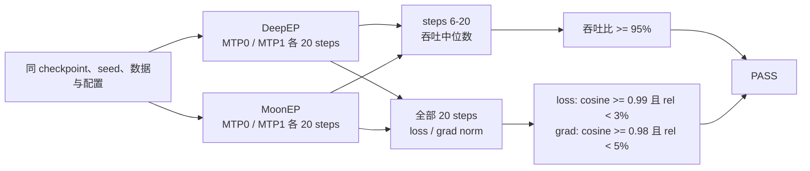
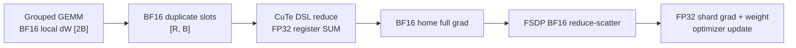
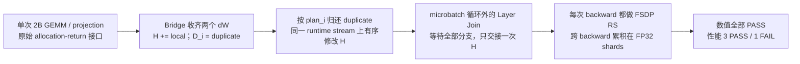

# XTuner MoonEP 09-02 最终验收报告

## 结论

MoonEP 第一版接入通过最终验收。真实 Qwen3.5-35B-A3B 在 8×H200、BF16、FSDP2×EP4、TP1、`torch.compile` 下完成 MTP0 与 MTP1 各一组 DeepEP/MoonEP 20-step 对照训练。MoonEP 稳态吞吐分别为 DeepEP 的 `108.49%` 和 `112.09%`；全部 loss 与 grad-norm 曲线满足冻结门槛。



## 版本与配置

正式训练 manifest 记录 XTuner `6d5f4b82aa3a9337537ebd7941942c22312afd8a`；整理提交历史后的等价产品代码位于 `3f5414f8`，两者在 `xtuner/v1` 下没有差异。MoonEP-mod 为 `d4494473fb0932dcc35f3a44a0e3b31827f5e282`。

| 项目                    | 验收值                                                                            |
| ----------------------- | --------------------------------------------------------------------------------- |
| Python / PyTorch / CUDA | `pt212_cu132` / `2.12.1+cu132` / `13.2`                                           |
| 硬件                    | 单节点 `8 × NVIDIA H200`                                                          |
| 模型 / 数据             | Qwen3.5-35B-A3B / Alpaca                                                          |
| 训练                    | 20 steps、seed 0、global batch 8、pack length 65536                               |
| 并行                    | FSDP2、EP4、TP1、SP1、micro1、reshard after forward                               |
| dtype                   | BF16 param、forward/backward、EP 通信与 FSDP reduce-scatter；FP32 optimizer shard |
| MoE                     | 256 routed experts、1 shared expert、top-k 8、router FP32                         |
| MoonEP                  | Direct VMM landing、staging reference 关闭、`moonep_num_sms=64`                   |
| MTP0 / MTP1             | `None` / `MTPConfig(num_layers=1, share_weights=False)`                           |
| grouped linear          | Triton；未启用 `grouped_gemm` CUTLASS 路径                                        |
| optimizer               | AdamW，lr `6e-5`，wd `0.01`，betas `(0.9, 0.95)`                                  |

完整配置、环境和 GPU 列表保存在 `work_dirs/moonep_0902_final_pass/*/acceptance_manifest.json`。四个 run 只切换 dispatcher 或 MTP 配置；checkpoint、seed、数据顺序、有效 token 数、packing、compile、optimizer 与 grouped-linear backend 保持一致。

## 20-step 结果

### 吞吐

吞吐只统计 compile/warm-up 后的 steps 6～20，单位为 text tokens/s。

| Gate | DeepEP median | MoonEP median | MoonEP / DeepEP | 判定 |
| ---- | ------------: | ------------: | --------------: | ---- |
| MTP0 |      5447.278 |      5909.833 |        108.491% | PASS |
| MTP1 |      3035.483 |      3402.410 |        112.088% | PASS |

### 数值曲线

| Gate / curve        |      Cosine | Mean relative difference | 判定 |
| ------------------- | ----------: | -----------------------: | ---- |
| MTP0 balancing loss | 0.999998824 |                0.114532% | PASS |
| MTP0 LM loss        | 0.999996055 |                0.269665% | PASS |
| MTP0 total loss     | 0.999996339 |                0.258404% | PASS |
| MTP0 grad norm      | 0.999883706 |                2.536973% | PASS |
| MTP1 balancing loss | 0.999999748 |                0.071091% | PASS |
| MTP1 LM loss        | 0.999999130 |                0.121277% | PASS |
| MTP1 MTP loss       | 0.999999091 |                0.105620% | PASS |
| MTP1 total loss     | 0.999999269 |                0.110629% | PASS |
| MTP1 grad norm      | 0.999980890 |                1.107751% | PASS |

机器判定结果：

- `work_dirs/moonep_0902_final_pass/mtp0_comparison.json`
- `work_dirs/moonep_0902_final_pass/mtp1_comparison.json`

两份结果均为 `passed=true`。

## 关键语义与验证

### BF16 duplicate-gradient return

正式路径由 MoonEP `Buffer.reduce_grad_bf16(...)` 归还 duplicate expert 梯度。两份 projection 共用 publication/reuse barrier；CuTe DSL kernel 从 BF16 VMM slot 读取，在 FP32 寄存器中执行 `SUM`，最后一次舍入写回 BF16 home gradient。原有 FP32 `Buffer.reduce_grad(...)` 保持不变。



EP2/4/8 public API 测试覆盖空 slot、重复 expert、连续 slot 复用和精确参与集合；最终真实训练使用 EP4。FSDP2×EP4 tiny 测试验证 duplicate contribution 在 reduce-scatter 前落入完整 BF16 gradient。

### 生命周期与并发

Runtime 只拥有模型级 Buffer/workspace，Dispatcher 拥有层级行为，InvocationState 只保存单次 forward/backward 的 plan、event 与 gradient slot。权重预取在 `dispatch` 阶段发起，`dispatch_postprocess` 只等待 device event 并消费 alias。

真实路径已覆盖：

- 同一 layer 多个 forward 后按原序和逆序 backward；
- Domino micro-batch=2；
- MTP reentrant original forward 与 replay；
- Direct VMM landing 的 validate-before-mutate、安装与卸载；
- 普通 AdamW 同步 DCP、同步/异步 HF export 与 router offload。

### 无 host sync

profiler 对真实 router 与 MoonEP direct hot path 的门禁结果为：

- router count 路径无 `cudaStreamSynchronize`；
- dispatch、weight prefetch、combine、duplicate-grad return 区间无 host/device/stream synchronize；
- 完整 home weight copy 为 `0`；
- 完整 local `[2B]` dW temporary/copy 为 `0`。

FSDP/NCCL 与 MoonEP 统一在 caller current stream 上形成一致的 device-side 顺序；没有用 host synchronize 修补跨 rank 依赖。

### 回归结果

| Suite                                                     | 结果                                 |
| --------------------------------------------------------- | ------------------------------------ |
| MoonEP-mod EP2/4/8、BF16 reduce、peer-skew 与连续调用     | PASS                                 |
| XTuner acceptance/config contracts                        | `23 passed`                          |
| persistence/router/landing/workspace/GroupedGEMM 组合回归 | `38 passed`                          |
| pre-commit（ruff、format、mypy 等）                       | PASS；mypy 检查 367 个 source files  |
| Qwen3.5 MTP0/MTP1 DeepEP/MoonEP                           | `4 × 20 steps`，两个 compare 均 PASS |

Muon cold DCP resume、SwapAdamW cold DCP resume 与 process-mode async DCP 对应 `todo_bug_fix/0003～0005`。它们是已有通用基线问题，不影响本报告的普通 AdamW、`debug_skip_save=True` 正式训练，相关实现与回归测试留给独立 PR。

## 复现命令

```bash
tests/acceptance/run_qwen35_moonep_acceptance.sh deepep 0 65536 work_dirs/moonep_0902_final_pass
tests/acceptance/run_qwen35_moonep_acceptance.sh moonep 0 65536 work_dirs/moonep_0902_final_pass
tests/acceptance/run_qwen35_moonep_acceptance.sh deepep 1 65536 work_dirs/moonep_0902_final_pass
tests/acceptance/run_qwen35_moonep_acceptance.sh moonep 1 65536 work_dirs/moonep_0902_final_pass

PYTHONPATH=. python -m xtuner._testing.moonep_acceptance compare \
  --deepep work_dirs/moonep_0902_final_pass/deepep_mtp0_pack65536 \
  --moonep work_dirs/moonep_0902_final_pass/moonep_mtp0_pack65536 \
  --output work_dirs/moonep_0902_final_pass/mtp0_comparison.json

PYTHONPATH=. python -m xtuner._testing.moonep_acceptance compare \
  --deepep work_dirs/moonep_0902_final_pass/deepep_mtp1_pack65536 \
  --moonep work_dirs/moonep_0902_final_pass/moonep_mtp1_pack65536 \
  --output work_dirs/moonep_0902_final_pass/mtp1_comparison.json
```

所有 GPU 测试均先通过 `/mnt/shared-storage-user/zhaopenghao/github/xtuner/zdev/gpu_lock.sh` 获取 8 卡文件锁。

## 首版边界与待办

本报告只声明 BF16、TP1、单节点 EP2/4/8（正式性能测试 EP4）、FSDP2、MTP 与已覆盖的 Domino micro-batch 能力。以下内容继续作为后续待办：

- 跨节点 MoonEP；
- XTuner 自管 expert 参数及其 DCP save/load；
- Muon、SwapAdamW 与 process-mode async DCP 的通用基线修复；
- EP+TP、FP8、pipeline parallel、FSDP `no_sync` 与 decoding。

## 最终结论

MoonEP dispatcher 已达到首版 Definition of Done：FSDP2×EP4 的 BF16 权重与梯度生命周期正确，MTP0/MTP1 真实 20-step 数值和性能门槛全部通过，关键热路径保持无 host sync；未实现能力已明确留在后续待办中。

# 2026-09-07 方案 A 验收：共享 home、micro2 与显存

## 结论

方案 A 的实现与回归通过，但扩展后的性能验收未全部达标。真实 Qwen3.5-35B-A3B 完成 `8 × 20 steps`，全部 loss/grad-norm 门槛通过、无 OOM；四组性能对照中三组通过，`micro2 / MTP0` 仅达到 DeepEP 的 `91.727%`，低于 `95%`。不能将本轮报告标为全量 PASS。

父提交 `aa9f48b7` 的相同 case 为 `91.674%`，旧验收报告的历史基线 `3f5414f8` 为 `92.121%`；该性能不足已存在于旧基线，不是 `272bbbd1` 引入的。方案 A 相对父提交的整卡采样峰值降低 `0.375 GiB/rank`，allocator 峰值未变。



## 实现、版本与验收口径

- `aa9f48b7`：所有 XTuner FSDP unit 拒绝 `set_requires_gradient_sync(False)`；保留原生 `set_is_last_backward` 语义，不修改 PyTorch 全局类。
- `272bbbd1`：一份 home 加 N 份 duplicate；`prepare_layer_inputs()` 在 microbatch 循环外创建层级 Join；GEMM 外 bridge 接收临时 dW，最终向 FSDP 交接一次。
- `dc6eec17`：micro2 配置、整卡显存采样、allocator 汇总与匹配检查。正式运行使用该提交的干净独立 worktree，没有混入原工作区的 Grouped GEMM 未提交修改。
- MoonEP-mod 固定为 `d4494473fb0932dcc35f3a44a0e3b31827f5e282`。本次没有修改 Triton kernel 或 MoonEP-mod，方案 B 未实现。

沿用前述 8×H200、`pt212_cu132`、BF16、FSDP2×EP4、TP1/SP1、full recompute、`torch.compile`、Triton、AdamW、seed 0、Alpaca 与同一 HF checkpoint。MTP1 为一层、非共享权重；attention 使用与旧验收相同的 FlexAttention。

| Case | intra-layer micro batch | Pack length | Global batch | 每 rank 每 step 有效 tokens |
| --- | ---: | ---: | ---: | ---: |
| micro1 / MTP0、MTP1 | 1 | 65536 | 8 | 65535 |
| micro2 / MTP0、MTP1 | 2 | 32768 | 16 | 65534 |

micro2 为缓解显存压力预先将 seqlen 减半，两边配置一致；四组 pair 的每步有效 token 数均通过相等检查。两个 micro 设置每 rank 的 padded tokens 都为 65536，但 packing 边界不同，不能将跨 micro 的变化解释为只改变 N 的消融实验。外层多次 backward 累积另由真实 TrainEngine 回归覆盖。

门槛不变：steps 6–20 的吞吐中位数比值至少 `95%`；全部 20 steps 的每项 loss cosine 至少 `0.99` 且平均相对差小于 `3%`；grad norm cosine 至少 `0.98` 且平均相对差小于 `5%`。新方案必然分配临时 dW，因此旧报告的“完整 dW temporary/copy 为零”不再适用；这不改变数值或性能门槛。

## 正式 20-step 结果

### 吞吐

单位为每 rank 的 text tokens/s，不是 8 卡总吞吐。

| Case | DeepEP median | MoonEP median | MoonEP / DeepEP | 性能判定 |
| --- | ---: | ---: | ---: | --- |
| micro1 / MTP0 | 5522.890 | 5887.042 | 106.594% | PASS |
| micro1 / MTP1 | 3080.191 | 3381.760 | 109.791% | PASS |
| micro2 / MTP0 | 6236.663 | 5720.705 | 91.727% | FAIL |
| micro2 / MTP1 | 3211.152 | 3347.343 | 104.241% | PASS |

### 数值曲线

以下相对差均为全部 20 steps 的平均值，不是单步最大值。

| Case | Curve | Cosine | Mean relative difference | 判定 |
| --- | --- | ---: | ---: | --- |
| micro1 / MTP0 | balancing loss | 0.999999395 | 0.086490% | PASS |
| micro1 / MTP0 | LM loss | 0.999996446 | 0.249715% | PASS |
| micro1 / MTP0 | total loss | 0.999996683 | 0.240871% | PASS |
| micro1 / MTP0 | grad norm | 0.999899095 | 2.459049% | PASS |
| micro1 / MTP1 | balancing loss | 0.999999285 | 0.133577% | PASS |
| micro1 / MTP1 | LM loss | 0.999999174 | 0.119179% | PASS |
| micro1 / MTP1 | MTP loss | 0.999998915 | 0.126705% | PASS |
| micro1 / MTP1 | total loss | 0.999999258 | 0.111857% | PASS |
| micro1 / MTP1 | grad norm | 0.999978654 | 1.178750% | PASS |
| micro2 / MTP0 | balancing loss | 0.999998277 | 0.154862% | PASS |
| micro2 / MTP0 | LM loss | 0.999998752 | 0.133384% | PASS |
| micro2 / MTP0 | total loss | 0.999998841 | 0.127784% | PASS |
| micro2 / MTP0 | grad norm | 0.999927415 | 2.706125% | PASS |
| micro2 / MTP1 | balancing loss | 0.999999713 | 0.067113% | PASS |
| micro2 / MTP1 | LM loss | 0.999998836 | 0.122751% | PASS |
| micro2 / MTP1 | MTP loss | 0.999998846 | 0.114392% | PASS |
| micro2 / MTP1 | total loss | 0.999998957 | 0.117653% | PASS |
| micro2 / MTP1 | grad norm | 0.999982915 | 1.058224% | PASS |

### 显存

单位为 GiB，取全部 8 个 rank/device 的最大值。allocator 两列依次为“全部 steps / steps 6–20”的峰值；Trainer 每步重置峰值计数。整卡列来自同一 GPU 锁内每 500 ms 的 `nvidia-smi memory.used` 采样，包含启动、编译以及 VMM/NCCL 等非 allocator 分配；它是采样峰值，不是精确连续峰值，不能与 allocator 数值相加。

| Case | Backend | Allocated：全程 / 稳态 | Reserved：全程 / 稳态 | 整卡采样峰值 |
| --- | --- | ---: | ---: | ---: |
| micro1 / MTP0 | DeepEP | 107.045 / 107.043 | 129.125 / 129.125 | 140.034 |
| micro1 / MTP0 | MoonEP | 107.158 / 107.158 | 123.318 / 123.318 | 134.819 |
| micro1 / MTP1 | DeepEP | 109.717 / 109.717 | 129.154 / 129.154 | 140.063 |
| micro1 / MTP1 | MoonEP | 109.833 / 109.833 | 128.562 / 128.562 | 140.063 |
| micro2 / MTP0 | DeepEP | 105.494 / 105.494 | 129.137 / 129.096 | 140.044 |
| micro2 / MTP0 | MoonEP | 104.848 / 104.848 | 124.271 / 124.271 | 135.140 |
| micro2 / MTP1 | DeepEP | 109.222 / 109.110 | 129.154 / 129.154 | 140.063 |
| micro2 / MTP1 | MoonEP | 108.455 / 108.455 | 129.195 / 129.193 | 140.062 |

MTP0 的 MoonEP 整卡峰值较低；MTP1 两边基本相同。不能统一宣称所有 case 都省显存。相对共享 home 改动前的直接对照见下节。

## 未达标项：commit 对照与改进评估

按 `diagnose` 流程保留原始失败，先验证三个假设：本次 staging/Join 回退、既有 micro2 瓶颈、运行波动。没有先修改 Triton 或通信调度来“试着修好”。

`aa9f48b7` worktree 只补齐本轮验收工具，`xtuner/v1` 与该提交完全相同；它和方案 A 使用相同 checkpoint、seed、20 steps、EP4、micro2、pack32768，并对照同一 DeepEP 基线。

| MoonEP 产品版本 | 稳态 tokens/s | 相对 DeepEP | Allocated 峰值 | Reserved 峰值 | 整卡采样峰值 |
| --- | ---: | ---: | ---: | ---: | ---: |
| 历史基线 `3f5414f8` | 5745.299 | 92.121% | 104.838 | 124.230 | 135.474 |
| 父提交 `aa9f48b7` | 5717.374 | 91.674% | 104.848 | 124.271 | 135.515 |
| 方案 A `272bbbd1`（运行于 `dc6eec17`） | 5720.705 | 91.727% | 104.848 | 124.271 | 135.140 |

方案 A 相对父提交吞吐变化约 `+0.058%`，属于近乎相同的测量结果；两边数值均通过。整卡采样峰值降低 `0.375 GiB`，与本模型少一份 BF16 home 的物理大小一致，但 allocator 峰值未变。此观测不等于临时 dW 不存在，也不能推广为所有 micro 设置都有相同收益。

历史基线 `3f5414f8` 同样只补验收工具、不改产品代码，数值通过而性能为 `92.121%`。三个版本均低于 95%，差距不是方案 A 独有的现象。旧报告只冻结了 micro1 的大模型性能，没有通过的 micro2 性能基线，因此这是新增 case 暴露的既有限制，而非已证实的近期回归。引入范围只能确定为“至少在 `3f5414f8` 已存在”；没有更多证据可指定它之前的 first-bad commit。

### 改进评估：真实 GPU profiler

另跑同配置的方案 A 20 steps，仅 rank 0 开启 profiler；`profile_step=10` 是零基索引，对应日志第 11 步。该诊断运行完成且无 OOM，但采集/导出有额外开销，不计入正式吞吐或显存表。按 CPU scope、CUDA launch correlation 与 External id 关联 GPU activity，避免漏掉继承外层 autograd ID 的 CuTe launch。

| 采集范围 | GPU activity 累计耗时 |
| --- | ---: |
| 80 次 `gradient_handoff`，含 return/barrier/slot 清零 | 72.630 ms |
| 其中 `add_` | 22.161 ms |
| 其中 `copy_` | 15.250 ms |
| 其中 `fill_`，包含既有 duplicate slot 清零 | 14.430 ms |
| `prepare_experts`，含 original forward/replay | 376.761 ms |
| `dispatch_forward`，含 original forward/replay | 415.249 ms |
| `combine_forward`，含 original forward/replay | 642.741 ms |

这些是 GPU activity 耗时的和，不是 step 墙钟时间；handoff 的 CPU inclusive 时间另为 49.832 ms，不能简单与 GPU 时间相加解释为加速收益。该步记录 160 次 add、160 次 copy、240 次 fill；后者并非全由方案 A 新增。

正式数据对应 MoonEP 中位 step 为 `11.456 s`，达到 95% 门槛需缩短到 `11.061 s`，缺口约 `394.7 ms/step`。因此：

- 首个 producer 用整块 `copy_` 替代 home `zero_ + add_` 是可考虑的小优化，但全部 add/copy/fill 也只有约 51.8 ms，不能将它当成补齐上述缺口的方案；本次未为此改动实现或声称性能问题已修复。
- 现有 prepare、dispatch/combine 的开销更值得继续定位。trace 中 MoonEP 各阶段与 Grouped GEMM 均在 stream 7；这证实当前没有两者之间的跨 stream 重叠，但仅这一份 MoonEP trace 不能证明它是相对 DeepEP 的唯一瓶颈。
- 后续应先补成对的 DeepEP profiler，再评估无效行处理或 microbatch 通信/计算重叠。不能直接删 mask、改静态 capacity 或换独立通信 stream：必须保留 skew/empty routing 正确性及 FSDP/NCCL 与 MoonEP 的跨 rank 顺序。当前 runtime 注释也记录了独立高优先级 stream 的既有停滞风险。

结论是有进一步优化方向，但没有证据支持在本次“不改 Triton kernel”的方案中，仅靠去掉临时 dW staging 就达到该门槛；未达标状态保持 FAIL，不放宽阈值。

## 回归与边界

| 验证 | 结果 |
| --- | --- |
| 干净提交：forward、workspace、landing、dispatcher/acceptance contracts、FSDP 同步策略 | 57 passed |
| 冷启动 DCP、HF 导出、activation/router offload、关闭生命周期 | 7 passed |
| CUTLASS：MTP reentrant micro2；micro1/2/4 累积与三次 AdamW 更新 | 2 passed |
| pre-commit / mypy | PASS；367 个 source files |
| 正式 Qwen3.5 配对 | 8 × 20 steps；全部数值 PASS，性能 3 PASS / 1 FAIL |
| 父提交、历史基线对照 | 2 × 20 steps；均复现 micro2/MTP0 性能不足 |
| 真实 profiler 诊断 | 1 × 20 steps；采集日志第 11 步，无 OOM |

累积回归通过真实 `TrainEngine.train_step → clip_grad_norm → step_optimizer` 路径验证多个 MoE 层、micro1/2/4、每轮多次同步 backward、三个 optimizer steps；`set_is_last_backward(False/True)` 不受同步策略限制。真实 VMM/transport 测试覆盖 EP2/4/8 的共享 home、独立 duplicate、hot/empty slot；profiler 回归确认无新增热路径 host sync、无完整 home weight copy，并确认 allocation-return dW 的存在。

额外尝试的“不同输入、逐元素 `atol=1e-3`”压力测试，micro1 router 即出现约 `0.002003` 的最大绝对差；父提交用同一复现也失败，不能算本次引入。正式累积回归保留原 `rtol=1e-2, atol=1e-3`，用重复输入隔离累积次数；不同输入的数值验证由既有模型对照和本节真实 20-step 曲线承担，不宣称任意输入下逐元素或 bitwise 等价。复现日志保留在 `.scratch/shared_home_matched_width.log` 与 `.scratch/shared_home_parent_matched_width.log`。

## 产物与复现

正式产物根目录为 `work_dirs/moonep_0907_shared_home/`，每个 run 保留 manifest、全部 rank 的 tracker、stdout 与 `device_memory.csv`。四份 `mtp{0,1}_micro{1,2}_comparison.json` 包含完整判定及显存汇总。父提交、历史基线产物分别为 `work_dirs/moonep_0907_shared_home_parent/`、`work_dirs/moonep_0907_shared_home_historical/`。

两个旧版本仅使用 `dc6eec17` 的三份验收工具（launcher、config、`xtuner/_testing/moonep_acceptance.py`），未改 `xtuner/v1`。profiler 产物在 `work_dirs/moonep_0907_shared_home_profile/`：`staging_profile_summary.json` 记录汇总与原始 trace 路径，分析脚本保留于 `.scratch/summarize_shared_home_trace.py`。

在对应干净 checkout 中执行以下命令；launcher 自行获取同一把 8 卡 GPU 文件锁。已有目录不会覆盖，复跑请换输出目录。

```bash
conda activate pt212_cu132

for mtp in 0 1; do
  for backend in deepep moonep; do
    MOONEP_ACCEPTANCE_MICRO_BATCH=1 tests/acceptance/run_qwen35_moonep_acceptance.sh \
      "$backend" "$mtp" 65536 work_dirs/moonep_0907_shared_home
    MOONEP_ACCEPTANCE_MICRO_BATCH=2 tests/acceptance/run_qwen35_moonep_acceptance.sh \
      "$backend" "$mtp" 32768 work_dirs/moonep_0907_shared_home
  done
done

python -m xtuner._testing.moonep_acceptance compare \
  --deepep work_dirs/moonep_0907_shared_home/deepep_mtp0_pack32768_micro2 \
  --moonep work_dirs/moonep_0907_shared_home/moonep_mtp0_pack32768_micro2 \
  --output work_dirs/moonep_0907_shared_home/mtp0_micro2_comparison.json

# 仅用于诊断，不纳入正式性能门槛；profile_step 为零基索引。
MOONEP_ACCEPTANCE_MICRO_BATCH=2 MOONEP_ACCEPTANCE_PROFILE_STEP=10 \
  tests/acceptance/run_qwen35_moonep_acceptance.sh \
  moonep 0 32768 work_dirs/moonep_0907_shared_home_profile
```

本轮结论：方案 A 已实现并通过功能/数值验证，micro2/MTP0 相对父提交的整卡采样峰值降低 0.375 GiB；该 case 的性能门槛仍未通过，不能沿用旧报告的全量 PASS 结论。
