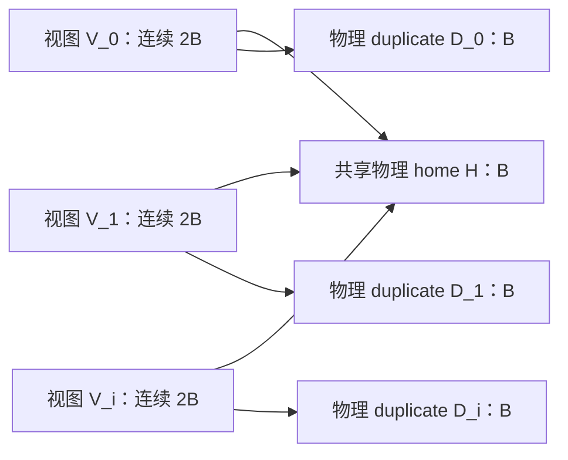
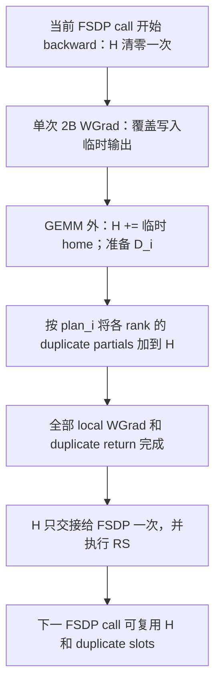
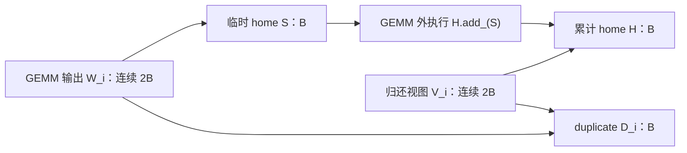

# MoonEP：一份 home gradient + N 份 duplicate gradient

结论：在“不修改 Triton kernel、每个 projection 单次 `[2B]` GEMM、一份累计 home”约束下，需要额外的临时 dW 存储。无 `grad_out` 时由算子分配完整 `[2B]` dW；带 `grad_out` 时可通过 VMM 让 duplicate 直接落入 `D_i`，仅额外保留一份 `[B]` home scratch，再在 GEMM 外累加。后者按每个 projection 一份 scratch 计算，micro2 的梯度 workspace 与当前方案相同，不能宣称节省 25%。

方案 A 已进入实现与测试：`prepare_layer_inputs()` 在 microbatch 循环外建立单个层级 Join，workspace 共享 home，GEMM 外 bridge 收齐两块 dW 后 staging/归还。方案 B 仍是设计，未实现。数值、显存和性能结论以 `xtuner_moonep_acceptance.md` 的新增验收记录为准。XTuner 每次 backward 必须 RS，禁止 `set_requires_gradient_sync(False)`。

## 1. 共同约束与存储

- `B`：当前 EP rank 的 home expert 数；`N`：`intra_layer_micro_batch`。
- 不修改现有 Triton GEMM kernel、epilogue 或 autotune 实现，不新增 home 累加 Triton kernel。累加使用 GEMM 外的 PyTorch tensor 操作；允许修改 Python/autograd 接线和 VMM 布局。
- 每个 projection 的权重和计算布局始终为 `[home B | duplicate B]`。不拆成 home/duplicate 两次 GEMM；`fused_w1w3` 和 `fused_w2` 仍各自执行一次 grouped GEMM。
- 每个 projection 只有一份共享 BF16 home **累积区** `H`，以及按 invocation 分配的 BF16 duplicate 区 `D_i`。这不意味着无需当前 WGrad 的临时输出；所有临时存储都必须纳入显存核算。
- `H` 只属于当前 expert-bearing FSDP call，不为所有 physical layers 常驻分配。不同层、shared-weight MTP 的不同 calls 在前一次 RS 消费完成后复用。
- 每个 invocation 保留自己的 routing plan；`D_i` 必须按对应 `plan_i` 归还，不能把不同 microbatch 的 duplicate slot 按 expert 身份直接相加。
- 所有 home 写入和 duplicate 归还需要 device stream ordering；不通过 host 等待或查询动态 routing 状态实现互斥。

VMM 可为每个 invocation 提供归还梯度所用的连续虚拟视图 `V_i = [H | D_i]`，而共享 home 的物理存储：



这里多个连续 VA 视图不等于多份 home 物理内存。已有 `[R,B,...]` remote duplicate mappings 随各 `D_i` 保留。`V_i` 用于 duplicate return，不能直接作为现有覆盖写入 GEMM 的输出，否则会清掉 `H` 中此前的累积值。

## 2. 共同的梯度生命周期



图中 B、S、C 表示依赖关系，不要求所有 invocation 的 staging 全部完成后才开始归还。满足相应 WGrad ready 条件后即可归还，但对共享 `H` 的读改写必须有序。A 方案复制 duplicate 到 `D_i`；B 方案让 GEMM 直接写 `D_i`。

需要一个 FSDP-call-local 的生命周期 owner，管理初始化、所有 producers 的完成和最终交接。不能把 forward 的 microbatch 编号当作 backward 的首次/最后完成顺序；reentrant checkpoint 的 original forward 也不能提前清零正在使用的梯度存储。

当前 `accumulate_fsdp_unsharded_expert_gradients()` 是首份赋值、后续 `add_`。新方案不能每个 invocation 都把整个累计 `H` 交给它，否则会重复计数，甚至发生 `H.add_(H)`。最终只能交接一次。

## 3. 方案 A：Grouped GEMM 不带 grad_out

### 3.1 算子接口与权重接线

保持 main 的算子形式：

```python
output = group_gemm(x, local_weight_2b, counts_2b)

# 原始 grouped-GEMM backward
dx = m_grouped_gemm(grad_output, local_weight_2b, counts_2b)
dw = k_grouped_gemm(grad_output, x, counts_2b)  # 分配并返回 [2B,...]
return dx, dw, None
```

这能复用 main 的 `group_gemm(x, weight, counts)` 接口，不表示 main 的 `GroupedLinear` 模块可以原封不动恢复：main 模块读取自己的 `[B]` home Parameter，而 MoonEP 必须向单次 GEMM 提供动态 `[2B]` 权重。当前的动态 weight 注入或等价的 MoonEP 权重适配仍然需要。

### 3.2 在 MoonEP autograd 边界接收 dW

在 grouped GEMM 外增加 MoonEP 的权重/activation autograd bridge，接收返回的 `[2B]` dW，对每个 projection 执行以下逻辑：

```python
# 伪代码：T_i 是原始 GEMM 分配的 BF16 [2B,...] 梯度。
H.add_(T_i[:B])
D_i.copy_(T_i[B:])
# 两个 projection 均已完成上述消费后，按 plan_i 发起 duplicate return。
# 归还 kernel 读取当前 H，累加对应 remote D_i，再写回 H。
```

bridge 必须让 dW 消费进入 activation 向前一层传播的反向依赖。一个可实现的结构是同一 bridge 输出 expert activation 与两块 `[2B]` 权重，在它的 backward 收齐 activation gradient 和两个 projection 的 dW 后，完成 staging 并发起 paired duplicate return。后续 Join 再消费 completion event。

这要求调整现有 Start/Join 接线：bridge 承担上述发起职责，不能让旧 Start 再次发起同一 invocation 的归还。

不能仅添加一个独立的 weight gradient hook，同时继续假定当前 activation 上的 Start/Join 已经等待它：GEMM 返回的 `dx` 和 `dw` 是不同的 autograd 分支，activation 分支就绪不代表 `dw` 已经被外部 bridge 消费。

此处选择由 MoonEP 显式维护共享 `H`，最终交接一次。bridge 消费的 dW 不再另外送给 home Parameter 的原生 AccumulateGrad，避免 native `.grad` 和 `H` 同时计数。也不要把每个 invocation 的完整累计 `H` 当作该 invocation 的梯度返回。

### 3.3 代价

- 不要求 grouped-GEMM kernel 支持前缀累加，可复用原始 allocation-return 算子。
- 每次 WGrad 仍会分配完整 `[2B]` 临时 `T_i`，并写入全局显存。
- 随后通过 PyTorch `add_`、`copy_` 读取 `T_i`、累加 home 和复制 duplicate，不改 Triton kernel。
- 原始普通 CUDA dW 不是预先发布的 remote VMM duplicate storage，所以 duplicate 仍需 staging。
- 多个 invocation / projection 的 dW 可能同时在途。上述 paired bridge 会持有梯度直到它的输入梯度收齐，不能假设全模型始终只有一份临时 dW。

因此，方案 A 只降低不含临时输出的 ring 容量；加入在途 dW 后，峰值可能比当前方案更高，不能承诺节省 25%。

## 4. 方案 B：带 grad_out，复用 home scratch，在 GEMM 外累加

### 4.1 两类连续视图

每个 projection 额外分配一份 BF16 `[B,...]` scratch `S`，保存当前 invocation 的 local WGrad。为每个 invocation 建立两个连续 `[2B]` 视图：

| 视图 | 物理映射 | 消费者 |
|---|---|---|
| `W_i` | `[S \| D_i]` | 现有覆盖写入的 `k_grouped_gemm_out` |
| `V_i` | `[H \| D_i]` | MoonEP duplicate-gradient return |



GEMM 对全部 `[2B]` groups 仍执行原来的覆盖写入。home 输出先落入 `S`，duplicate 输出直接落入已经发布的 `D_i`，不需要另一次 duplicate copy。两个视图共用同一份 `D_i` 的物理存储。

### 4.2 backward 接线与 scratch 复用

以下是 Python/autograd 层的概念伪代码，现有 Triton kernel 保持不变：

```python
# W_i = VMM_view(S, D_i)，不是 VMM_view(H, D_i)。
k_grouped_gemm_out(grad_output, x, counts_2b, W_i)
H.add_(W_i[:B])
# 此时 S 的本次内容已被消费；不把 W_i 返回给 AccumulateGrad。
# 两块 projections 均完成后，使用 V_i = [H | D_i] 按 plan_i 归还。
```

`H.add_` 必须在当前 projection 的 GEMM backward 返回之前排入正确的 stream 顺序，而不是延迟到现有 paired Start/Join 才读取 `S`。否则其他 invocation 的同一 projection WGrad 可能先覆盖 scratch。

这需要 Python/autograd wrapper 得到 `H` 和静态 home 范围 `B`，可通过 tensor 参数或等价的输出描述传递；单独一个 `grad_out` 指针不能表达“写完后把前缀加到哪个 accumulator”。不得把 Python invocation/runtime 对象带入编译的 tensor 计算图。

每个 projection 独立的一份 `S` 只有在“写 S → 将 S 加入 H → 下一次写 S”依赖得到保证时才足够。多个 `W_i` 的 VA 不同但 scratch 物理页相同，compile/custom-op 必须正确表达共享资源依赖，不能仅依赖当前碰巧串行的执行顺序。若无法证明这个边界，就不能宣称只需要一份 scratch。

paired Start 可以在两个 projection 都完成 WGrad 和外部累加后发起归还；归还读取 `H` 和 `D_i`，不再读取 `S`。最终仍只向 FSDP 交接一次累计 `H`。

### 4.3 临时 dW 的准确含义

| 对象 | 是否需要 |
|---|---|
| GEMM 内部的 FP32 tile accumulator | 需要，保留现有实现 |
| BF16 home 累积区 `H` 和 N 份 `D_i` | 需要 |
| 额外的全局显存 home scratch `S` | 需要，保存尚未加入 H 的当前 local dW |
| 额外分配完整 `[2B]` scratch | 上述 VMM 方案不需要，duplicate 半段已经是 `D_i` |

如果不实现 `W_i = [S | D_i]` 的 VMM 映射，也可以把完整 `[2B]` tensor 作为 `grad_out`，再执行 `H.add_(out[:B])` 和 `D_i.copy_(out[B:])`。这更接近方案 A，只把临时输出的分配权交给调用方，并不能消除临时 dW 或 duplicate copy。

因此，“带 out”在此限制下的收益是控制临时存储的复用，并让 duplicate 直接落入目标 slot；不再承诺直接累加 home 或完全消除临时 dW。

### 4.4 数值与生命周期要求

- 两种方案都先得到 BF16 local WGrad，再通过 PyTorch `add_` 累加 BF16 `H`。定义 local 累加与 duplicate return 的顺序，并验证其相对当前实现的舍入差异。
- 现有 kernel 对空 group 写零的语义继续用于临时输出和 `D_i`；零贡献加入 `H` 不会清掉旧累积值。
- `H` 的清零、外部 `add_` 与 duplicate return 的读改写必须有序，`S` 的覆盖写入与消费也必须有序。
- 不修改 GEMM epilogue 或 autotune，不新增累加 Triton kernel；仍需验证映射后的 out 路径及编译模式。

## 5. 显存与方案选择

令 `G` 为两块 projections 各一份 home gradient 的 BF16 总物理大小，不含 FSDP reduction input、参数、optimizer 或 activation。

| 方案 | 累积/通信存储 | 额外 dW 存储 | 额外工作 |
|---|---:|---|---|
| 旧版 N 份 `[home + duplicate]` | `2NG` | direct-output 路径无需额外 dW | 各 invocation 完成后逐次 home 交接 |
| A：共享 home，无 grad_out | `(N+1)G` | 每份完整 projection-pair dW 为 `2G`，在途数量取决于反向调度 | autograd bridge、home 累加与 duplicate copy |
| B：共享 home，out 映射到 `[S \| D_i]` | `(N+1)G` | 每个 projection 一份 S，合计 `G` | GEMM 外 home 累加、scratch 复用 |

方案 B 的总 workspace 是 `(N+2)G`，而不是 `(N+1)G`。相对旧版 `2NG`：

- micro2：`4G → 4G`，没有 workspace 容量收益，而且仍有额外 local dW 读写。
- micro4：`8G → 6G`，理论节省 25%，前提是每个 projection 确实只需要一份 scratch。
- micro1 不需要该共享优化；若后续实现 B，可以评估保留旧版直接输出路径。目前实现的 A 对 micro1/2/4 统一使用 allocation-return，不保留 micro1 特例。

方案 A 按文中 paired bridge 保留一个 invocation 两块 projection 的完整 dW 时，仅 workspace 加这份临时输出就达到 `(N+3)G`；更多在途输出还会抬高峰值。不能只比较 `(N+1)G` 的累积/通信存储。

建议：在不改 Triton kernel 的限制下，不以“micro2 省显存”为理由推进共享 home。若优先保持原始 GEMM 接口，可考虑 A；若目标是较大 N 下减少 workspace，才进一步验证 B 的 scratch 生命周期和性能。两种方案的实际峰值还需计入 FSDP reduction input、编译器临时量等。

## 6. 实施与验收清单

- [x] 保持单次 `[2B]` GEMM 和现有 Triton kernel 不变；建立共享 home 与 N 份 duplicate chunks 的归还视图。
- [x] 建立 call 级初始化和完成边界：home 清零一次、全部贡献完成后交接一次、FSDP copy-in 消费后才复用。
- [x] A：实现 GEMM 外的 autograd bridge，建立 dW staging → paired duplicate return → 层级 Join → FSDP RS 的依赖。
- [ ] B：建立额外 scratch 及 `[S | D_i]` GEMM 输出视图，通过 Python/autograd 接线完成外部累加，证明 scratch 消费先于复用。
- [x] A：相同 seed/重复输入下，比较 micro1/2/4 的 routed/shared/router 梯度与三次 AdamW 更新；不同输入的 DeepEP 对照另由模型回归和正式验收覆盖。容差为 `rtol=1e-2, atol=1e-3`，不是 bitwise 等价。
- [ ] B：实现后与 A、旧版做同输入逐参数梯度和 optimizer 更新对照。
- [x] A：覆盖 micro1/2/4、多个 MoE 层、连续梯度累积和 optimizer steps；真实 VMM/transport 测试覆盖 EP2/4/8 的 hot expert、空 slot 和 duplicate 隔离。
- [x] A：覆盖实际重计算路径、shared-weight MTP 多 calls、eager/compile，以及 Triton/CUTLASS。
- [x] A：CUDA profiler 检查真实热路径无新增 host sync、无完整 home weight copy，并确认 allocation-return dW 确实存在。
- [ ] 若继续优化 A/B，进一步测量各临时 dW 的在途生命周期与 D2D 带宽；整模型显存和 step 耗时以正式验收报告为准。

## 7. 当前代码依据

- `xtuner/v1/module/grouped_linear/moe_group_linear.py`：当前动态 weight 和可选 WGrad target 的传递入口。
- `xtuner/v1/ops/moe/cuda/group_gemm.py`：不带 out 时返回新 dW；带 out 时调用覆盖写入 kernel。本次 A 不使用带 out 分支，也不修改其 autograd 返回约定。
- `xtuner/v1/ops/moe/cuda/triton_kernels/k_grouped_gemm_TMA_triton3_4.py`：allocation-return 路径通过 `new_empty` 创建完整 dW；现有 out 路径复用相同覆盖写入 kernel，尚无 home 累加 epilogue。
- `xtuner/v1/module/dispatcher/moonep_workspace.py`：一份 home 与 N 份 duplicate slot 的 VMM 布局及 paired gradient completion。
- `xtuner/v1/module/dispatcher/fsdp_vmm_landing.py`：保留首份赋值 / 后续原地相加接口，由层级 Join 仅交接一次累计 H，不能逐 invocation 重复交接共享 H。
- MoonEP-mod 的 `moonep/api.py::Buffer.reduce_grad_bf16` 与 `moonep/bf16_grad_reduce.py`：读取已有 BF16 home，使用 FP32 寄存器累加 remote duplicate，再写回 BF16 home。共享 H 后仍须验证其调用顺序和 slot lifecycle。

最终约束是：不改 Triton kernel、单次 `[2B]` GEMM、一份当前层 home 累积区、N 份按 plan 隔离的 duplicate 梯度、每次 backward 必须 RS。在此约束下需要额外临时 dW 存储；带 out 可以把额外存储缩小为 home scratch，但不能将它从显存账目中省略。
